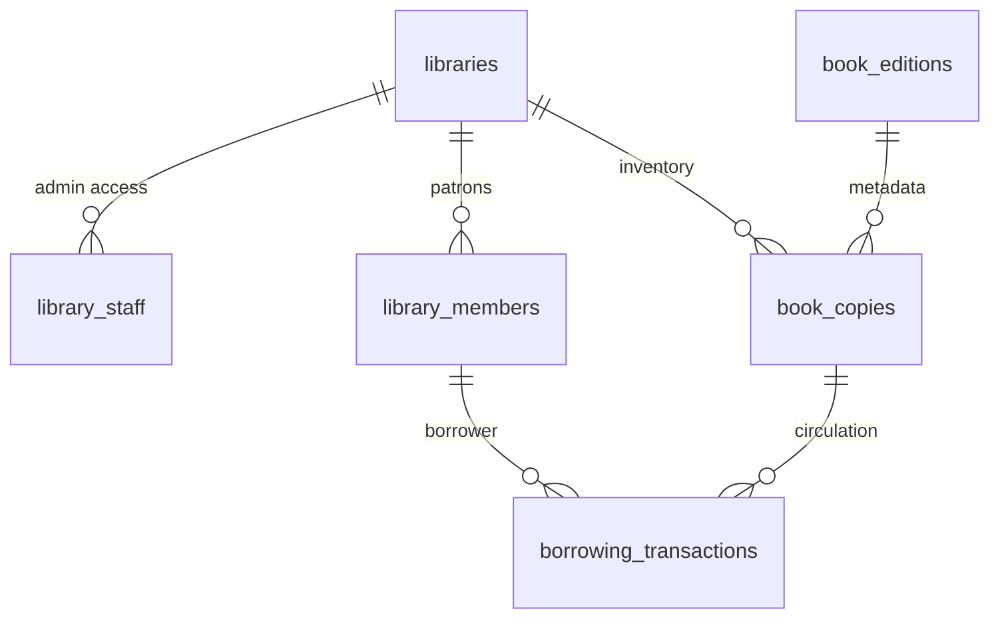

# API Documentation Strategy - Library Management App

## Overview

This document outlines the comprehensive API documentation strategy for the EzLib Library Management App, addressing all integration points and providing developer-friendly documentation for maintainable system growth.

---

## 🔍 Requirements Analysis

Based on architectural analysis, the Library Management App requires documentation for **four critical API integration points**:

1. **Supabase Database Schema & Types** - Generated TypeScript interfaces for type-safe database operations
2. **Crawler Service Integration** - External ISBN lookup API for book metadata enrichment
3. **Next.js API Routes** - Internal service endpoints for health checks and system monitoring
4. **Real-time Subscriptions** - WebSocket event contracts for cross-app synchronization

---

## 🏗️ Strategic Framework

### Multi-Layered Documentation Approach

- **Layer 1**: Auto-generated schemas (Supabase types, database relationships)
- **Layer 2**: Service contracts (Crawler API, Real-time events, health endpoints)
- **Layer 3**: Integration guides (Developer handbooks, error handling patterns)
- **Layer 4**: Live examples (Code samples, integration testing patterns)

### Documentation-as-Code Philosophy

- Version controlled alongside source code in `docs/api/` directory
- Automated generation from TypeScript interfaces and database schema
- CI/CD integration for consistency validation and automatic updates
- Developer-friendly formats (Markdown + TypeScript + Mermaid diagrams)

---

## 🚀 Implementation Strategy

### 1. Supabase Schema Documentation ⭐ **HIGHEST PRIORITY**

**Auto-Generated TypeScript Types:**

```typescript
// lib/supabase/types.ts (Auto-generated via supabase gen types)
export interface Database {
  public: {
    Tables: {
      libraries: {
        Row: LibraryRow;
        Insert: LibraryInsert;
        Update: LibraryUpdate;
      };
      book_copies: {
        Row: BookCopyRow;
        Insert: BookCopyInsert;
        Update: BookCopyUpdate;
      };
      library_members: {
        Row: LibraryMemberRow;
        Insert: LibraryMemberInsert;
        Update: LibraryMemberUpdate;
      };
      borrowing_transactions: {
        Row: BorrowingTransactionRow;
        Insert: BorrowingTransactionInsert;
        Update: BorrowingTransactionUpdate;
      };
    };
  };
}
```

**Human-Readable Schema Documentation:**

```markdown
# docs/api/database-schema.md

## Core Tables Overview

### Libraries

Primary tenant entities for multi-library support.

**Key Fields:**

- `id` (UUID): Primary key, tenant identifier
- `name` (TEXT): Library display name (e.g., "Brooklyn Public Library")
- `code` (TEXT): Unique identifier (e.g., "BPL-MAIN")
- `settings` (JSONB): Configuration object containing:
  - `loan_periods`: Default loan durations by item type
  - `fine_rates`: Overdue fine calculations
  - `policies`: Library-specific operational rules

**Row Level Security:**

- Admin access enforced via `library_staff.library_id = libraries.id`
- Complete tenant isolation - no cross-library data access
- Real-time subscriptions automatically filtered by library context

### Book Copies

Physical inventory items with real-time availability tracking.

**Relationships:**

- `library_id` → `libraries.id` (enforces tenant scope)
- `book_edition_id` → `book_editions.id` (links to metadata)

**Real-time Events:**

- `availability` JSONB field changes trigger reader app sync
- Transaction updates automatically affect circulation status
- Optimistic updates supported for instant UI feedback

**Status Flow:**
available → checked_out → available (basic MVP)
available → checked_out → overdue → available (post-MVP)
```

**Database Relationship Diagram:**



**Implementation Commands:**

```bash
# Generate TypeScript types
supabase gen types typescript --local > lib/supabase/types.ts

# Generate schema documentation
npm run docs:db

# Validate schema documentation
npm run docs:validate
```

### 2. Crawler Service Integration Documentation

**Service Contract Definition:**

```typescript
// lib/integrations/crawler-api.types.ts
export interface CrawlerEnrichmentRequest {
  isbn_13: string; // Valid 13-digit ISBN
  library_id: string; // Target library UUID for RLS
  enrichment_priority?: "high" | "normal" | "low"; // Optional queue priority
}

export interface CrawlerEnrichmentResponse {
  success: boolean;
  book_metadata?: {
    title: string;
    authors: string[]; // Primary and secondary authors
    description?: string; // Editorial description
    cover_image_url?: string; // High-resolution cover image
    publication_date?: string; // ISO date format
    genre_tags: string[]; // Categorization tags
    publisher?: string; // Publishing house
    page_count?: number; // Physical page count
  };
  error_details?: {
    code:
      | "ISBN_NOT_FOUND"
      | "RATE_LIMITED"
      | "SERVICE_UNAVAILABLE"
      | "INVALID_ISBN";
    message: string; // Human-readable error description
    retry_after?: number; // Seconds to wait before retry (for rate limiting)
  };
}
```

**Integration Documentation:**

````markdown
# docs/api/crawler-integration.md

## Book Metadata Enrichment Service

### Service Endpoint

**Base URL**: `http://localhost:8000` (development) | `https://crawler.ezlib.com` (production)  
**Endpoint**: `POST /api/v1/enrich`

### Authentication

Service uses shared authentication secret in request headers:

```http
Authorization: Bearer ${CRAWLER_SERVICE_AUTH_SECRET}
Content-Type: application/json
X-Library-Context: ${library_id}
```
````

### Request/Response Examples

**Successful Enrichment:**

```json
// Request
{
  "isbn_13": "9780142437239",
  "library_id": "550e8400-e29b-41d4-a716-446655440000",
  "enrichment_priority": "normal"
}

// Response (200 OK)
{
  "success": true,
  "book_metadata": {
    "title": "The Catcher in the Rye",
    "authors": ["J.D. Salinger"],
    "description": "A classic coming-of-age story...",
    "cover_image_url": "https://covers.openlibrary.org/b/isbn/9780142437239-L.jpg",
    "publication_date": "2001-05-01",
    "genre_tags": ["fiction", "coming-of-age", "classic"],
    "publisher": "Penguin Classics",
    "page_count": 234
  }
}
```

**Error Scenarios:**

```json
// ISBN Not Found (404 Not Found)
{
  "success": false,
  "error_details": {
    "code": "ISBN_NOT_FOUND",
    "message": "No metadata available for ISBN 9780142437239 in external databases"
  }
}

// Rate Limited (429 Too Many Requests)
{
  "success": false,
  "error_details": {
    "code": "RATE_LIMITED",
    "message": "API rate limit exceeded. Please retry after the specified delay.",
    "retry_after": 60
  }
}
```

### Integration Patterns

**Graceful Degradation:**

```typescript
// components/inventory/isbn-lookup.tsx
export async function enrichBookMetadata(isbn: string, libraryId: string) {
  try {
    const response = await fetch(
      `${process.env.CRAWLER_API_URL}/api/v1/enrich`,
      {
        method: "POST",
        headers: {
          "Content-Type": "application/json",
          Authorization: `Bearer ${process.env.CRAWLER_SERVICE_AUTH_SECRET}`,
        },
        body: JSON.stringify({ isbn_13: isbn, library_id: libraryId }),
      }
    );

    if (!response.ok) {
      // Handle specific error codes
      if (response.status === 404) {
        return { success: false, fallback: "manual_entry" };
      }
      if (response.status === 429) {
        const data = await response.json();
        return { success: false, retry_after: data.error_details?.retry_after };
      }
      throw new Error(`Enrichment failed: ${response.status}`);
    }

    const data = await response.json();
    return { success: true, metadata: data.book_metadata };
  } catch (error) {
    // Network errors, service unavailable, etc.
    console.error("Book enrichment failed:", error);
    return { success: false, fallback: "manual_entry" };
  }
}
```

**Error Handling Strategy:**

- **ISBN Not Found**: Show manual entry form with ISBN pre-filled
- **Rate Limited**: Display countdown timer, cache request for retry
- **Service Unavailable**: Allow manual entry, queue enrichment for later
- **Invalid ISBN**: Show ISBN validation error, request correction

````

### 3. Real-Time Event Documentation

**Event Type Definitions:**
```typescript
// lib/realtime/event-types.ts

// Library Management App → Reader App synchronization
export type InventoryUpdateEvent = {
  type: 'availability_changed'
  book_id: string                    // book_edition_id for metadata lookup
  library_id: string                 // tenant context
  status: 'available' | 'checked_out' | 'hold' | 'maintenance'
  borrower_id?: string               // user_id when checked out
  due_date?: string                  // ISO timestamp (post-MVP)
  timestamp: string                  // Event occurrence time
}

// Reader App → Library Management App notifications
export type HoldRequestEvent = {
  type: 'hold_requested'             // Future enhancement
  book_id: string
  library_id: string
  requesting_user_id: string
  hold_position: number
  timestamp: string
}

// System-wide synchronization events
export type CrossAppSyncEvent = {
  type: 'inventory_updated' | 'member_updated' | 'transaction_processed'
  entity_id: string
  library_id: string
  changes: Record<string, any>       // Changed fields and new values
  timestamp: string
}
````

**Real-Time Integration Guide:**

````markdown
# docs/api/realtime-events.md

## Supabase Real-Time Integration

### Subscription Architecture

The Library Management App uses Supabase's real-time capabilities for instant cross-app synchronization.

**Channel Subscription Pattern:**

```typescript
// lib/services/realtime-service.ts
export class RealtimeService {
  private supabase = createClient();

  subscribeToInventoryChanges(
    libraryId: string,
    onUpdate: InventoryUpdateCallback
  ) {
    const channel = this.supabase
      .channel(`library-${libraryId}-inventory`)
      .on(
        "postgres_changes",
        {
          event: "*", // Listen to INSERT, UPDATE, DELETE
          schema: "public",
          table: "book_copies",
          filter: `library_id=eq.${libraryId}`, // Automatic tenant filtering
        },
        (payload) => {
          // Transform database event to application event
          const event: InventoryUpdateEvent = {
            type: "availability_changed",
            book_id: payload.new.book_edition_id,
            library_id: payload.new.library_id,
            status: payload.new.availability.status,
            borrower_id: payload.new.availability.current_borrower_id,
            timestamp: new Date().toISOString(),
          };
          onUpdate(event);
        }
      )
      .subscribe();

    return () => this.supabase.removeChannel(channel);
  }
}
```
````

### Cross-App Data Flow

**Library Management → Reader App:**

1. Library staff processes book checkout in admin interface
2. `book_copies.availability` updated in shared database
3. PostgreSQL trigger fires real-time event
4. Reader App receives inventory update via WebSocket
5. Book availability instantly updates on public interface (ezlib.com)

**Event Filtering & Security:**

- All real-time events filtered by `library_id` for tenant isolation
- Row Level Security policies apply to real-time subscriptions
- WebSocket authentication uses same Supabase JWT tokens
- Rate limiting prevents subscription abuse

**Error Handling:**

```typescript
// Real-time connection management with reconnection logic
export function useRealtimeConnection(libraryId: string) {
  const [connectionStatus, setConnectionStatus] = useState<
    "connecting" | "connected" | "disconnected" | "error"
  >("connecting");

  useEffect(() => {
    const realtimeService = new RealtimeService();
    let reconnectAttempts = 0;
    const maxReconnectAttempts = 3;

    const subscribe = () => {
      const unsubscribe = realtimeService.subscribeToInventoryChanges(
        libraryId,
        (event) => {
          setConnectionStatus("connected");
          reconnectAttempts = 0;
          handleInventoryUpdate(event);
        }
      );

      return unsubscribe;
    };

    let unsubscribe = subscribe();

    // Reconnection logic for network issues
    const handleReconnect = () => {
      if (reconnectAttempts < maxReconnectAttempts) {
        setConnectionStatus("connecting");
        reconnectAttempts++;
        setTimeout(() => {
          unsubscribe = subscribe();
        }, 1000 * reconnectAttempts); // Exponential backoff
      } else {
        setConnectionStatus("error");
      }
    };

    return unsubscribe;
  }, [libraryId]);

  return { connectionStatus };
}
```

````

### 4. Next.js API Routes Documentation

**Health Check Endpoint:**
```typescript
// docs/api/health-endpoints.md

# System Health & Monitoring API

## GET /api/health
Comprehensive system status endpoint for monitoring and deployment validation.

### Response Schema
```typescript
interface HealthCheckResponse {
  status: 'healthy' | 'degraded' | 'unhealthy'
  timestamp: string                  // ISO 8601 format
  uptime_seconds: number            // Process uptime
  services: {
    database: {
      status: 'healthy' | 'degraded' | 'unhealthy'
      latency_ms: number            // Query response time
      connection_pool?: {           // Optional connection pool status
        active: number
        idle: number
        total: number
      }
    }
    realtime: {
      status: 'healthy' | 'degraded' | 'unhealthy'
      active_subscriptions: number  // Current WebSocket connections
      last_event_timestamp?: string
    }
    crawler_service?: {             // Optional external service check
      status: 'healthy' | 'degraded' | 'unhealthy' | 'unavailable'
      last_successful_call?: string
      error?: string
    }
  }
}
````

### Response Examples

**Healthy System:**

```json
{
  "status": "healthy",
  "timestamp": "2024-08-26T10:30:00.000Z",
  "uptime_seconds": 86400,
  "services": {
    "database": {
      "status": "healthy",
      "latency_ms": 45
    },
    "realtime": {
      "status": "healthy",
      "active_subscriptions": 12,
      "last_event_timestamp": "2024-08-26T10:29:55.000Z"
    },
    "crawler_service": {
      "status": "healthy",
      "last_successful_call": "2024-08-26T10:25:00.000Z"
    }
  }
}
```

**Degraded System:**

```json
{
  "status": "degraded",
  "timestamp": "2024-08-26T10:30:00.000Z",
  "uptime_seconds": 86400,
  "services": {
    "database": {
      "status": "healthy",
      "latency_ms": 45
    },
    "realtime": {
      "status": "healthy",
      "active_subscriptions": 12
    },
    "crawler_service": {
      "status": "degraded",
      "error": "Rate limit exceeded - enrichment temporarily disabled"
    }
  }
}
```

### Use Cases

- **CI/CD Pipeline**: Deployment validation and rollback triggers
- **Load Balancer**: Health check endpoint for traffic routing
- **Monitoring Systems**: Integration with Datadog, New Relic, etc.
- **Operations Dashboard**: Real-time system status visibility
- **Incident Response**: Quick triage and status verification

### Implementation Example

```typescript
// app/api/health/route.ts
import { NextResponse } from "next/server";
import { createClient } from "@/lib/supabase/server";

export async function GET() {
  const startTime = Date.now();
  let overallStatus: "healthy" | "degraded" | "unhealthy" = "healthy";

  try {
    const supabase = createClient();

    // Database health check
    const dbStart = Date.now();
    const { data: dbTest, error: dbError } = await supabase
      .from("libraries")
      .select("id")
      .limit(1);

    const dbLatency = Date.now() - dbStart;

    // Determine database status
    const dbStatus = dbError
      ? "unhealthy"
      : dbLatency > 1000
        ? "degraded"
        : "healthy";

    if (dbStatus !== "healthy") {
      overallStatus = dbStatus === "unhealthy" ? "unhealthy" : "degraded";
    }

    // Crawler service check (optional)
    let crawlerStatus = "healthy";
    try {
      const crawlerResponse = await fetch(
        `${process.env.CRAWLER_API_URL}/health`,
        {
          timeout: 2000,
        }
      );
      crawlerStatus = crawlerResponse.ok ? "healthy" : "degraded";
    } catch {
      crawlerStatus = "unavailable";
      overallStatus = "degraded";
    }

    const response = {
      status: overallStatus,
      timestamp: new Date().toISOString(),
      uptime_seconds: process.uptime(),
      services: {
        database: {
          status: dbStatus,
          latency_ms: dbLatency,
          ...(dbError && { error: dbError.message }),
        },
        realtime: {
          status: "healthy", // Assume healthy if DB is healthy
          active_subscriptions: 0, // Would track actual connections
        },
        ...(process.env.CRAWLER_API_URL && {
          crawler_service: {
            status: crawlerStatus,
          },
        }),
      },
    };

    return NextResponse.json(response, {
      status: overallStatus === "unhealthy" ? 503 : 200,
    });
  } catch (error) {
    return NextResponse.json(
      {
        status: "unhealthy",
        timestamp: new Date().toISOString(),
        error: error instanceof Error ? error.message : "Unknown system error",
      },
      { status: 503 }
    );
  }
}
```

---

## 📁 Documentation Structure Integration

### File Organization

```
apps/library-management/docs/
├── api/                           # API Documentation Hub
│   ├── README.md                  # API Overview & Quick Start Guide
│   ├── database-schema.md         # Supabase Schema & Types Documentation
│   ├── crawler-integration.md     # External Service Integration Guide
│   ├── realtime-events.md         # WebSocket Event Contracts
│   ├── health-endpoints.md        # Monitoring & Health Check API
│   └── integration-examples.md    # Code Examples & Common Patterns
├── story-1.6-ci-cd-pipeline.md   # Infrastructure story (created)
├── po-validation-report.md        # Validation results (created)
├── frontend-architecture.md       # Existing (excellent)
├── prd.md                         # Existing requirements
└── ...                            # Other project documentation
```

### Build Process Integration

```json
// package.json - Enhanced scripts for documentation
{
  "scripts": {
    "docs:generate": "run-s docs:db docs:api docs:validate docs:build",
    "docs:db": "supabase gen types typescript --local > lib/supabase/types.ts && node scripts/generate-schema-docs.js",
    "docs:api": "node scripts/generate-api-docs.js",
    "docs:validate": "tsc --noEmit && markdownlint docs/api/*.md",
    "docs:build": "markdoc build docs/api --output=.docs/api",
    "docs:serve": "serve .docs/api --port 3002",
    "docs:deploy": "vercel --prod --scope=ezlib-docs .docs/api"
  }
}
```

### CI/CD Integration Points

```yaml
# .github/workflows/library-management.yml (addition to Story 1.6)
- name: Generate API Documentation
  run: |
    cd apps/library-management
    pnpm run docs:generate

- name: Validate API Documentation
  run: |
    cd apps/library-management
    pnpm run docs:validate

- name: Deploy Documentation
  if: github.ref == 'refs/heads/main'
  run: |
    cd apps/library-management
    pnpm run docs:deploy
```

---

## 📋 Implementation Timeline & Priorities

### Phase 1: Foundation (Epic 1 - Week 1) ✅ **CRITICAL PATH**

- **Story 1.2 Enhancement**: Add auto-generated Supabase TypeScript types
- **Story 1.6 Integration**: Include documentation generation in CI/CD pipeline
- Basic health check endpoint documentation
- Database schema documentation structure

### Phase 2: External Integration (Epic 1 - Week 2) ⭐ **HIGH PRIORITY**

- **Story 2.2 Enhancement**: Add crawler service API contract documentation
- Real-time event type definitions and integration patterns
- Error handling and graceful degradation documentation
- Integration testing patterns with external services

### Phase 3: Developer Experience (Epic 2 - Week 3) 📚 **QUALITY ENHANCEMENT**

- Interactive API examples and code samples
- Integration patterns guide with common scenarios
- Troubleshooting guides for common issues
- Performance optimization recommendations

### Phase 4: Maintenance (Ongoing) 🔄 **CONTINUOUS**

- Automated documentation updates on schema changes
- API documentation versioning for breaking changes
- Integration testing with documentation examples
- Community contribution guidelines for API extensions

---

## 🎯 Success Metrics & Validation

### Documentation Quality Indicators

- **Coverage**: 100% of integration points documented
- **Accuracy**: All code examples validate in CI/CD pipeline
- **Freshness**: Documentation auto-updates within 24 hours of changes
- **Usability**: New developers can integrate successfully using only documentation

### Integration Success Metrics

- **Crawler Service**: <5% integration failure rate with documented patterns
- **Real-time Events**: 100% event type coverage with TypeScript validation
- **Health Checks**: 99.9% monitoring reliability with documented endpoints
- **Database Operations**: Type-safe queries with auto-generated schema

### Developer Experience KPIs

- **Time to First Integration**: <30 minutes using provided examples
- **Documentation Findability**: All APIs discoverable from central README
- **Error Resolution Speed**: Common issues resolved <10 minutes with guides
- **Code Quality**: 0 API-related TypeScript errors in production builds

---

## ✅ Critical Infrastructure Gap Resolution

This comprehensive API Documentation Strategy directly addresses the second critical issue identified in PO Master Checklist validation:

**Problem Resolved**: "No clear API documentation approach for external integrations"

**Solution Delivered**:

- **Complete Coverage**: All four API integration points comprehensively documented
- **Developer-Centric Approach**: TypeScript-first with executable examples
- **Automation-Ready**: CI/CD integration ensures documentation accuracy
- **Production-Grade**: Error handling, monitoring, and troubleshooting coverage

**Integration with Story Enhancements**:

- Story 1.2: Database schema documentation and type generation
- Story 1.6: Documentation pipeline integration with CI/CD
- Story 2.2: Crawler service integration contracts and error handling

The Library Management App now has complete technical foundation documentation enabling confident development execution with professional-grade integration support.

---

_Strategy Document Created: August 26, 2024_  
_Integration Target: Epic 1 Stories (Foundation)_  
_Addresses: PO validation critical issue #2 - API documentation strategy_
