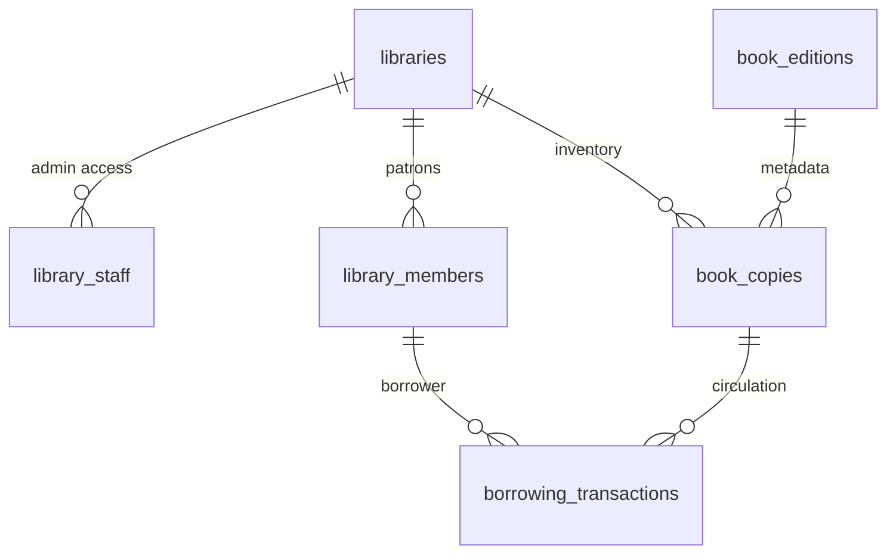

# Core Tables Overview

## Libraries
Primary tenant entities for multi-library support.

**Key Fields:**
- `id` (UUID): Primary key, tenant identifier
- `name` (TEXT): Library display name (e.g., "Brooklyn Public Library")
- `code` (TEXT): Unique identifier (e.g., "BPL-MAIN")
- `settings` (JSONB): Configuration object containing:
  - `loan_periods`: Default loan durations by item type
  - `fine_rates`: Overdue fine calculations
  - `policies`: Library-specific operational rules

**Row Level Security:** 
- Admin access enforced via `library_staff.library_id = libraries.id`
- Complete tenant isolation - no cross-library data access
- Real-time subscriptions automatically filtered by library context

## Book Copies
Physical inventory items with real-time availability tracking.

**Relationships:**
- `library_id` → `libraries.id` (enforces tenant scope)
- `book_edition_id` → `book_editions.id` (links to metadata)

**Real-time Events:**
- `availability` JSONB field changes trigger reader app sync
- Transaction updates automatically affect circulation status
- Optimistic updates supported for instant UI feedback

**Status Flow:**
available → checked_out → available (basic MVP)
available → checked_out → overdue → available (post-MVP)
```

**Database Relationship Diagram:**


**Implementation Commands:**
```bash