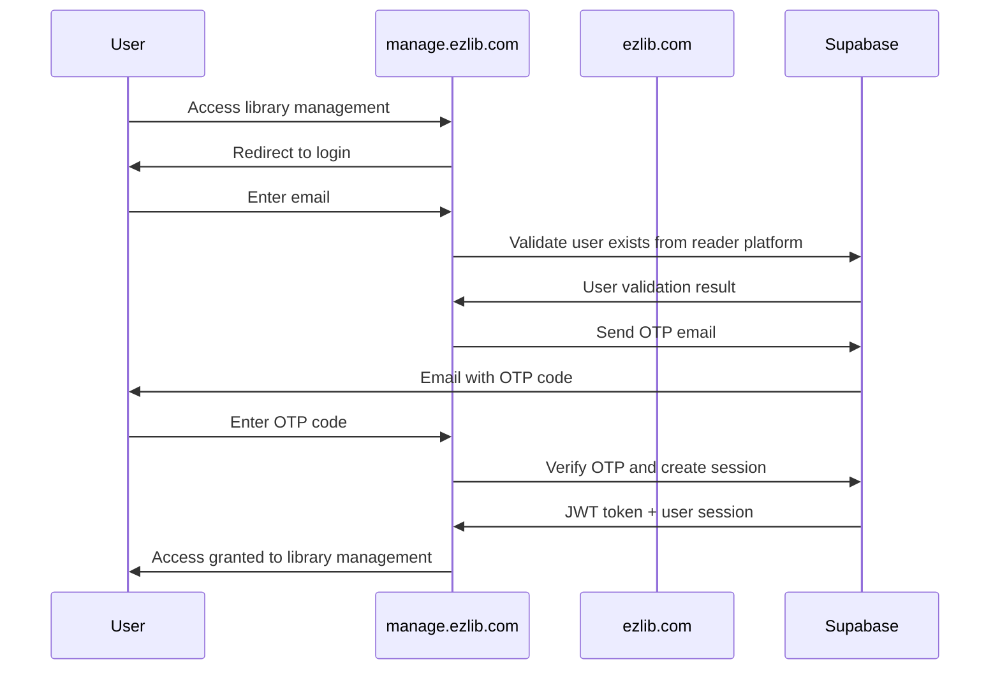

# Library Management App - Tech Stack

<!-- Powered by BMAD™ Core -->

## Overview

This document defines the complete technology stack for the **EzLib Library Management System**, focusing on the **ultra-simple MVP approach** with real-time synchronization capabilities and cross-domain authentication.

## Frontend Stack

### Core Framework

| Technology     | Version | Purpose                         | Rationale                                                                                  |
| -------------- | ------- | ------------------------------- | ------------------------------------------------------------------------------------------ |
| **Next.js**    | 14+     | React framework with App Router | Server-side rendering, optimal admin performance, built-in optimization, Vercel deployment |
| **React**      | 18+     | UI library                      | Component-based architecture, excellent ecosystem, team expertise                          |
| **TypeScript** | 5.0+    | Type safety                     | Strict mode, error prevention, developer productivity, maintainable codebase               |

### UI & Styling

| Technology        | Version | Purpose             | Rationale                                                                   |
| ----------------- | ------- | ------------------- | --------------------------------------------------------------------------- |
| **shadcn/ui**     | Latest  | Component system    | Professional admin interface, accessibility by default, highly customizable |
| **Radix UI**      | Latest  | Unstyled primitives | Accessibility foundation, keyboard navigation, ARIA support                 |
| **Tailwind CSS**  | 3.4+    | Utility-first CSS   | Rapid development, consistent design system, responsive by default          |
| **Lucide Icons**  | Latest  | Icon system         | Consistent iconography, tree-shakable, extensive library                    |
| **Framer Motion** | Latest  | Animation library   | Smooth transitions for admin workflows, loading states                      |

### State Management

| Technology          | Version | Purpose           | Rationale                                                                   |
| ------------------- | ------- | ----------------- | --------------------------------------------------------------------------- |
| **Zustand**         | Latest  | Client-side state | Lightweight, simple API, perfect for UI state management                    |
| **React Query**     | Latest  | Server state      | Optimized caching for admin operations, background updates, offline support |
| **React Hook Form** | Latest  | Form state        | Performance optimization, minimal re-renders, excellent DX                  |

### Form & Validation

| Technology          | Version | Purpose           | Rationale                                                            |
| ------------------- | ------- | ----------------- | -------------------------------------------------------------------- |
| **Zod**             | Latest  | Schema validation | Type-safe validation, runtime type checking, form integration        |
| **React Hook Form** | Latest  | Form management   | Performance focused, uncontrolled components, validation integration |

## Database & Backend

### Database

| Technology     | Version | Purpose             | Rationale                                                                             |
| -------------- | ------- | ------------------- | ------------------------------------------------------------------------------------- |
| **Supabase**   | Latest  | PostgreSQL BaaS     | Real-time subscriptions, Row Level Security, authentication, direct client connection |
| **PostgreSQL** | 15+     | Relational database | ACID compliance, JSON support, full-text search, scalability                          |

### Authentication

| Technology        | Version | Purpose                | Rationale                                                             |
| ----------------- | ------- | ---------------------- | --------------------------------------------------------------------- |
| **Supabase Auth** | Latest  | Authentication service | Passwordless OTP, JWT tokens, role-based access, cross-domain support |
| **NextAuth.js**   | Latest  | Session management     | Cross-domain session handling, provider integration                   |

### Real-time

| Technology            | Version | Purpose      | Rationale                                                                |
| --------------------- | ------- | ------------ | ------------------------------------------------------------------------ |
| **Supabase Realtime** | Latest  | Live updates | Inventory synchronization, WebSocket connections, automatic reconnection |

## Development Tools

### Build & Bundling

| Technology | Version | Purpose               | Rationale                                                       |
| ---------- | ------- | --------------------- | --------------------------------------------------------------- |
| **Turbo**  | Latest  | Monorepo build system | Fast builds, intelligent caching, optimized for monorepos       |
| **PNPM**   | Latest  | Package manager       | Fast installs, efficient disk usage, monorepo workspace support |
| **SWC**    | Latest  | JavaScript compiler   | Fast compilation, built into Next.js, better than Babel         |

### Code Quality

| Technology      | Version | Purpose                | Rationale                                             |
| --------------- | ------- | ---------------------- | ----------------------------------------------------- |
| **ESLint**      | Latest  | Code linting           | Code quality, consistency, best practices enforcement |
| **Prettier**    | Latest  | Code formatting        | Consistent formatting, automated style enforcement    |
| **Husky**       | Latest  | Git hooks              | Pre-commit quality checks, automated testing          |
| **lint-staged** | Latest  | Staged file processing | Only lint/format changed files                        |

### Testing

| Technology          | Version | Purpose           | Rationale                                                      |
| ------------------- | ------- | ----------------- | -------------------------------------------------------------- |
| **Jest**            | Latest  | Unit testing      | Comprehensive testing framework, snapshot testing, mocking     |
| **Testing Library** | Latest  | Component testing | User-focused testing, accessibility testing, React integration |
| **Playwright**      | Latest  | E2E testing       | Cross-browser testing, critical workflow validation            |
| **MSW**             | Latest  | API mocking       | Service mocking for tests, consistent API responses            |

## Deployment & Infrastructure

### Hosting

| Technology         | Version | Purpose          | Rationale                                                            |
| ------------------ | ------- | ---------------- | -------------------------------------------------------------------- |
| **Vercel**         | Latest  | Frontend hosting | Next.js optimization, edge caching, global CDN, seamless deployments |
| **Supabase Cloud** | Latest  | Backend hosting  | Managed PostgreSQL, auto-scaling, global edge network                |

### Monitoring

| Technology           | Version | Purpose        | Rationale                                                  |
| -------------------- | ------- | -------------- | ---------------------------------------------------------- |
| **Vercel Analytics** | Latest  | Web analytics  | Built-in performance monitoring, user insights             |
| **Sentry**           | Latest  | Error tracking | Real-time error monitoring, performance tracking, alerting |

## Integration Services

### Book Metadata

| Technology                | Version | Purpose                  | Rationale                                              |
| ------------------------- | ------- | ------------------------ | ------------------------------------------------------ |
| **EzLib Crawler Service** | Latest  | Book metadata enrichment | ISBN lookup, automated cataloging, FastAPI integration |

### Communication

| Technology | Version | Purpose             | Rationale                                                        |
| ---------- | ------- | ------------------- | ---------------------------------------------------------------- |
| **Resend** | Latest  | Transactional email | Reliable delivery, developer-friendly API, authentication emails |

## Development Environment

### Required Tools

| Tool             | Version | Purpose             | Installation                     |
| ---------------- | ------- | ------------------- | -------------------------------- |
| **Node.js**      | 18+     | JavaScript runtime  | [nodejs.org](https://nodejs.org) |
| **PNPM**         | 8+      | Package manager     | `npm install -g pnpm`            |
| **Supabase CLI** | Latest  | Database management | `npm install -g supabase`        |
| **Turbo CLI**    | Latest  | Monorepo management | `npm install -g turbo`           |
| **Git**          | Latest  | Version control     | System package manager           |

### Editor Setup

| Tool        | Purpose           | Extensions/Plugins                                      |
| ----------- | ----------------- | ------------------------------------------------------- |
| **VS Code** | Code editor       | TypeScript, Tailwind CSS IntelliSense, Prettier, ESLint |
| **Cursor**  | AI-powered editor | Built-in AI assistance, same extensions as VS Code      |

## Environment Configuration

### Required Environment Variables

```bash
# Next.js Configuration
NEXT_PUBLIC_SITE_URL=https://manage.ezlib.com
NEXT_PUBLIC_READER_APP_URL=https://ezlib.com

# Supabase Configuration
NEXT_PUBLIC_SUPABASE_URL=your-supabase-project-url
NEXT_PUBLIC_SUPABASE_ANON_KEY=your-supabase-anon-key
SUPABASE_SERVICE_ROLE_KEY=your-supabase-service-role-key

# Cross-Domain Authentication
NEXTAUTH_SECRET=your-nextauth-secret
NEXTAUTH_URL=https://manage.ezlib.com

# Book Crawler Integration
NEXT_PUBLIC_CRAWLER_API_URL=http://localhost:8000
CRAWLER_SERVICE_AUTH_SECRET=your-crawler-auth-secret

# Feature Flags (MVP Progression)
NEXT_PUBLIC_ENABLE_DUE_DATES=false
NEXT_PUBLIC_ENABLE_FINES=false
NEXT_PUBLIC_ENABLE_HOLDS=false
NEXT_PUBLIC_ENABLE_ADVANCED_SEARCH=false

# Real-time Updates
NEXT_PUBLIC_ENABLE_REALTIME=true
NEXT_PUBLIC_REALTIME_RETRY_ATTEMPTS=3

# Analytics & Monitoring
NEXT_PUBLIC_VERCEL_ANALYTICS_ID=your-analytics-id
SENTRY_DSN=your-sentry-dsn
SENTRY_ORG=your-sentry-org
SENTRY_PROJECT=library-management

# Development
NEXT_PUBLIC_DEBUG_MODE=false
```

## Package Dependencies

### Core Dependencies

```json
{
  "dependencies": {
    "@radix-ui/react-dialog": "^1.0.5",
    "@radix-ui/react-dropdown-menu": "^2.0.6",
    "@radix-ui/react-label": "^2.0.2",
    "@radix-ui/react-slot": "^1.0.2",
    "@radix-ui/react-toast": "^1.1.5",
    "@supabase/auth-helpers-nextjs": "^0.8.7",
    "@supabase/supabase-js": "^2.38.4",
    "@tanstack/react-query": "^5.8.4",
    "@tanstack/react-table": "^8.10.7",
    "class-variance-authority": "^0.7.0",
    "clsx": "^2.0.0",
    "framer-motion": "^10.16.5",
    "lucide-react": "^0.294.0",
    "next": "^14.0.3",
    "next-auth": "^4.24.5",
    "react": "^18.2.0",
    "react-dom": "^18.2.0",
    "react-hook-form": "^7.48.2",
    "sonner": "^1.2.4",
    "tailwind-merge": "^2.0.0",
    "tailwindcss-animate": "^1.0.7",
    "zod": "^3.22.4",
    "zustand": "^4.4.7"
  }
}
```

### Development Dependencies

```json
{
  "devDependencies": {
    "@hookform/resolvers": "^3.3.2",
    "@playwright/test": "^1.40.0",
    "@testing-library/jest-dom": "^6.1.4",
    "@testing-library/react": "^14.1.2",
    "@testing-library/user-event": "^14.5.1",
    "@types/node": "^20.9.0",
    "@types/react": "^18.2.37",
    "@types/react-dom": "^18.2.15",
    "@typescript-eslint/eslint-plugin": "^6.10.0",
    "@typescript-eslint/parser": "^6.10.0",
    "autoprefixer": "^10.4.16",
    "eslint": "^8.53.0",
    "eslint-config-next": "^14.0.3",
    "eslint-config-prettier": "^9.0.0",
    "husky": "^8.0.3",
    "jest": "^29.7.0",
    "jest-environment-jsdom": "^29.7.0",
    "lint-staged": "^15.0.2",
    "msw": "^2.0.8",
    "postcss": "^8.4.31",
    "prettier": "^3.0.3",
    "tailwindcss": "^3.3.5",
    "typescript": "^5.2.2"
  }
}
```

## Architecture Decisions

### Why Next.js 14+ App Router?

**Benefits:**

- **Server-Side Rendering**: Improved SEO and initial load performance
- **Built-in Optimization**: Image optimization, font optimization, bundle splitting
- **File-based Routing**: Intuitive routing with layouts and nested routes
- **API Routes**: Built-in API layer for server-side operations
- **Vercel Integration**: Seamless deployment and edge caching

**Trade-offs:**

- **Learning Curve**: New App Router patterns vs traditional routing
- **Bundle Size**: Larger initial bundle compared to pure React
- **Server Dependencies**: Requires Node.js server environment

### Why Supabase over Custom Backend?

**Benefits:**

- **Real-time Subscriptions**: Built-in WebSocket connections for inventory sync
- **Row Level Security**: Database-level multi-tenancy without custom logic
- **Authentication**: Passwordless OTP, JWT tokens, role-based access
- **Managed Infrastructure**: Auto-scaling, backups, monitoring included
- **Direct Client Connection**: No API layer needed, reduced latency

**Trade-offs:**

- **Vendor Lock-in**: Tied to Supabase ecosystem and pricing
- **Limited Customization**: Database functions limited to PostgreSQL
- **Cost Scaling**: Per-user pricing may become expensive at scale

### Why Zustand + React Query?

**Benefits:**

- **Separation of Concerns**: Client state vs server state clearly separated
- **Performance**: Minimal re-renders, selective subscriptions
- **Developer Experience**: Simple APIs, excellent TypeScript support
- **Caching Strategy**: Intelligent background updates and stale-while-revalidate

**Trade-offs:**

- **Learning Curve**: Two state management libraries vs single solution
- **Bundle Size**: Additional dependencies vs built-in React state

### Why shadcn/ui over Material-UI?

**Benefits:**

- **Customization**: Complete control over component styling and behavior
- **Bundle Size**: Tree-shakable, only include what you use
- **Design System**: Professional admin interface out of the box
- **Accessibility**: Built on Radix UI primitives with ARIA support

**Trade-offs:**

- **Component Library**: Smaller ecosystem vs mature Material-UI
- **Custom Styling**: More setup required vs theme-based customization

## Performance Considerations

### Bundle Optimization

```typescript
// Dynamic imports for large components
const ReportsPage = dynamic(() => import('@/components/reports/reports-page'), {
  loading: () => <PageSkeleton />,
  ssr: false
})

// Lazy loading for chart libraries
const ChartLibrary = dynamic(() => import('recharts'), {
  loading: () => <ChartSkeleton />
})
```

### Database Optimization

```sql
-- Indexes for common queries
CREATE INDEX idx_book_inventory_library_id ON book_inventory(library_id);
CREATE INDEX idx_book_inventory_status ON book_inventory((availability->>'status'));
CREATE INDEX idx_borrowing_transactions_library_status ON borrowing_transactions(library_id, status);

-- Full-text search indexes
CREATE INDEX idx_book_editions_title_search ON book_editions USING gin(to_tsvector('english', title));
CREATE INDEX idx_users_name_search ON users USING gin(to_tsvector('english', display_name));
```

### Real-time Optimization

```typescript
// Debounced updates for high-frequency changes
const debouncedInventoryUpdate = useMemo(
  () =>
    debounce((updates: InventoryUpdate[]) => {
      queryClient.setQueryData(["inventory", libraryId], updates);
    }, 100),
  [libraryId, queryClient]
);
```

## Security Considerations

### Authentication Flow



### Data Protection

- **Row Level Security**: All database operations filtered by library membership
- **JWT Validation**: Server-side token verification for all protected routes
- **HTTPS Everywhere**: All communication encrypted in transit
- **Input Sanitization**: All user inputs validated and sanitized
- **CORS Configuration**: Strict origin validation for cross-domain requests

## Upgrade Path

### MVP → Enhanced Features

```typescript
// Feature flag system for progressive enhancement
export const FEATURE_FLAGS = {
  DUE_DATES: process.env.NEXT_PUBLIC_ENABLE_DUE_DATES === 'true',
  FINES: process.env.NEXT_PUBLIC_ENABLE_FINES === 'true',
  HOLDS: process.env.NEXT_PUBLIC_ENABLE_HOLDS === 'true',
  ADVANCED_SEARCH: process.env.NEXT_PUBLIC_ENABLE_ADVANCED_SEARCH === 'true'
} as const

// Progressive component rendering
export function BookTable({ books }: BookTableProps) {
  return (
    <Table>
      <TableHeader>
        <TableRow>
          <TableHead>Title</TableHead>
          <TableHead>Author</TableHead>
          <TableHead>Status</TableHead>
          {FEATURE_FLAGS.DUE_DATES && <TableHead>Due Date</TableHead>}
          {FEATURE_FLAGS.FINES && <TableHead>Fine Amount</TableHead>}
        </TableRow>
      </TableHeader>
    </Table>
  )
}
```

This tech stack provides a **solid foundation** for the ultra-simple MVP while enabling **smooth progression** to advanced library management features. The choices prioritize **developer productivity**, **user experience**, and **operational reliability** for small library teams.
