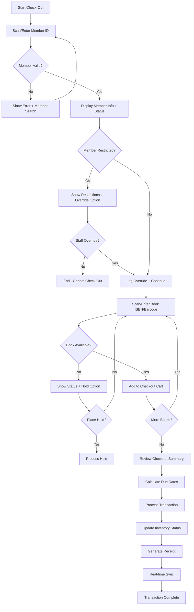
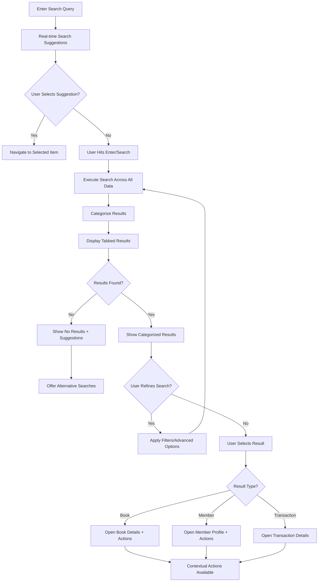

# EzLib Library Management System UI/UX Specification

## Introduction

This document defines the user experience goals, information architecture, user flows, and visual design specifications for **EzLib Library Management System**'s user interface. It serves as the foundation for visual design and frontend development, ensuring a cohesive and user-centered experience.

The specification focuses on the administrative web application (manage.ezlib.com) that enables library staff to efficiently manage operations for small-to-medium libraries serving up to 5,000 books and 1,000 members. The design emphasizes operational efficiency, real-time data synchronization, and intuitive workflows that minimize training time while providing comprehensive functionality.

### Overall UX Goals & Principles

#### Target User Personas

**Primary Librarian:** Front-line library staff member responsible for daily circulation operations, member assistance, and basic inventory management. Values efficiency, error prevention, and quick task completion. Typically performs 50-100+ transactions per day including check-outs, returns, and member lookups.

**Library Administrator:** Senior staff or library director who manages policies, generates reports, oversees member communications, and handles administrative functions. Needs comprehensive data access, batch operations capability, and strategic insights for library management and board reporting.

**Multi-Library Manager:** Administrative user who manages multiple library locations within a regional system. Requires seamless context switching between libraries, consolidated reporting, and consistent operational workflows across locations.

#### Usability Goals

- **Rapid Task Completion:** Common circulation tasks (check-out, check-in, member lookup) completed in under 30 seconds with minimal clicks
- **Learning Efficiency:** New staff members can perform basic operations within 15 minutes of system introduction
- **Error Prevention:** Clear validation, confirmation dialogs, and visual feedback prevent costly mistakes in inventory and member management
- **Operational Confidence:** Real-time status updates and audit trails ensure staff trust in data accuracy and system reliability
- **Context Preservation:** System maintains user context and workflow state across interruptions and multi-tasking scenarios

#### Design Principles

1. **Dashboard-First Efficiency** - All critical information and actions accessible from primary dashboard; minimize navigation depth for frequent operations
2. **Search-Driven Discovery** - Prominent, intelligent search functionality with autocomplete and filtering across all data types
3. **Real-Time Transparency** - Live status indicators, instant updates, and clear synchronization status build operational confidence
4. **Contextual Simplicity** - Progressive disclosure shows relevant information and actions based on current selection and user permissions
5. **Accessible Professionalism** - Clean, library-appropriate aesthetics that meet WCAG AA standards and support extended screen usage

#### Change Log
| Date | Version | Description | Author |
|------|---------|-------------|--------|
| 2024-08-24 | 1.0 | Initial UI/UX specification creation | Sally (UX Expert) |

## Information Architecture (IA)

### Site Map / Screen Inventory

```mermaid
graph TD
    A[Login/Auth] --> B[Dashboard]
    B --> C[Library Selector]
    B --> D[Inventory Management]
    B --> E[Member Directory] 
    B --> F[Circulation Desk]
    B --> G[Reports Center]
    B --> H[System Settings]
    B --> I[Global Search]
    
    D --> D1[Book List/Grid]
    D --> D2[Add New Book]
    D --> D3[Book Details/Edit]
    D --> D4[Bulk Operations]
    
    E --> E1[Member List]
    E --> E2[Member Registration]
    E --> E3[Member Profile/History]
    E --> E4[Member Communications]
    
    F --> F1[Check-Out Interface]
    F --> F2[Check-In/Returns]
    F --> F3[Renewals]
    F --> F4[Holds Management]
    F --> F5[Overdue Processing]
    
    G --> G1[Standard Reports]
    G --> G2[Analytics Dashboard]
    G --> G3[Custom Reports]
    G --> G4[Export Center]
    
    H --> H1[Library Policies]
    H --> H2[Staff Management]
    H --> H3[System Configuration]
    H --> H4[Audit Logs]
    
    I --> I1[Search Results]
    I --> I2[Advanced Filters]
```

### Navigation Structure

**Primary Navigation:** Fixed sidebar with collapsible sections for main functional areas (Dashboard, Inventory, Members, Circulation, Reports, Settings). Each section expands to show secondary options on hover/click. Library context switcher positioned prominently in header.

**Secondary Navigation:** Contextual tabs within each primary section (e.g., within Inventory: All Books, New Acquisitions, Needs Processing). Breadcrumb navigation shows current location and library context. Quick action floating buttons for frequent tasks within each section.

**Breadcrumb Strategy:** Always visible breadcrumb trail showing: Library Name > Primary Section > Subsection > Current Item. Clickable path elements enable quick navigation up the hierarchy while maintaining context awareness.

## User Flows

### Book Check-Out Flow

**User Goal:** Process book check-out for library member quickly and accurately while ensuring proper inventory tracking

**Entry Points:** Circulation Desk dashboard, Global search results, Member profile page

**Success Criteria:** Book successfully checked out, due date assigned, inventory updated, receipt generated, real-time sync completed

#### Flow Diagram

#### Edge Cases & Error Handling:
- Member has overdue items - display warning but allow checkout with staff discretion
- Book is damaged or needs repair - prevent checkout and show alternate copies
- Hold queue exists for book - process hold fulfillment automatically
- Network connectivity issues - queue transaction for sync when connection restored
- Scanner malfunction - provide manual entry with ISBN validation
- Multiple copies available - automatically select available copy closest to circulation desk

**Notes:** This flow prioritizes speed for routine operations while providing clear decision points for edge cases. The system maintains context if staff need to switch between members or resolve issues mid-transaction.

### Global Search and Discovery Flow

**User Goal:** Find books, members, or transactions quickly using the global search interface

**Entry Points:** Global search bar (always visible), dedicated search page, dashboard quick search

**Success Criteria:** User finds target item within 3 search attempts, results load within 2 seconds, clear next actions available

#### Flow Diagram

#### Edge Cases & Error Handling:
- Search query too short - show helpful message with minimum character requirement
- Network delay - show loading indicator and allow query cancellation
- Large result sets - implement pagination with clear navigation
- Ambiguous search terms - offer search refinement suggestions
- Special characters or ISBN format - automatically detect and format queries
- No results found - suggest alternative spellings, broader terms, or different categories

**Notes:** Search results prioritize exact matches first, then partial matches, with recent items getting slight ranking boost. The interface maintains search context when users navigate to details and return.

## Wireframes & Mockups

**Primary Design Files:** Will be created in Figma workspace - [Link to be added when design files are created]

### Key Screen Layouts

#### Dashboard (Main Landing)

**Purpose:** Provide at-a-glance operational overview and quick access to frequent tasks

**Key Elements:**
- **Header Bar**: Library selector dropdown, global search, user profile, notifications
- **Quick Stats Cards**: Today's checkouts, pending returns, overdue items, new members
- **Action Shortcuts**: Large buttons for Check-Out, Check-In, Add Member, Add Book
- **Recent Activity Feed**: Live stream of transactions and system events
- **At-a-Glance Widgets**: Holds awaiting pickup, items needing processing, staff alerts
- **Navigation Sidebar**: Collapsible menu with all major sections and secondary options

**Interaction Notes:** Dashboard widgets are draggable/customizable based on staff role. Quick stats are clickable to drill into detailed views. Recent activity supports real-time updates with smooth animations.

**Design File Reference:** [Figma Frame: Dashboard-Main to be created]

#### Circulation Desk Workspace

**Purpose:** Streamlined interface optimized for high-frequency check-out/check-in operations

**Key Elements:**
- **Dual-Panel Layout**: Left panel for member info, right panel for book scanning/cart
- **Member Search/Display**: Large member ID input with instant lookup and status display
- **Transaction Cart**: Running list of books being processed with remove/modify options
- **Quick Actions Bar**: One-click buttons for common operations (hold processing, renewals)
- **Status Indicators**: Real-time sync status, printer connection, scanner status
- **Transaction History**: Expandable recent transactions for quick reference/reversal

**Interaction Notes:** Interface supports rapid keyboard navigation and barcode scanner input. Visual feedback confirms each scanned item. Error states are prominent but non-blocking.

**Design File Reference:** [Figma Frame: Circulation-Workspace to be created]

#### Book Inventory Management

**Purpose:** Comprehensive view and management of library book collection

**Key Elements:**
- **Advanced Filter Sidebar**: Genre, availability, acquisition date, condition filters
- **Book Grid/List Toggle**: Switchable views with cover thumbnails or detailed rows
- **Bulk Action Toolbar**: Multi-select with batch operations (update, export, communicate)
- **Book Detail Modal**: Full metadata display with inline editing capabilities
- **Add Book Wizard**: Step-by-step book addition with ISBN lookup integration
- **Sort/Search Controls**: Multiple sort options with persistent user preferences

**Interaction Notes:** Supports both power-user keyboard shortcuts and mouse-driven workflows. Book details open in modal to maintain list context. Bulk selection uses standard checkbox patterns.

**Design File Reference:** [Figma Frame: Inventory-Management to be created]

## Component Library / Design System

**Design System Approach:** Build custom component library using shadcn/ui as foundation, extending with library-specific components and patterns.

### Core Components

#### SearchBar Component

**Purpose:** Consistent global search functionality across all screens

**Variants:** Header compact, page full-width, modal embedded

**States:** Default, focused, loading, results-showing, error

**Usage Guidelines:** Always include keyboard shortcuts (Ctrl+K), support autocomplete, maintain search history

#### StatusIndicator Component

**Purpose:** Display real-time status for books, members, transactions, and system sync

**Variants:** Availability (available, checked-out, overdue, on-hold), Member (active, suspended, restricted), System (synced, syncing, offline)

**States:** Default, updating, error, warning

**Usage Guidelines:** Use consistent color coding, include hover tooltips for additional context

#### ActionButton Component

**Purpose:** Primary action buttons for frequent operations

**Variants:** Primary (check-out, check-in), Secondary (hold, renew), Danger (delete, override)

**States:** Default, hover, active, loading, disabled

**Usage Guidelines:** Include loading states for async operations, provide clear confirmation for destructive actions

## Branding & Style Guide

**Brand Guidelines:** Professional library aesthetic following shadcn/ui design language and Tailwind CSS conventions

### Color Palette (shadcn/ui Theme)

| Color Type | CSS Variable | Tailwind Class | Usage |
|------------|--------------|----------------|-------|
| Primary | hsl(var(--primary)) | bg-primary, text-primary | Primary actions, CTA buttons |
| Primary Foreground | hsl(var(--primary-foreground)) | text-primary-foreground | Text on primary backgrounds |
| Secondary | hsl(var(--secondary)) | bg-secondary | Secondary buttons, subtle backgrounds |
| Muted | hsl(var(--muted)) | bg-muted | Card backgrounds, disabled states |
| Success | hsl(142.1 76.2% 36.3%) | text-green-600 | Available books, successful operations |
| Destructive | hsl(var(--destructive)) | text-destructive | Errors, overdue items, delete actions |
| Warning | hsl(38 92% 50%) | text-amber-500 | Overdue warnings, important notices |
| Border | hsl(var(--border)) | border | Default borders |
| Accent | hsl(var(--accent)) | bg-accent | Hover states, subtle highlights |

### Typography (Tailwind CSS Classes)

#### Font Families
- **Primary:** Default shadcn/ui font stack (Inter/system fonts)
- **Monospace:** `font-mono` for IDs, ISBNs, technical data

#### Type Scale (Tailwind Classes)
| Element | Tailwind Class | Usage |
|---------|----------------|-------|
| Display | `text-4xl font-bold` | Page titles, major headings |
| H1 | `text-3xl font-semibold` | Section headings |
| H2 | `text-2xl font-semibold` | Subsection headings |
| H3 | `text-xl font-medium` | Component titles |
| H4 | `text-lg font-medium` | Card headers |
| Body | `text-base` | Default body text |
| Small | `text-sm` | Captions, secondary info |
| Tiny | `text-xs` | Labels, metadata |

### Iconography

**Icon Library:** Lucide React (default shadcn/ui icon library)

**Usage Guidelines:** 
- Small icons: `size={16}` (`w-4 h-4`)
- Medium icons: `size={20}` (`w-5 h-5`) 
- Large icons: `size={24}` (`w-6 h-6`)

### Spacing & Layout (Tailwind CSS)

**Spacing Scale:** Tailwind's default scale (0, 1, 2, 3, 4, 5, 6, 8, 10, 12, 16, 20, 24, 32, 40, 48, 56, 64)
- `p-4` (16px), `m-6` (24px), `gap-8` (32px), etc.

**Grid System:** CSS Grid with Tailwind utilities
- `grid`, `grid-cols-12`, `col-span-*`, `gap-*`

**Component Spacing:** Follow shadcn/ui component spacing conventions

## Accessibility Requirements

### Compliance Target
**Standard:** WCAG 2.1 AA compliance for all interfaces

### Key Requirements

**Visual:**
- Color contrast ratios: 4.5:1 minimum for normal text, 3:1 for large text
- Focus indicators: Visible 2px outline with high contrast
- Text sizing: Responsive text that scales to 200% without horizontal scrolling

**Interaction:**
- Keyboard navigation: Full functionality available via keyboard
- Screen reader support: Semantic HTML, proper ARIA labels, live regions for updates
- Touch targets: Minimum 44px for all interactive elements

**Content:**
- Alternative text: Descriptive alt text for all images and icons
- Heading structure: Logical h1-h6 hierarchy for screen readers
- Form labels: Explicit labels for all form inputs with error messaging

### Testing Strategy
Regular accessibility audits using axe-core, manual keyboard testing, and screen reader validation with NVDA/JAWS

## Responsiveness Strategy

### Breakpoints
| Breakpoint | Min Width | Max Width | Target Devices |
|------------|-----------|-----------|----------------|
| Mobile | 320px | 767px | Phones (limited functionality) |
| Tablet | 768px | 1023px | iPads, circulation desk tablets |
| Desktop | 1024px | 1439px | Standard library workstations |
| Wide | 1440px | - | Large monitors, multi-display setups |

### Adaptation Patterns

**Layout Changes:** Sidebar collapses to drawer on tablet/mobile, dashboard switches to single-column

**Navigation Changes:** Bottom tab bar on mobile, full sidebar on desktop

**Content Priority:** Hide secondary information on smaller screens, focus on core actions

**Interaction Changes:** Touch-friendly targets on tablet, keyboard shortcuts prominent on desktop

## Next Steps

### Immediate Actions
1. Create Figma workspace and initial component library
2. Begin Epic 1 implementation using this specification as foundation
3. Set up design system in codebase with shadcn/ui + custom components
4. Establish responsive breakpoints and accessibility testing workflow

### Design Handoff Checklist
- [x] All user flows documented
- [x] Component inventory complete (essential components)
- [x] Accessibility requirements defined
- [x] Responsive strategy clear
- [x] Brand guidelines incorporated
- [x] Performance goals established

## Working Draft Status
This specification provides sufficient foundation to begin development. Detailed wireframes, additional components, and refined visual designs will be iterated during Epic 1-2 implementation based on user feedback and technical constraints.
