# EzLib Library Management System UI/UX Specification

## Introduction

This document defines the user experience goals, information architecture, user flows, and visual design specifications for **EzLib Library Management System**'s user interface. It serves as the foundation for visual design and frontend development, ensuring a cohesive and user-centered experience.

The specification focuses on the **ultra-simple MVP** administrative web application (manage.ezlib.com) that enables library staff to transition from manual/spreadsheet systems to digital operations in a single day. **Phase 1 MVP** deliberately excludes due dates, fines, holds, and advanced features to prioritize rapid deployment and real-world usage learning. The design emphasizes "ship fast, iterate based on real usage" with only the 4 essential operations: add books, register members, checkout, and return.

### Overall UX Goals & Principles

#### Target User Personas

**Primary Librarian:** Front-line library staff member responsible for daily circulation operations, member assistance, and basic inventory management. Values efficiency, error prevention, and quick task completion. Typically performs 50-100+ transactions per day including check-outs, returns, and member lookups.

**Library Administrator:** Senior staff or library director who manages policies, generates reports, oversees member communications, and handles administrative functions. Needs comprehensive data access, batch operations capability, and strategic insights for library management and board reporting.

**Multi-Library Manager:** Administrative user who manages multiple library locations within a regional system. Requires seamless context switching between libraries, consolidated reporting, and consistent operational workflows across locations.

#### Usability Goals

- **Rapid Task Completion:** Common circulation tasks (check-out, check-in, member lookup) completed in under 30 seconds with minimal clicks
- **Learning Efficiency:** New staff members can perform basic operations within 15 minutes of system introduction
- **Error Prevention:** Clear validation, confirmation dialogs, and visual feedback prevent costly mistakes in inventory and member management
- **Operational Confidence:** Real-time status updates and audit trails ensure staff trust in data accuracy and system reliability
- **Context Preservation:** System maintains user context and workflow state across interruptions and multi-tasking scenarios

#### Design Principles

1. **Ultra-Simple First** - Start with basic functionality only; add complexity incrementally based on real library staff feedback
2. **Circulation Hub Centrality** - All patron-facing operations unified in single workspace to eliminate navigation during busy periods
3. **Search-Driven Everything** - Prominent search functionality embedded in workflows, not separate sections
4. **Real-Time Confidence** - Immediate visual feedback for all actions with live inventory synchronization
5. **Ship Fast, Learn Fast** - Rapid deployment over feature completeness; design for iteration based on actual usage patterns

#### Change Log

| Date       | Version | Description                          | Author            |
| ---------- | ------- | ------------------------------------ | ----------------- |
| 2024-08-24 | 1.0     | Initial UI/UX specification creation | Sally (UX Expert) |
| 2024-08-26 | 1.1     | Updated to ultra-simple MVP approach | Sally (UX Expert) |

## Information Architecture (IA)

### Site Map / Screen Inventory (MVP Phase 1)

```mermaid
graph TD
    A[Login/Auth] --> B[📊 Dashboard]
    B --> C[🔄 Circulation Hub]
    B --> D[📚 Management]
    B --> E[⚙️ Admin]

    C --> C1[📤 Quick Checkout]
    C --> C2[📥 Quick Return]
    C --> C3[📋 Current Transactions]
    C --> C4[➕ Register New Member]

    D --> D1[📖 Book Inventory]
    D --> D2[➕ Add New Book]
    D --> D3[👥 Member Directory]

    E --> E1[🏢 Library Settings]
    E --> E2[👨‍💼 Staff Management]

    style C fill:#e1f5fe
    style C1 fill:#f3e5f5
    style C2 fill:#f3e5f5
    style C3 fill:#f3e5f5
    style C4 fill:#f3e5f5
```



### ❌ POST-MVP Features (Deliberately Excluded)

- Due dates & overdue processing
- Fines & fee management
- Holds & reservation system
- Renewals management
- Reports & analytics
- Advanced search & filtering
- Bulk operations
- Member communications
- Audit logs

### Navigation Structure

**Primary Navigation:** Simple 4-section navigation optimized for workflow-based operations:

- **Dashboard** - Operational overview and quick stats
- **Circulation Hub** - Unified checkout/return workspace (primary interface)
- **Management** - Book inventory and member directory (batch operations)
- **Admin** - Library settings and staff management

**Secondary Navigation:** Minimal tabs within sections. **Circulation Hub** is designed as single-screen workspace to eliminate navigation during patron transactions. **Management** section uses simple list/add toggles.

**Breadcrumb Strategy:** Simple path: Library Name > Section > Current Item. **No deep nesting** in MVP to maintain ultra-simple navigation patterns.

## User Flows

### MVP Book Check-Out Flow (Ultra-Simple)

**User Goal:** Process book check-out in under 15 seconds with minimal clicks

**Entry Points:** Circulation Hub only (unified workspace)

**Success Criteria:** Book successfully checked out, inventory updated, real-time sync completed. **NO due dates in MVP** - focus on basic transaction tracking only.

#### Flow Diagram

```mermaid
graph TD
    A[Start Check-Out] --> B[Search/Select Member]
    B --> C{Member Found?}
    C -->|No| D[Quick Register New Member]
    D --> E[Member Selected]
    C -->|Yes| E
    E --> F[Search/Scan Book]
    F --> G{Book Available?}
    G -->|No| H[Show "Not Available" + Try Another]
    H --> F
    G -->|Yes| I[One-Click CHECK OUT]
    I --> J[Update Inventory Status]
    J --> K[Real-time Sync]
    K --> L[Transaction Complete - Ready for Next]

    style I fill:#4caf50,color:#fff
    style L fill:#e8f5e8
```

#### MVP Edge Cases & Error Handling:

- Member not found - provide quick "Register New Member" option without leaving checkout flow
- Book not available - simple "Not Available" message with "Try Another Book" action
- Network connectivity issues - queue transaction for sync when connection restored
- Scanner malfunction - provide manual entry with title/author search
- Multiple copies available - automatically select first available copy

**Notes:** MVP deliberately eliminates complex edge cases (overdue items, holds, restrictions) to prioritize speed and simplicity. Staff can complete most transactions in 3 clicks: Member → Book → Checkout.

### Embedded Search Flow (MVP)

**User Goal:** Find books, members, or transactions quickly using the global search interface

**Entry Points:** Global search bar (always visible), dedicated search page, dashboard quick search

**Success Criteria:** User finds target item within 3 search attempts, results load within 2 seconds, clear next actions available

#### Flow Diagram


#### Edge Cases & Error Handling:

- Search query too short - show helpful message with minimum character requirement
- Network delay - show loading indicator and allow query cancellation
- Large result sets - implement pagination with clear navigation
- Ambiguous search terms - offer search refinement suggestions
- Special characters or ISBN format - automatically detect and format queries
- No results found - suggest alternative spellings, broader terms, or different categories

**Notes:** Search results prioritize exact matches first, then partial matches, with recent items getting slight ranking boost. The interface maintains search context when users navigate to details and return.

## Wireframes & Mockups

**Primary Design Files:** Will be created in Figma workspace - [Link to be added when design files are created]

### Key Screen Layouts

#### Dashboard (MVP Landing)

**Purpose:** Simple operational overview and direct access to Circulation Hub

**Key Elements:**

- **Header Bar**: Library name, user profile, simple navigation
- **Quick Stats Cards**: Today's checkouts, returns, total active members (basic counts only)
- **Primary Action**: Large "Go to Circulation Hub" button (primary workflow)
- **Secondary Actions**: "Add New Book", "Register Member" (management tasks)
- **Recent Activity**: Simple list of last 5 transactions

**MVP Simplifications:**

- ❌ No overdue items (no due dates yet)
- ❌ No holds awaiting pickup (no holds system yet)
- ❌ No customizable widgets (fixed layout)
- ❌ No complex notifications (basic status only)

**Interaction Notes:** Dashboard serves as simple "mission control" with direct path to primary Circulation Hub workflow. Focus on getting staff into operational flow quickly.

**Design File Reference:** [Figma Frame: Dashboard-MVP to be created]

#### Circulation Hub (MVP Primary Workspace)

**Purpose:** Unified interface for all patron transactions - checkout and return in single screen

**Key Elements:**

- **Split Interface**: "Checkout" and "Return" sections side-by-side or tabbed
- **Member Search**: Prominent search box with instant results (embedded, not separate page)
- **Book Search**: Prominent search box with availability status (embedded, not separate page)
- **One-Click Actions**: Large "CHECK OUT" and "RETURN" buttons
- **Current Transaction Display**: Shows selected member and book(s) before confirming
- **Status Indicators**: Simple "Available"/"Checked Out" status only

**MVP Simplifications:**

- ❌ No transaction cart (one book at a time initially)
- ❌ No hold processing (no holds system)
- ❌ No renewals (no due dates)
- ❌ No transaction history (focus on current transaction)
- ❌ No printer integration (receipt optional)

**Interaction Notes:** Staff never leave this screen during patron interactions. All search and actions embedded to eliminate navigation delays.

**Design File Reference:** [Figma Frame: Circulation-Hub-MVP to be created]

#### Book Management (MVP Simplified)

**Purpose:** Basic book inventory with simple add/edit capabilities

**Key Elements:**

- **Simple Book List**: Title, author, status (Available/Checked Out) only
- **Basic Search**: Search by title or author (no advanced filters)
- **Add Book Form**: Simple form with Title, Author, ISBN (optional auto-populate)
- **Status Toggle**: Click to mark book as "Available" or "Not Available"

**MVP Simplifications:**

- ❌ No advanced filters (genre, acquisition date, condition)
- ❌ No grid view (simple list only)
- ❌ No bulk operations (one book at a time)
- ❌ No detailed metadata (basic info only)
- ❌ No cover thumbnails (text-only list)
- ❌ No sorting options (simple alphabetical)

**Interaction Notes:** Focus on basic CRUD operations - add books quickly, see current status, edit basic info. Used during "management time" not "circulation time".

**Design File Reference:** [Figma Frame: Book-Management-MVP to be created]

## Component Library / Design System

**Design System Approach:** Build custom component library using shadcn/ui as foundation, extending with library-specific components and patterns.

### Core Components

#### SearchBar Component

**Purpose:** Consistent global search functionality across all screens

**Variants:** Header compact, page full-width, modal embedded

**States:** Default, focused, loading, results-showing, error

**Usage Guidelines:** Always include keyboard shortcuts (Ctrl+K), support autocomplete, maintain search history

#### StatusIndicator Component

**Purpose:** Display real-time status for books, members, transactions, and system sync

**Variants:** Availability (available, checked-out, overdue, on-hold), Member (active, suspended, restricted), System (synced, syncing, offline)

**States:** Default, updating, error, warning

**Usage Guidelines:** Use consistent color coding, include hover tooltips for additional context

#### ActionButton Component

**Purpose:** Primary action buttons for frequent operations

**Variants:** Primary (check-out, check-in), Secondary (hold, renew), Danger (delete, override)

**States:** Default, hover, active, loading, disabled

**Usage Guidelines:** Include loading states for async operations, provide clear confirmation for destructive actions

## Branding & Style Guide

**Brand Guidelines:** Professional library aesthetic following shadcn/ui design language and Tailwind CSS conventions

### Color Palette (shadcn/ui Theme)

| Color Type         | CSS Variable                   | Tailwind Class           | Usage                                  |
| ------------------ | ------------------------------ | ------------------------ | -------------------------------------- |
| Primary            | hsl(var(--primary))            | bg-primary, text-primary | Primary actions, CTA buttons           |
| Primary Foreground | hsl(var(--primary-foreground)) | text-primary-foreground  | Text on primary backgrounds            |
| Secondary          | hsl(var(--secondary))          | bg-secondary             | Secondary buttons, subtle backgrounds  |
| Muted              | hsl(var(--muted))              | bg-muted                 | Card backgrounds, disabled states      |
| Success            | hsl(142.1 76.2% 36.3%)         | text-green-600           | Available books, successful operations |
| Destructive        | hsl(var(--destructive))        | text-destructive         | Errors, overdue items, delete actions  |
| Warning            | hsl(38 92% 50%)                | text-amber-500           | Overdue warnings, important notices    |
| Border             | hsl(var(--border))             | border                   | Default borders                        |
| Accent             | hsl(var(--accent))             | bg-accent                | Hover states, subtle highlights        |

### Typography (Tailwind CSS Classes)

#### Font Families

- **Primary:** Default shadcn/ui font stack (Inter/system fonts)
- **Monospace:** `font-mono` for IDs, ISBNs, technical data

#### Type Scale (Tailwind Classes)

| Element | Tailwind Class           | Usage                       |
| ------- | ------------------------ | --------------------------- |
| Display | `text-4xl font-bold`     | Page titles, major headings |
| H1      | `text-3xl font-semibold` | Section headings            |
| H2      | `text-2xl font-semibold` | Subsection headings         |
| H3      | `text-xl font-medium`    | Component titles            |
| H4      | `text-lg font-medium`    | Card headers                |
| Body    | `text-base`              | Default body text           |
| Small   | `text-sm`                | Captions, secondary info    |
| Tiny    | `text-xs`                | Labels, metadata            |

### Iconography

**Icon Library:** Lucide React (default shadcn/ui icon library)

**Usage Guidelines:**

- Small icons: `size={16}` (`w-4 h-4`)
- Medium icons: `size={20}` (`w-5 h-5`)
- Large icons: `size={24}` (`w-6 h-6`)

### Spacing & Layout (Tailwind CSS)

**Spacing Scale:** Tailwind's default scale (0, 1, 2, 3, 4, 5, 6, 8, 10, 12, 16, 20, 24, 32, 40, 48, 56, 64)

- `p-4` (16px), `m-6` (24px), `gap-8` (32px), etc.

**Grid System:** CSS Grid with Tailwind utilities

- `grid`, `grid-cols-12`, `col-span-*`, `gap-*`

**Component Spacing:** Follow shadcn/ui component spacing conventions

## Accessibility Requirements

### Compliance Target

**Standard:** WCAG 2.1 AA compliance for all interfaces

### Key Requirements

**Visual:**

- Color contrast ratios: 4.5:1 minimum for normal text, 3:1 for large text
- Focus indicators: Visible 2px outline with high contrast
- Text sizing: Responsive text that scales to 200% without horizontal scrolling

**Interaction:**

- Keyboard navigation: Full functionality available via keyboard
- Screen reader support: Semantic HTML, proper ARIA labels, live regions for updates
- Touch targets: Minimum 44px for all interactive elements

**Content:**

- Alternative text: Descriptive alt text for all images and icons
- Heading structure: Logical h1-h6 hierarchy for screen readers
- Form labels: Explicit labels for all form inputs with error messaging

### Testing Strategy

Regular accessibility audits using axe-core, manual keyboard testing, and screen reader validation with NVDA/JAWS

## Responsiveness Strategy

### Breakpoints

| Breakpoint | Min Width | Max Width | Target Devices                       |
| ---------- | --------- | --------- | ------------------------------------ |
| Mobile     | 320px     | 767px     | Phones (limited functionality)       |
| Tablet     | 768px     | 1023px    | iPads, circulation desk tablets      |
| Desktop    | 1024px    | 1439px    | Standard library workstations        |
| Wide       | 1440px    | -         | Large monitors, multi-display setups |

### Adaptation Patterns

**Layout Changes:** Sidebar collapses to drawer on tablet/mobile, dashboard switches to single-column

**Navigation Changes:** Bottom tab bar on mobile, full sidebar on desktop

**Content Priority:** Hide secondary information on smaller screens, focus on core actions

**Interaction Changes:** Touch-friendly targets on tablet, keyboard shortcuts prominent on desktop

## Next Steps

### Immediate Actions

1. **MVP Implementation Focus**: Begin with ultra-simple 4-operation interface
2. Set up design system in codebase with shadcn/ui + minimal custom components
3. Build Circulation Hub as primary interface (80% of usage)
4. Create simple book/member management screens for basic CRUD
5. **Skip Figma initially** - prototype directly in code for faster iteration
6. Deploy MVP for real library staff testing within 2 weeks

### MVP Implementation Checklist

- [x] Ultra-simple user flows documented (checkout, return, add book, add member)
- [x] Essential component inventory (SearchBar, StatusIndicator, ActionButton)
- [x] Accessibility requirements defined (WCAG 2.1 AA)
- [x] Responsive strategy clear (tablet-optimized)
- [x] MVP scope clearly defined (no due dates, holds, fines)
- [ ] Circulation Hub wireframe completed
- [ ] Basic CRUD interfaces designed
- [ ] Real library staff identified for testing

## MVP Implementation Status

This specification has been **updated to focus on ultra-simple MVP launch**. The original comprehensive features (holds, due dates, fines, reports) are documented but **deliberately excluded from Phase 1**.

**Next Phase Strategy:**

- **Phase 1 (MVP)**: 4 core operations only - ship in 2-3 weeks
- **Phase 2**: Add due dates based on real library feedback
- **Phase 3**: Add holds system if libraries actually request it
- **Phase 4**: Add reporting/analytics based on actual usage patterns

This "ship fast, iterate based on real usage" approach ensures we build what library staff actually need, not what we think they need.
