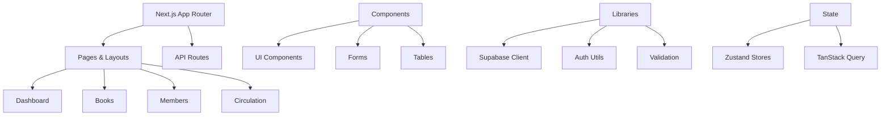
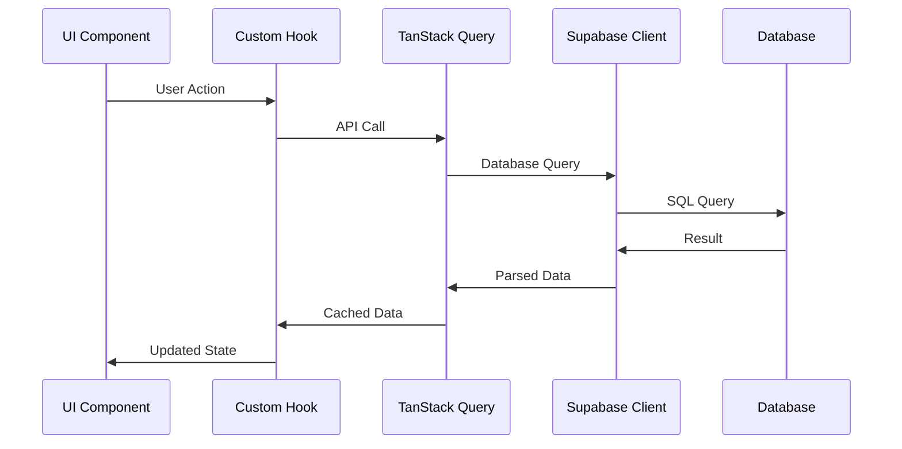
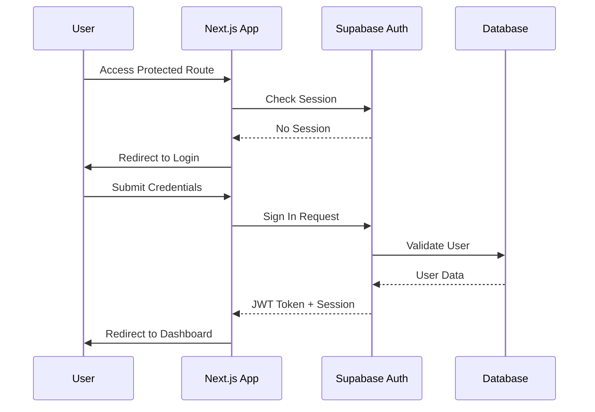

# Library Management System - Frontend Architecture

<!-- Powered by BMAD™ Core -->

## Change Log

| Date       | Version | Description                                                        | Author              |
| ---------- | ------- | ------------------------------------------------------------------ | ------------------- |
| 2025-08-28 | 2.0     | Complete rewrite to match actual monolithic Next.js implementation | Winston (Architect) |
| 2025-08-25 | 1.0     | Initial fictional architecture (superseded)                        | BMad Orchestrator   |

## Introduction

This document defines the **actual frontend architecture** for the **Library Management System**, a **monolithic Next.js 15 application** with Supabase authentication and shadcn/ui components. This is a single standalone application serving library staff operations.

### Architecture Reality

- **Pattern**: Monolithic Frontend Application
- **Framework**: Next.js 15.5.2 with App Router
- **Authentication**: Direct Supabase client integration
- **UI System**: shadcn/ui with Radix UI primitives
- **Styling**: Tailwind CSS v4
- **State**: Zustand + TanStack Query pattern (planned)

## Current Implementation State

### What Actually Exists ✅

**Core Framework Setup:**

- Next.js 15.5.2 with App Router configured
- React 19.1.0 with concurrent features
- TypeScript 5+ with strict mode enabled
- Root layout with Geist fonts

**UI Component System:**

- shadcn/ui components properly installed
- Radix UI primitives configured
- Tailwind CSS v4 with utility classes
- Component variants with class-variance-authority

**Development Tooling:**

- ESLint 9 with Next.js configuration
- Prettier 3.6.2 with consistent formatting
- Husky git hooks with lint-staged
- PNPM package management

**Form Handling:**

- React Hook Form 7.62.0
- Zod 4.1.3 validation schemas
- @hookform/resolvers integration

### What Needs Implementation 🚧

**Authentication System:**

- Supabase client configuration
- Auth routes and protected pages
- User session management
- Permission-based access control

**Application Pages:**

- Dashboard with navigation
- Book management CRUD
- Member management CRUD
- Circulation workflows
- Settings and configuration

**State Management:**

- Zustand stores for client state
- TanStack Query for server state
- Real-time subscriptions

**Business Logic:**

- API integration utilities
- Form validation schemas
- Custom React hooks
- Error handling patterns

## Architecture Patterns

### Monolithic Application Structure



### Component Architecture

**Layered Component Structure:**

1. **Page Components** (`src/app/`) - Route-level components
2. **Layout Components** (`src/components/layout/`) - Navigation, headers, sidebars
3. **Feature Components** (`src/components/forms/`, `src/components/tables/`) - Domain-specific
4. **UI Components** (`src/components/ui/`) - Reusable shadcn/ui primitives
5. **Provider Components** (`src/components/providers/`) - Context providers

### Data Flow Architecture

**Planned Data Flow:**



## Technology Integration

### Next.js 15 App Router

**Current Configuration:**

```typescript
// next.config.ts
const nextConfig: NextConfig = {
  /* config options here */
};

export default nextConfig;
```

**Routing Structure:**

- File-based routing with `src/app/`
- Route groups with `(auth)` and `(dashboard)`
- Dynamic routes with `[id]` parameters
- Layouts with nested routing

### Supabase Integration

**Planned Client Setup:**

```typescript
// lib/supabase/client.ts
import { createClient } from "@supabase/supabase-js";

const supabaseUrl = process.env.NEXT_PUBLIC_SUPABASE_URL!;
const supabaseAnonKey = process.env.NEXT_PUBLIC_SUPABASE_PUBLISHABLE_KEY!;

export const supabase = createClient(supabaseUrl, supabaseAnonKey);
```

**Server-Side Rendering:**

```typescript
// lib/supabase/server.ts
import { createServerClient } from "@supabase/ssr";
import { cookies } from "next/headers";

export function createClient() {
  return createServerClient(
    process.env.NEXT_PUBLIC_SUPABASE_URL!,
    process.env.NEXT_PUBLIC_SUPABASE_PUBLISHABLE_KEY!,
    {
      cookies: {
        get(name: string) {
          return cookies().get(name)?.value;
        },
      },
    }
  );
}
```

### shadcn/ui Component System

**Current Configuration:**

```json
// components.json
{
  "$schema": "https://ui.shadcn.com/schema.json",
  "style": "new-york",
  "rsc": true,
  "tsx": true,
  "tailwind": {
    "config": "",
    "css": "src/app/globals.css",
    "baseColor": "slate",
    "cssVariables": true,
    "prefix": ""
  },
  "aliases": {
    "components": "@/components",
    "utils": "@/lib/utils",
    "ui": "@/components/ui"
  },
  "iconLibrary": "lucide"
}
```

**Available Components:**

- Button, Input, Label, Textarea
- Card, Dialog, Dropdown Menu
- Table, Checkbox, Select
- Toast notifications via Sonner

### State Management Strategy

**Planned Architecture:**

1. **Client State (Zustand):**

```typescript
// lib/stores/ui-store.ts
interface UIState {
  sidebarOpen: boolean;
  theme: "light" | "dark";
  toggleSidebar: () => void;
  setTheme: (theme: "light" | "dark") => void;
}

export const useUIStore = create<UIState>()((set) => ({
  sidebarOpen: true,
  theme: "light",
  toggleSidebar: () => set((state) => ({ sidebarOpen: !state.sidebarOpen })),
  setTheme: (theme) => set({ theme }),
}));
```

2. **Server State (TanStack Query):**

```typescript
// lib/hooks/use-books.ts
export function useBooks() {
  return useQuery({
    queryKey: ["books"],
    queryFn: () => supabase.from("books").select("*"),
  });
}

export function useCreateBook() {
  const queryClient = useQueryClient();

  return useMutation({
    mutationFn: (book: CreateBookData) => supabase.from("books").insert(book),
    onSuccess: () => {
      queryClient.invalidateQueries({ queryKey: ["books"] });
    },
  });
}
```

### Form Handling Pattern

**Current Implementation:**

```typescript
// components/forms/book-form.tsx
import { useForm } from 'react-hook-form'
import { zodResolver } from '@hookform/resolvers/zod'
import { z } from 'zod'

const bookSchema = z.object({
  title: z.string().min(1, 'Title is required'),
  author: z.string().min(1, 'Author is required'),
  isbn: z.string().optional(),
})

type BookFormData = z.infer<typeof bookSchema>

export function BookForm() {
  const { register, handleSubmit, formState: { errors } } = useForm<BookFormData>({
    resolver: zodResolver(bookSchema),
  })

  const onSubmit = (data: BookFormData) => {
    // Handle form submission
  }

  return (
    <form onSubmit={handleSubmit(onSubmit)}>
      {/* Form fields */}
    </form>
  )
}
```

## Authentication Architecture

### Planned Authentication Flow



### Route Protection

**Planned Middleware:**

```typescript
// middleware.ts
import { createMiddlewareClient } from "@supabase/auth-helpers-nextjs";
import { NextResponse } from "next/server";
import type { NextRequest } from "next/server";

export async function middleware(req: NextRequest) {
  const res = NextResponse.next();
  const supabase = createMiddlewareClient({ req, res });

  const {
    data: { session },
  } = await supabase.auth.getSession();

  if (!session && req.nextUrl.pathname.startsWith("/dashboard")) {
    return NextResponse.redirect(new URL("/login", req.url));
  }

  return res;
}

export const config = {
  matcher: ["/dashboard/:path*"],
};
```

## UI/UX Patterns

### Layout System

**Planned Dashboard Layout:**

```typescript
// app/(dashboard)/layout.tsx
export default function DashboardLayout({
  children,
}: {
  children: React.ReactNode
}) {
  return (
    <div className="flex h-screen">
      <Sidebar />
      <div className="flex-1 flex flex-col">
        <Header />
        <main className="flex-1 p-6 overflow-auto">
          {children}
        </main>
      </div>
    </div>
  )
}
```

### Design System

**Tailwind Configuration:**

- Consistent spacing scale
- Custom color palette for library theme
- Responsive breakpoints
- Dark mode support via CSS variables

**Component Variants:**

```typescript
// components/ui/button.tsx
const buttonVariants = cva(
  "inline-flex items-center justify-center rounded-md text-sm font-medium",
  {
    variants: {
      variant: {
        default: "bg-primary text-primary-foreground hover:bg-primary/90",
        destructive:
          "bg-destructive text-destructive-foreground hover:bg-destructive/90",
        outline:
          "border border-input hover:bg-accent hover:text-accent-foreground",
      },
      size: {
        default: "h-10 px-4 py-2",
        sm: "h-9 rounded-md px-3",
        lg: "h-11 rounded-md px-8",
      },
    },
  }
);
```

## Performance Considerations

### Next.js Optimizations

**Built-in Features:**

- Automatic code splitting by route
- Image optimization with next/image
- Font optimization with next/font
- Bundle analysis and tree shaking

**Planned Optimizations:**

- Dynamic imports for heavy components
- React.lazy for code splitting
- Memoization for expensive calculations
- Virtual scrolling for large lists

### Database Optimization

**Direct Client Benefits:**

- No API layer overhead
- Automatic connection pooling
- Real-time subscriptions
- Row-level security enforcement

## Error Handling Strategy

### Planned Error Boundaries

```typescript
// components/error-boundary.tsx
'use client'

import { Component, ErrorInfo, ReactNode } from 'react'

interface Props {
  children: ReactNode
}

interface State {
  hasError: boolean
}

export class ErrorBoundary extends Component<Props, State> {
  public state: State = {
    hasError: false
  }

  public static getDerivedStateFromError(): State {
    return { hasError: true }
  }

  public componentDidCatch(error: Error, errorInfo: ErrorInfo) {
    console.error('Uncaught error:', error, errorInfo)
  }

  public render() {
    if (this.state.hasError) {
      return <ErrorFallback />
    }

    return this.props.children
  }
}
```

### Form Validation

**Zod Schema Pattern:**

```typescript
// lib/validation/books.ts
import { z } from "zod";

export const createBookSchema = z.object({
  title: z.string().min(1, "Title is required").max(255, "Title too long"),
  author: z
    .string()
    .min(1, "Author is required")
    .max(255, "Author name too long"),
  isbn: z
    .string()
    .regex(/^[\d-]{10,17}$/, "Invalid ISBN format")
    .optional(),
  publishedYear: z
    .number()
    .int()
    .min(1000)
    .max(new Date().getFullYear())
    .optional(),
});

export type CreateBookData = z.infer<typeof createBookSchema>;
```

## Development Workflow

### Code Organization Principles

1. **Feature-First Organization**: Group related components, hooks, and utilities
2. **Separation of Concerns**: UI, business logic, and data access separated
3. **Reusability**: Common patterns extracted to shared utilities
4. **Type Safety**: Strong TypeScript typing throughout
5. **Testing**: Components tested in isolation (future)

### Development Commands

```bash
# Development
pnpm dev                    # Start development server on port 3001
pnpm build                  # Build production bundle
pnpm type-check             # TypeScript type checking

# Code Quality
pnpm lint                   # ESLint checks
pnpm lint:fix               # Fix linting issues
pnpm format                 # Prettier formatting
```

### Git Workflow

**Pre-commit Hooks:**

- ESLint with automatic fixes
- Prettier formatting
- TypeScript type checking
- Staged files only processing

## Security Considerations

### Client-Side Security

**Environment Variables:**

- Public variables prefixed with `NEXT_PUBLIC_`
- Sensitive keys server-side only
- No secrets in client bundle

**Input Validation:**

- All user inputs validated with Zod
- Sanitization at form level
- Database queries parameterized

### Supabase Security

**Row Level Security:**

- Database-level access control
- User context in policies
- Automatic filtering of queries

## Future Enhancements

### Planned Features

1. **Real-time Updates**: Supabase subscriptions for live data
2. **Offline Support**: Service worker and cache strategies
3. **Progressive Web App**: PWA manifest and installability
4. **Advanced Search**: Full-text search capabilities
5. **Bulk Operations**: Multi-select and batch actions
6. **Data Export**: CSV/PDF export functionality
7. **Analytics**: Usage tracking and reporting

### Technical Debt

1. **Testing Framework**: Add Jest and Testing Library
2. **E2E Testing**: Implement Playwright tests
3. **Storybook**: Component documentation and testing
4. **Performance Monitoring**: Add monitoring and analytics
5. **Accessibility**: WCAG compliance auditing
6. **Internationalization**: Multi-language support

## Conclusion

This frontend architecture provides a **solid foundation** for the Library Management System using modern React patterns and proven technologies. The monolithic approach ensures simplicity while the planned component structure enables future scalability and maintainability.

The current minimal implementation provides the essential building blocks, with clear patterns established for authentication, state management, and UI components. Future development can follow these established patterns to build out the complete library management functionality.

**Key Architectural Strengths:**

- **Simplicity**: Single application, unified codebase
- **Modern Stack**: Latest React and Next.js features
- **Type Safety**: End-to-end TypeScript implementation
- **Scalable Patterns**: Established conventions for growth
- **Developer Experience**: Excellent tooling and workflows
