# EzLib Architecture Overview

## Executive Summary

EzLib is a **unified fullstack platform** using standalone monolithic Next.js 15.5.2 applications with role-based interfaces, supporting users who can simultaneously be readers and library managers. The system uses **Supabase as the shared backend** providing PostgreSQL database, authentication, and real-time subscriptions across multiple independent frontend applications. 

Each application is self-contained with its own dependencies, build process, and deployment pipeline while sharing only the essential database layer. The architecture separates social reading features from library operations through **domain-based app separation** while maintaining unified user identity and cross-library data access.

## Change Log

| Date | Version | Description | Author |
|------|---------|-------------|---------|
| 2025-08-21 | 1.0 | Initial architecture creation from PRD | Winston (Architect) |
| 2025-09-03 | 2.0 | Monolithic NextJS 15.5.2 Architecture - Removed monorepo approach | Winston (Architect) |

---

## Architectural Approach

### Design Philosophy: Monolithic Applications

**Why Monolithic Over Microservices:**
- ✅ **Faster Development** - Single codebase per application, easier debugging
- ✅ **Simpler Deployment** - Each app deploys independently to Vercel  
- ✅ **Better Performance** - No network calls between services
- ✅ **Easier Testing** - End-to-end testing within single application
- ✅ **Team Scale** - Perfect for small/medium teams

**Why Multiple Apps Instead of Single App:**
- 🎯 **Clear Separation of Concerns** - Reader vs Library Management have different UX needs
- 🎯 **Independent Development** - Teams can work on different apps simultaneously
- 🎯 **Separate Deployment** - Deploy reader app without affecting library management
- 🎯 **Domain-Specific Optimization** - Each app optimized for its use case

### Repository Structure

```
ezlib/
├── apps/
│   ├── library-management/         # NextJS 15+ app [IMPLEMENTED]
│   └── reader/                     # NextJS 15+ app [PLANNED]
├── packages/
│   └── types/                      # Shared database types only [IMPLEMENTED]
├── services/
│   └── crawler/                    # Python FastAPI service [PARTIALLY IMPLEMENTED]
├── supabase/                       # Shared database [IMPLEMENTED]
│   ├── migrations/                 # 5 migrations implemented
│   └── seeds/                      # Structured seed data
└── docs/                          # Architecture documentation
```

**Key Principle**: Each app is **completely self-contained** - own package.json, dependencies, build process, and deployment.

---

## System Architecture

### High Level Architecture Diagram

```mermaid
graph TB
    Users[👥 Users<br/>Readers + Library Managers] --> LB[🌐 Vercel Edge Network]

    LB --> ReaderApp[📱 Reader Social App<br/>ezlib.com - NextJS 15+<br/>[PLANNED]]
    LB --> LibApp[💼 Library Management App<br/>manage.ezlib.com - NextJS 15+<br/>[IMPLEMENTED]]
    LB --> PublicSite[🌍 Public Site<br/>[OPTIONAL]]

    ReaderApp --> Supabase[(🗄️ Supabase<br/>PostgreSQL + Auth + Realtime)]
    LibApp --> Supabase
    PublicSite --> Supabase

    Crawler[📚 Book Crawler Service<br/>Python FastAPI<br/>[PARTIALLY IMPLEMENTED]] --> Supabase
    Crawler --> External[🌐 External APIs<br/>ISBN/Reviews/Ratings]

    Supabase --> RLS[🔐 Row Level Security<br/>Multi-tenant + Role-based]
```

### Component Architecture

```mermaid
graph TB
    subgraph "Monolithic Frontend Applications"
        ReaderApp[📱 Reader Social App<br/>ezlib.com<br/>Self-contained NextJS 15.5.2]
        LibApp[💼 Library Management<br/>manage.ezlib.com<br/>Self-contained NextJS 15.5.2]
    end

    subgraph "Minimal Shared Resources"
        SharedTypes[packages/types<br/>Database Types Only]
    end

    subgraph "Data Layer"
        Database[(🗄️ Supabase Database<br/>PostgreSQL + RLS)]
        Storage[📁 Supabase Storage<br/>Files & Images]
        Auth[👤 Supabase Auth<br/>User Management]
        Realtime[⚡ Supabase Realtime<br/>Cross-app Subscriptions]
    end

    subgraph "External Services"
        Crawler[🐍 Python Book Crawler<br/>FastAPI Service]
        ExternalAPIs[🌐 External Book APIs<br/>ISBN + Reviews]
    end

    %% Minimal Shared Dependencies
    ReaderApp -.-> SharedTypes
    LibApp -.-> SharedTypes

    %% Direct Database Connections (Each app is independent)
    ReaderApp --> Database
    ReaderApp --> Auth
    ReaderApp --> Storage
    ReaderApp --> Realtime

    LibApp --> Database
    LibApp --> Auth
    LibApp --> Storage
    LibApp --> Realtime

    %% External Service Dependencies
    Crawler --> Database
    Crawler --> ExternalAPIs

    %% Self-contained notes
    ReaderApp -.->|"Own: package.json<br/>shadcn/ui, React 19.1<br/>Tailwind 4, build process"| ReaderApp
    LibApp -.->|"Own: package.json<br/>shadcn/ui, React 19.1<br/>Tailwind 4, build process"| LibApp
```



---

## Technology Stack

### Current Implementation Stack

| Category | Technology | Version | Purpose | Rationale |
|----------|------------|---------|---------|-----------|
| **Frontend Framework** | Next.js | 15.5.2+ | Both reader and library apps | App Router, server components, optimized for Vercel |
| **React** | React | 19.1.0+ | UI framework | Latest features, server components compatibility |
| **Frontend Language** | TypeScript | 5.0+ | Type safety across all apps | Shared types between apps, reduces bugs |
| **CSS Framework** | Tailwind CSS | 4.0+ | Utility-first styling | Consistent design across apps |
| **UI Component Library** | shadcn/ui + Radix | Latest | Consistent design system | Professional library management + social reader UI |
| **State Management** | Zustand + React Query | Latest | Client state + server state | Lightweight, works well with Supabase real-time |
| **Form Handling** | React Hook Form + Zod | Latest | Form validation & type safety | Declarative forms with schema validation |
| **Animation** | Framer Motion | Latest | UI animations | Smooth interactions and transitions |
| **Icons** | Lucide React | Latest | Icon system | Consistent icon library |
| **Notifications** | Sonner | Latest | Toast notifications | User feedback system |

### Backend & Infrastructure

| Category | Technology | Version | Purpose | Rationale |
|----------|------------|---------|---------|-----------|
| **Database** | Supabase PostgreSQL | Latest | Primary data store | Multi-tenant RLS, real-time, auth integration |
| **Authentication** | Supabase Auth | Latest | Unified user management | Passwordless OTP, role-based access |
| **File Storage** | Supabase Storage | Latest | Book covers, user avatars | Integrated with auth, CDN delivery |
| **Real-time** | Supabase Realtime | Latest | Cross-app subscriptions | Book availability, social activities |
| **Build Tool** | Next.js Built-in | Latest | Application build system | Integrated build pipeline for each monolithic app |
| **Deployment** | Vercel | Latest | Hosting platform | Native Next.js integration, preview deployments |
| **Crawler Language** | Python | 3.11+ | Book data enrichment service | Superior scraping ecosystem, rich ISBN libraries |
| **Crawler Framework** | FastAPI | Latest | REST API for book data | Async support, Pydantic validation |

### Testing Stack

| Category | Technology | Version | Purpose |
|----------|------------|---------|---------|
| **Unit Testing** | Jest + Testing Library | Latest | Component and integration tests |
| **E2E Testing** | Playwright | Latest | Cross-app user workflows |
| **Type Checking** | TypeScript | 5.0+ | Static type analysis |

---

## Application Architecture

### Reader Social App (`apps/reader/`) - [PLANNED]

**Domain**: `ezlib.com` (default application)  
**Purpose**: Public-facing social book discovery platform  
**Status**: Not yet implemented

**Key Features:**
- Book discovery with social context and recommendations
- Personalized reading activity feed and social interactions  
- Direct book borrowing workflow with library integration
- Review creation and social engagement features
- Real-time notifications for book availability

**Technology Stack**: Next.js 15.5.2 App Router, self-contained with own package.json, shadcn/ui components, React Query, Tailwind 4.0

### Library Management App (`apps/library-management/`) - [IMPLEMENTED]

**Domain**: `manage.ezlib.com` (subdomain)  
**Purpose**: Administrative dashboard for library staff  
**Status**: Currently implemented and in active development

**Key Features:**
- Book inventory and catalog management
- Member registration, tracking, and subscription management
- Borrowing transaction workflow management (approve, check-out, return)
- Book collection organization and curation
- Real-time notifications for borrowing requests and overdue items
- Library analytics and reporting

**Technology Stack**: Next.js 15.5.2 App Router, self-contained with own package.json, professional UI components, React Query, table-heavy interfaces

### Python Book Crawler Service (`services/crawler/`) - [PARTIALLY IMPLEMENTED]

**Purpose**: Asynchronous book metadata enrichment from external sources  
**Deployment**: FastAPI service (initially on Vercel Functions, later dedicated service)

**Key Features:**
- ISBN lookup APIs (OpenLibrary, Google Books, Goodreads)
- Web scraping for review and rating data
- Author biographical data collection
- Book cover image processing and optimization

**Technology Stack**: FastAPI with Python 3.11+, Supabase Python client, asyncio for concurrent processing

---

## Data Architecture

### Database Design Principles

**Multi-Tenant SaaS Pattern**:
- Single PostgreSQL database shared across all applications
- Row Level Security (RLS) for data isolation between libraries
- Unified user identity with role-based access control

**Key Entity Relationships**:
- **Users** → can be readers and/or library admins simultaneously
- **Libraries** → multi-tenant with independent book inventories  
- **Books** → universal entities (`GeneralBook`) with library-specific editions (`BookEdition`)
- **Borrowing** → tracks complete lifecycle from request through return

**Performance Optimizations**:
- Strategic indexes for book discovery and library operations
- JSONB fields for flexible metadata storage
- Denormalized data where appropriate for query performance

### Authentication Architecture

**Passwordless OTP System**:
- Email-based one-time password authentication
- Cross-domain session management between `ezlib.com` and `manage.ezlib.com`
- JWT tokens with RLS policies for data access control

**Role-Based Access**:
- **Readers** - can browse books, create reviews, request borrowing
- **Library Admins** - can manage inventory, members, and transactions
- **Dual Roles** - users can be both readers and library administrators

---

## Key Architectural Decisions

### 1. Monolithic Applications vs Microservices

**Decision**: Use standalone monolithic Next.js applications  
**Rationale**: 
- Simpler development and deployment for current team size
- Better performance with no inter-service network calls
- Easier debugging and testing
- Natural boundaries align with user domains (reader vs library management)

### 2. Shared Database vs Service-Specific Databases

**Decision**: Single shared Supabase database with RLS  
**Rationale**:
- Unified user identity across applications
- Real-time cross-app notifications (borrowing requests)
- Simplified data consistency and transactions
- Multi-tenant isolation through RLS policies

### 3. Direct Database Access vs API Gateway

**Decision**: Each application connects directly to Supabase  
**Rationale**:
- Leverages Supabase's built-in optimizations (connection pooling, caching)
- Reduces complexity and potential failure points
- Enables real-time subscriptions with minimal latency
- RLS provides security without additional API layer

### 4. Separate Applications vs Single Application

**Decision**: Domain-based application separation  
**Rationale**:
- Different user experiences (social reading vs administrative management)
- Independent development and deployment cycles
- Optimized UI/UX for each user type
- Clear separation of concerns

### 5. Minimal Shared Packages vs Extensive Sharing

**Decision**: Only share database types, each app manages own UI components  
**Rationale**:
- Reduces coupling between applications
- Allows UI evolution independent per application
- Simpler dependency management
- Easier to reason about each application's dependencies

---

## Deployment Architecture

### Application Deployment

**Each Application Deploys Independently**:
- **Library Management**: `apps/library-management/` → `manage.ezlib.com` (Vercel project)
- **Reader App**: `apps/reader/` → `ezlib.com` (Vercel project)
- **Crawler Service**: `services/crawler/` → FastAPI deployment

**Benefits**:
- Zero-downtime deployments per application
- Independent rollback capabilities
- Different deployment schedules and cadences
- Environment-specific configurations per application

### Database Deployment

**Shared Supabase Instance**:
- Single database serves all applications
- Migration-first development workflow
- Environment promotion (local → staging → production)
- Automated backups and point-in-time recovery

---

## Development Workflow

### Local Development

**Prerequisites**:
- PNPM (package manager)
- Supabase CLI
- Node.js 18+ for Next.js apps
- Python 3.11+ for crawler service

**Startup Sequence**:
```bash
# Start database
supabase start

# Start library management app
cd apps/library-management && pnpm dev

# Start reader app (when implemented)
cd apps/reader && pnpm dev

# Start crawler service
cd services/crawler && poetry run uvicorn src.main:app --reload
```

### Code Quality

**Pre-commit Checks**:
- ESLint + Prettier for code formatting
- TypeScript type checking
- Jest unit tests
- Build verification

**Database Changes**:
- Migration-first development (never modify database directly)
- Automatic type generation from schema
- Database reset capability for clean state

---

## Integration Patterns

### Cross-Application Communication

**Real-time Updates**:
- Supabase subscriptions for book availability changes
- Borrowing request notifications from reader app to library management
- Social activity feeds across applications

**Shared User State**:
- Unified authentication across domains
- Consistent user preferences and settings
- Cross-application user activity tracking

### External Service Integration

**Book Metadata Enrichment**:
- OpenLibrary API for primary book metadata
- Google Books API for publisher information
- Goodreads scraping for social proof and reviews
- Wikipedia/Wikidata for author biographical data

**Rate Limiting & Error Handling**:
- Graceful degradation when external services are unavailable
- Retry mechanisms with exponential backoff
- Comprehensive logging for troubleshooting

---

## Security Architecture

### Authentication & Authorization

**Multi-Level Security**:
- Supabase Auth for user identity and session management
- Row Level Security (RLS) for data access control
- HTTPS-only with security headers
- CSRF protection through SameSite cookies

### Data Privacy

**Multi-Tenant Isolation**:
- Library data isolated through RLS policies
- User privacy controls for social features
- GDPR-compliant data handling and retention
- Audit trails for all significant operations

---

## Performance Considerations

### Frontend Performance

**Next.js Optimizations**:
- App Router with server components
- Static generation where possible
- Image optimization with Next.js Image component
- Bundle splitting and code splitting

**Database Performance**:
- Strategic indexes for common query patterns
- Connection pooling through Supabase
- Query optimization with EXPLAIN ANALYZE
- Real-time subscriptions instead of polling

### Scalability Strategy

**Horizontal Scaling**:
- Stateless Next.js applications scale automatically on Vercel
- Supabase handles database scaling and connection management
- CDN for static assets and images
- Edge functions for geographically distributed logic

---

## Monitoring & Observability

### Application Monitoring

**Built-in Solutions**:
- Vercel Analytics for performance metrics
- Vercel Functions Logs for centralized logging
- Supabase Dashboard for database insights
- Real User Monitoring (RUM) for frontend performance

### Error Tracking

**Error Management**:
- Sentry integration for error tracking and alerting
- Structured logging with correlation IDs
- Database query performance monitoring
- User feedback collection for UX issues

---

*EzLib Architecture Document v2.0 - Monolithic NextJS 15.5.2 Architecture*  
*Updated: September 2025 - Focused on high-level architecture and key decisions*