# EzLib Fullstack Architecture Document

## Introduction

This document outlines the complete fullstack architecture for **EzLib**, including backend systems, frontend implementation, and their integration. It serves as the single source of truth for AI-driven development, ensuring consistency across the entire technology stack.

This unified approach combines what would traditionally be separate backend and frontend architecture documents, streamlining the development process for modern fullstack applications where these concerns are increasingly intertwined.

### Starter Template or Existing Project

Based on your PRD and project brief, I can see you're planning a **greenfield project** with specific technology preferences:

- **Frontend:** Next.js with TypeScript, React components, Tailwind CSS
- **Backend:** Next.js API routes initially, with potential migration to separate Node.js/Express services
- **Database:** Supabase (PostgreSQL) for user management, book catalog, borrowing transactions, and social features
- **Hosting:** Vercel for frontend deployment, Supabase for backend services

Since you've already specified a **Next.js + Supabase + Vercel** stack, this suggests using the **T3 Stack** or similar Next.js fullstack template as a foundation, which provides:
- Next.js 14+ with TypeScript
- Tailwind CSS pre-configured
- Database integration patterns
- Authentication setup

However, your **multi-frontend architecture** requirement (reader social app + library management dashboard + book crawler service) suggests we should consider a **monorepo approach** rather than a single Next.js app.

### Change Log

| Date | Version | Description | Author |
|------|---------|-------------|---------|
| 2025-08-21 | 1.0 | Initial architecture creation from PRD | Winston (Architect) |

## High Level Architecture

### Technical Summary

EzLib implements a **unified fullstack platform** using a Next.js monorepo architecture with role-based interfaces, supporting users who can simultaneously be readers and library managers. The system uses **Supabase as the shared backend** providing PostgreSQL database, authentication, and real-time subscriptions across multiple frontend experiences. The architecture separates social reading features from library operations through **context-aware UI switching** while maintaining unified user identity and cross-library data access. A dedicated **book crawler service** enriches the platform with ISBN-based metadata and external review integration, deployed as a separate Node.js service alongside the main Next.js application on Vercel and Supabase infrastructure.

### Platform and Infrastructure Choice

**Platform:** Vercel + Supabase  
**Key Services:** Next.js App Router, Supabase Auth/Database/Realtime, Vercel Functions, Vercel Edge Network  
**Deployment Host and Regions:** Vercel Global CDN, Supabase US-East (expandable)

### Repository Structure

**Structure:** Monorepo with shared packages  
**Monorepo Tool:** Turbo (built into Vercel, optimized for Next.js)  
**Package Organization:** App-based separation with shared libraries for types, UI components, and business logic

### High Level Architecture Diagram

```mermaid
graph TB
    Users[👥 Users<br/>Readers + Library Managers] --> LB[🌐 Vercel Edge Network]
    
    LB --> ReaderApp[📱 Reader Social App<br/>Next.js]
    LB --> LibApp[💼 Library Management App<br/>Next.js] 
    LB --> PublicSite[🌍 Public Site<br/>Next.js]
    
    ReaderApp --> API[🔗 Shared API Layer<br/>Next.js API Routes]
    LibApp --> API
    PublicSite --> API
    
    API --> Supabase[(🗄️ Supabase<br/>PostgreSQL + Auth + Realtime)]
    API --> Crawler[📚 Book Crawler Service<br/>Node.js/Vercel Functions]
    
    Crawler --> External[🌐 External APIs<br/>ISBN/Reviews/Ratings]
    Crawler --> Supabase
    
    Supabase --> RLS[🔐 Row Level Security<br/>Multi-tenant + Role-based]
```



### Architectural Patterns

- **Jamstack Architecture:** Static generation with serverless APIs for optimal performance and scalability - _Rationale:_ Supports both social feeds (dynamic) and library catalogs (cacheable) efficiently

- **Multi-Tenant SaaS Pattern:** Single database with tenant isolation for libraries via Row Level Security - _Rationale:_ Enables users to manage multiple libraries while maintaining data privacy and operational separation

- **Role-Based Access Control (RBAC):** Dynamic permission system supporting reader/manager dual roles - _Rationale:_ Handles complex user scenarios where same person reads socially and manages libraries professionally

- **Event-Driven Real-time Updates:** Supabase subscriptions for book availability and social activities - _Rationale:_ Critical for social engagement and operational accuracy in library borrowing workflows

- **Backend for Frontend (BFF) Pattern:** Tailored API responses for different frontend contexts - _Rationale:_ Reader social feeds need different data shapes than library management dashboards

- **Service Layer Pattern:** Centralized business logic layer shared across all frontends - _Rationale:_ Ensures consistent borrowing rules, social algorithms, and library operations regardless of interface

## Tech Stack

### Technology Stack Table

| Category | Technology | Version | Purpose | Rationale |
|----------|------------|---------|---------|-----------|
| **Frontend Language** | TypeScript | 5.0+ | Type safety across all apps | Shared types between reader/library apps, reduces bugs |
| **Frontend Framework** | Next.js | 14+ | Both reader and library apps | App Router, server components, optimized for Vercel |
| **UI Component Library** | shadcn/ui + Radix | Latest | Consistent design system | Professional library management + social reader UI |
| **State Management** | Zustand + React Query | Latest | Client state + server state | Lightweight, works well with Supabase real-time |
| **Backend Language** | TypeScript | 5.0+ | Next.js API routes | Shared types with frontend, consistent codebase |
| **Backend Framework** | Next.js API Routes | 14+ | Shared backend services | Unified auth, simplified deployment |
| **API Style** | REST + Supabase Client | Latest | Database operations + real-time | Leverages Supabase strengths, familiar patterns |
| **Database** | Supabase PostgreSQL | Latest | Primary data store | Multi-tenant RLS, real-time, auth integration |
| **Cache** | Supabase Edge Cache | Latest | Query caching | Built-in caching, reduces complexity |
| **File Storage** | Supabase Storage | Latest | Book covers, user avatars | Integrated with auth, CDN delivery |
| **Authentication** | Supabase Auth | Latest | Unified user management | Role-based access, social login support |
| **Crawler Language** | Python | 3.11+ | Book data enrichment service | Superior scraping ecosystem, AI/ML ready, rich ISBN libraries |
| **Crawler Framework** | FastAPI | Latest | REST API for book data | Async support, Pydantic validation, Vercel Functions compatible |
| **Crawler Deployment** | Vercel Functions → FastAPI | Latest | Phased deployment strategy | Start simple, scale to dedicated service when needed |
| **Frontend Testing** | Jest + Testing Library | Latest | Component and integration tests | React-focused, good Next.js support |
| **Backend Testing** | Jest + Supertest | Latest | API endpoint testing | Consistent with frontend testing |
| **E2E Testing** | Playwright | Latest | Cross-app user workflows | Multi-domain testing for subdomain architecture |
| **Build Tool** | Turbo | Latest | Monorepo build orchestration | Vercel-optimized, shared dependency caching |
| **Bundler** | Next.js Built-in | 14+ | Webpack + SWC | Optimized for React Server Components |
| **IaC Tool** | Vercel CLI | Latest | Deployment configuration | Declarative subdomain/environment setup |
| **CI/CD** | GitHub Actions + Vercel | Latest | Automated deployment | Native Vercel integration, preview deployments |
| **Monitoring** | Vercel Analytics + Sentry | Latest | Performance + error tracking | Real user monitoring across subdomains |
| **Logging** | Vercel Functions Logs | Latest | Centralized logging | Built-in observability |
| **CSS Framework** | Tailwind CSS | 3.4+ | Utility-first styling | Consistent design across reader/library apps |

## Data Models

The core data models define the shared business entities across both reader social features and library management operations. These TypeScript interfaces will be used consistently across all frontend applications and API services.

### User

**Purpose:** Base user identity - all users are readers by default, with additional library relationships managed separately.

**Key Attributes:**
- `id`: string (UUID) - Primary identifier linked to Supabase Auth
- `email`: string - Authentication email address
- `display_name`: string - Public display name for social features
- `avatar_url`: string | null - Profile image
- `preferences`: UserPreferences - Reading and notification preferences

#### TypeScript Interface
```typescript
interface User {
  id: string;
  email: string;
  display_name: string;
  avatar_url: string | null;
  created_at: Date;
  updated_at: Date;
  preferences: UserPreferences;
}

interface UserPreferences {
  notification_email: boolean;
  notification_sms: boolean;
  privacy_social_activity: 'public' | 'followers' | 'private';
  preferred_language: string; // For book edition filtering
  preferred_country: string;  // For regional book recommendations
}
```

#### Relationships
- **Has many:** `LibReader`, `LibAdmin`, `Review`, `SocialFollow`

### LibReader

**Purpose:** Library membership with subscription tracking and borrowing privileges.

**Key Attributes:**
- `id`: string (UUID) - Primary identifier
- `user_id`: string - Reference to User
- `library_id`: string - Reference to Library
- `state`: 'active' | 'inactive' | 'banned' - Membership status
- `subscription_start`: Date - Membership start date
- `subscription_end`: Date | null - Membership expiry (null = lifetime)
- `notes`: string | null - Staff notes about member

#### TypeScript Interface
```typescript
interface LibReader {
  id: string;
  user_id: string;
  library_id: string;
  state: 'active' | 'inactive' | 'banned';
  subscription_start: Date;
  subscription_end: Date | null;
  notes: string | null;
  created_at: Date;
  updated_at: Date;
}
```

#### Relationships
- **Belongs to:** `User`, `Library`
- **Has many:** `BorrowingTransaction`

### LibAdmin

**Purpose:** Library administration roles separate from reader memberships.

**Key Attributes:**
- `id`: string (UUID) - Primary identifier
- `user_id`: string - Reference to User
- `library_id`: string - Reference to Library
- `role`: 'owner' | 'manager' | 'librarian' - Administrative level
- `granted_at`: Date - When role was assigned
- `granted_by`: string - User ID who granted the role

#### TypeScript Interface
```typescript
interface LibAdmin {
  id: string;
  user_id: string;
  library_id: string;
  role: 'owner' | 'manager' | 'librarian';
  granted_at: Date;
  granted_by: string;
  permissions: AdminPermissions;
}

interface AdminPermissions {
  manage_books: boolean;
  manage_members: boolean;
  manage_staff: boolean;
  view_analytics: boolean;
  manage_collections: boolean;
}
```

#### Relationships
- **Belongs to:** `User`, `Library`

### Author

**Purpose:** Centralized author entity supporting author pages, bibliography management, and role-based book relationships (author, translator, editor, etc.).

**Key Attributes:**
- `id`: string (UUID) - Primary identifier
- `name`: string - Primary display name
- `canonical_name`: string - Normalized name for deduplication
- `biography`: string | null - Author biographical information
- `metadata`: AuthorMetadata - Additional author details
- `social_stats`: AuthorSocialStats - Aggregated statistics across all works

#### TypeScript Interface
```typescript
interface Author {
  id: string;
  name: string;
  canonical_name: string; // Normalized for matching across languages/sources
  biography: string | null;
  metadata: AuthorMetadata;
  social_stats: AuthorSocialStats;
  created_at: Date;
  updated_at: Date;
}

interface AuthorMetadata {
  birth_date: Date | null;
  death_date: Date | null;
  birth_place: string | null;
  nationality: string | null;
  photo_url: string | null;
  official_website: string | null;
  genres: string[]; // Primary genres they write in
  aliases: string[]; // Pen names, alternative spellings
  external_ids: ExternalAuthorIds;
  last_enriched_at: Date | null;
}

interface ExternalAuthorIds {
  goodreads_id: string | null;
  openlibrary_id: string | null;
  wikipedia_url: string | null;
  imdb_id: string | null; // For authors who are also screenwriters/directors
}

interface AuthorSocialStats {
  total_books: number;
  total_reviews: number;
  average_rating: number | null;
  total_followers: number; // Users following this author
  languages_published: string[];
}
```

#### Relationships
- **Has many:** `BookContributor` (through junction table)
- **Has many:** `AuthorFollow` (users following author)
- **Has many:** `GeneralBook` (through book contributors)

### GeneralBook

**Purpose:** Universal book entity aggregating all editions and translations for global social features.

**Key Attributes:**
- `id`: string (UUID) - Primary identifier
- `canonical_title`: string - Most common title
- `first_publication_year`: number | null - Original publication year
- `subjects`: string[] - Genre/topic classifications
- `global_stats`: GlobalBookStats - Aggregated statistics across all editions

#### TypeScript Interface
```typescript
interface GeneralBook {
  id: string;
  canonical_title: string;
  first_publication_year: number | null;
  subjects: string[];
  global_stats: GlobalBookStats;
  created_at: Date;
  updated_at: Date;
}

interface GlobalBookStats {
  total_editions: number;
  total_reviews: number;
  global_average_rating: number | null;
  total_borrows: number;
  languages_available: string[];
}
```

#### Relationships
- **Has many:** `BookEdition`
- **Has many:** `Review` (aggregated across editions)

### BookEdition

**Purpose:** Specific edition/translation of a book with unique metadata and library ownership.

**Key Attributes:**
- `id`: string (UUID) - Primary identifier
- `general_book_id`: string - Reference to GeneralBook
- `isbn_13`: string | null - Edition-specific ISBN
- `title`: string - Edition-specific title
- `language`: string - Edition language code
- `edition_metadata`: EditionMetadata - Edition-specific details

#### TypeScript Interface
```typescript
interface BookEdition {
  id: string;
  general_book_id: string;
  isbn_13: string | null;
  title: string;
  subtitle: string | null;
  language: string; // ISO 639-1 code
  country: string | null; // Target market
  edition_metadata: EditionMetadata;
  social_stats: EditionSocialStats;
  created_at: Date;
  updated_at: Date;
}

interface EditionMetadata {
  publisher: string | null;
  publication_date: Date | null;
  page_count: number | null;
  cover_image_url: string | null;
  edition_notes: string | null; // "Revised", "Annotated", etc.
  format: 'hardcover' | 'paperback' | 'ebook' | 'audiobook' | 'other';
  last_enriched_at: Date | null;
}

interface EditionSocialStats {
  review_count: number;
  average_rating: number | null;
  language_specific_rating: number | null;
}
```

#### Relationships
- **Belongs to:** `GeneralBook`
- **Has many:** `BookInventory`, `Review`
- **Has many:** `BookContributor` (edition-specific contributors like translators)
- **Has many:** `Author` (through BookContributor)

### BookContributor (Junction Table)

**Purpose:** Flexible relationship between authors and books supporting multiple roles (author, translator, editor, illustrator, etc.).

#### TypeScript Interface
```typescript
interface BookContributor {
  id: string;
  general_book_id: string;
  book_edition_id: string | null; // Null for general book, specific for edition-only contributors
  author_id: string;
  role: ContributorRole;
  credit_text: string | null; // Custom credit text if needed
  sort_order: number; // For display ordering
}

type ContributorRole = 
  | 'author'
  | 'co_author'
  | 'translator'
  | 'editor'
  | 'illustrator'
  | 'photographer'
  | 'foreword'
  | 'afterword'
  | 'introduction'
  | 'narrator'      // For audiobooks
  | 'adapter'       // For adaptations
  | 'compiler';     // For compilations
```

#### Relationships
- **Belongs to:** `GeneralBook`, `BookEdition` (optional), `Author`

### BookInventory

**Purpose:** Library-specific book availability and collection organization.

**Key Attributes:**
- `id`: string (UUID) - Primary identifier
- `book_edition_id`: string - Reference to BookEdition
- `library_id`: string - Owning library
- `availability`: InventoryAvailability - Current status
- `physical_details`: PhysicalDetails - Library-specific information

#### TypeScript Interface
```typescript
interface BookInventory {
  id: string;
  book_edition_id: string;
  library_id: string;
  availability: InventoryAvailability;
  physical_details: PhysicalDetails;
  created_at: Date;
  updated_at: Date;
}

interface InventoryAvailability {
  status: 'available' | 'checked_out' | 'on_hold' | 'lost' | 'damaged' | 'withdrawn';
  total_copies: number;
  available_copies: number;
  current_borrower_id: string | null;
  due_date: Date | null;
}

interface PhysicalDetails {
  shelf_location: string | null;
  condition: 'new' | 'good' | 'fair' | 'poor';
  acquisition_date: Date | null;
  acquisition_cost: number | null;
  barcode: string | null;
}
```

#### Relationships
- **Belongs to:** `BookEdition`, `Library`
- **Has many:** `BorrowingTransaction`
- **Belongs to many:** `Collection` (through junction table)

### Collection

**Purpose:** Library-defined book organization and curation system.

**Key Attributes:**
- `id`: string (UUID) - Primary identifier
- `library_id`: string - Owning library
- `name`: string - Collection display name
- `description`: string | null - Collection purpose/criteria
- `type`: 'genre' | 'age_group' | 'special' | 'featured' - Collection category
- `is_public`: boolean - Visible to readers in public catalog

#### TypeScript Interface
```typescript
interface Collection {
  id: string;
  library_id: string;
  name: string;
  description: string | null;
  type: 'genre' | 'age_group' | 'special' | 'featured';
  is_public: boolean;
  sort_order: number;
  created_at: Date;
  updated_at: Date;
}
```

#### Relationships
- **Belongs to:** `Library`
- **Belongs to many:** `BookInventory` (through `collection_books` junction table)

### BorrowingTransaction

**Purpose:** Complete borrowing lifecycle tracking from request through return, supporting both staff-initiated and reader-requested borrowing.

**Key Attributes:**
- `id`: string (UUID) - Primary identifier
- `book_inventory_id`: string - Reference to borrowed book inventory
- `borrower_id`: string - User who borrowed the book
- `library_id`: string - Library that owns the book
- `status`: TransactionStatus - Current transaction state
- `timeline`: TransactionEvent[] - Complete audit trail

#### TypeScript Interface
```typescript
interface BorrowingTransaction {
  id: string;
  book_inventory_id: string;
  borrower_id: string;
  library_id: string;
  status: TransactionStatus;
  requested_at: Date | null;
  approved_at: Date | null;
  checked_out_at: Date | null;
  due_date: Date | null;
  returned_at: Date | null;
  renewal_count: number;
  notes: string | null;
}

type TransactionStatus = 
  | 'requested'     // Reader requested borrowing
  | 'approved'      // Staff approved request
  | 'checked_out'   // Book physically borrowed
  | 'overdue'       // Past due date
  | 'returned'      // Successfully returned
  | 'cancelled'     // Request cancelled
  | 'lost';         // Book reported lost

interface TransactionEvent {
  event_type: TransactionStatus;
  timestamp: Date;
  user_id: string;
  notes: string | null;
}
```

#### Relationships
- **Belongs to:** `BookInventory`, `User` (borrower), `Library`
- **Has many:** `TransactionEvent` (audit trail)

### Review

**Purpose:** Reviews linked to specific editions but aggregated for global book discovery.

#### TypeScript Interface
```typescript
interface Review {
  id: string;
  book_edition_id: string;
  general_book_id: string; // Denormalized for efficient querying
  reviewer_id: string;
  content: string;
  rating: number; // 1-5 scale
  language: string; // Review language
  visibility: 'public' | 'followers' | 'private';
  social_metrics: ReviewMetrics;
  created_at: Date;
  updated_at: Date;
}

interface ReviewMetrics {
  like_count: number;
  comment_count: number;
  borrow_influence_count: number; // How many people borrowed after this review
  share_count: number;
}
```

#### Relationships
- **Belongs to:** `BookEdition`, `GeneralBook`, `User` (reviewer)

## API Specification

Based on the REST API approach with Supabase client integration, here's the comprehensive API specification covering both reader social features and library management operations.

### REST API Specification

```yaml
openapi: 3.0.0
info:
  title: EzLib API
  version: 1.0.0
  description: |
    Unified API for EzLib reader social platform and library management system.
    Supports multi-tenant libraries with role-based access control.
    
    **Authentication:** All endpoints require Supabase JWT token in Authorization header
    **Base URLs:**
    - Reader App: https://ezlib.com/api
    - Library Management: https://manage.ezlib.com/api
    
servers:
  - url: https://ezlib.com/api
    description: Reader Social API
  - url: https://manage.ezlib.com/api  
    description: Library Management API

security:
  - BearerAuth: []

paths:
  # ===================
  # AUTHENTICATION
  # ===================
  /auth/profile:
    get:
      summary: Get current user profile
      tags: [Authentication]
      responses:
        '200':
          description: User profile with roles and library memberships
    
    patch:
      summary: Update user profile
      tags: [Authentication]
      responses:
        '200':
          description: Updated user profile

  # ===================
  # BOOK DISCOVERY
  # ===================
  /books/discover:
    get:
      summary: Discover books with social and availability context
      tags: [Book Discovery]
      parameters:
        - name: language
          in: query
          schema: { type: string }
          description: Preferred language for editions
        - name: library_ids
          in: query
          schema: 
            type: array
            items: { type: string }
          description: Filter by library availability
        - name: following_only
          in: query
          schema: { type: boolean }
          description: Only show books reviewed by followed users
      responses:
        '200':
          description: Curated book discovery feed

  /books/general/{generalBookId}:
    get:
      summary: Get general book details with all editions
      tags: [Book Discovery]
      parameters:
        - name: generalBookId
          in: path
          required: true
          schema: { type: string }
        - name: user_language
          in: query
          schema: { type: string }
          description: Prioritize editions in this language
      responses:
        '200':
          description: Complete book information across editions

  /books/editions/{editionId}/availability:
    get:
      summary: Get real-time availability across libraries
      tags: [Book Discovery]
      parameters:
        - name: editionId
          in: path
          required: true
          schema: { type: string }
      responses:
        '200':
          description: Availability status with library details

  # ===================
  # BORROWING WORKFLOW
  # ===================
  /borrowing/request:
    post:
      summary: Request to borrow a book
      tags: [Borrowing]
      requestBody:
        required: true
        content:
          application/json:
            schema:
              type: object
              required: [book_inventory_id]
              properties:
                book_inventory_id: { type: string }
                preferred_pickup_date: { type: string, format: date }
                notes: { type: string }
      responses:
        '201':
          description: Borrowing request created

  /borrowing/requests:
    get:
      summary: Get user's borrowing requests and history
      tags: [Borrowing]
      parameters:
        - name: status
          in: query
          schema: 
            type: array
            items: { type: string }
        - name: library_id
          in: query
          schema: { type: string }
      responses:
        '200':
          description: User's borrowing history

  # ===================
  # SOCIAL FEATURES
  # ===================
  /social/feed:
    get:
      summary: Get personalized social reading feed
      tags: [Social]
      parameters:
        - name: feed_type
          in: query
          schema: 
            type: string
            enum: [following, trending, local_libraries]
            default: following
      responses:
        '200':
          description: Social activity feed

  /reviews:
    post:
      summary: Create a book review
      tags: [Social]
      requestBody:
        required: true
        content:
          application/json:
            schema:
              type: object
              required: [book_edition_id, content, rating]
              properties:
                book_edition_id: { type: string }
                content: { type: string }
                rating: { type: integer, minimum: 1, maximum: 5 }
      responses:
        '201':
          description: Review created successfully

  /authors/{authorId}:
    get:
      summary: Get author page with bibliography
      tags: [Authors]
      parameters:
        - name: authorId
          in: path
          required: true
          schema: { type: string }
        - name: user_language
          in: query
          schema: { type: string }
          description: Filter books to preferred language editions
      responses:
        '200':
          description: Author profile and works

  # ===================
  # LIBRARY MANAGEMENT  
  # ===================
  /libraries/{libraryId}/inventory:
    get:
      summary: Get library book inventory (Staff only)
      tags: [Library Management]
      parameters:
        - name: libraryId
          in: path
          required: true
          schema: { type: string }
        - name: collection_id
          in: query
          schema: { type: string }
        - name: search
          in: query
          schema: { type: string }
          description: Search by title, author, ISBN
      responses:
        '200':
          description: Library inventory listing

    post:
      summary: Add book to library inventory
      tags: [Library Management]
      parameters:
        - name: libraryId
          in: path
          required: true
          schema: { type: string }
      requestBody:
        required: true
        content:
          application/json:
            schema:
              type: object
              properties:
                isbn_13: { type: string }
                book_edition_id: { type: string }
                total_copies: { type: integer }
      responses:
        '201':
          description: Book added to inventory

  /libraries/{libraryId}/members:
    get:
      summary: Get library members (Staff only)
      tags: [Library Management]
      parameters:
        - name: libraryId
          in: path
          required: true
          schema: { type: string }
        - name: search
          in: query
          schema: { type: string }
      responses:
        '200':
          description: Library members list

    post:
      summary: Add new library member
      tags: [Library Management]
      parameters:
        - name: libraryId
          in: path
          required: true
          schema: { type: string }
      requestBody:
        required: true
        content:
          application/json:
            schema:
              type: object
              required: [user_email]
              properties:
                user_email: { type: string, format: email }
                subscription_end: { type: string, format: date }
                notes: { type: string }
      responses:
        '201':
          description: Member added successfully

  /libraries/{libraryId}/collections:
    get:
      summary: Get library collections
      tags: [Library Management]
      parameters:
        - name: libraryId
          in: path
          required: true
          schema: { type: string }
      responses:
        '200':
          description: Library collections

    post:
      summary: Create new collection
      tags: [Library Management]
      parameters:
        - name: libraryId
          in: path
          required: true
          schema: { type: string }
      requestBody:
        required: true
        content:
          application/json:
            schema:
              type: object
              required: [name, type]
              properties:
                name: { type: string }
                description: { type: string }
                is_public: { type: boolean }
      responses:
        '201':
          description: Collection created

  # ===================
  # PYTHON CRAWLER API
  # ===================
  /crawler/enrich-book:
    post:
      summary: Trigger book metadata enrichment (Internal API)
      tags: [Data Enrichment]
      requestBody:
        required: true
        content:
          application/json:
            schema:
              type: object
              properties:
                isbn_13: { type: string }
                book_edition_id: { type: string }
                general_book_id: { type: string }
                force_refresh: { type: boolean }
      responses:
        '202':
          description: Enrichment job queued

components:
  securitySchemes:
    BearerAuth:
      type: http
      scheme: bearer
      bearerFormat: JWT
```

## Components

Based on the multi-frontend architecture, unified data models, and REST API design, here are the major logical components across the fullstack EzLib system:

### Reader Social App (ezlib.com)

**Responsibility:** Public-facing social book discovery platform for readers to find, review, and borrow books from local libraries.

**Key Interfaces:**
- `/api/books/discover` - Curated book discovery with social context
- `/api/social/feed` - Personalized reading activity feed  
- `/api/borrowing/request` - Book borrowing workflow
- `/api/reviews` - Social review creation and interaction
- Supabase real-time subscriptions for book availability updates

**Dependencies:** Shared API Layer, Supabase Database, Python Book Crawler

**Technology Stack:** Next.js 14 App Router, shadcn/ui components, Zustand + React Query state management, Tailwind CSS styling

### Library Management App (manage.ezlib.com)

**Responsibility:** Administrative dashboard for library staff to manage books, members, borrowing operations, and collections.

**Key Interfaces:**
- `/api/libraries/{id}/inventory` - Book catalog and availability management
- `/api/libraries/{id}/members` - Member registration and status tracking
- `/api/libraries/{id}/transactions` - Borrowing workflow management
- `/api/libraries/{id}/collections` - Book organization and curation
- Real-time notifications for borrowing requests and overdue items

**Dependencies:** Shared API Layer, Supabase Database, Role-based Access Control

**Technology Stack:** Next.js 14 App Router with server-side rendering, professional UI components optimized for data management, table-heavy interfaces with filtering and search

### Shared API Layer

**Responsibility:** Unified backend services providing authentication, business logic, and data access for both frontend applications.

**Key Interfaces:**
- REST API endpoints (defined in API specification)
- Supabase client integration with Row Level Security
- Cross-subdomain authentication token validation
- Rate limiting and request validation middleware
- Error handling and logging integration

**Dependencies:** Supabase Database, Python Book Crawler, External APIs

**Technology Stack:** Next.js API Routes with TypeScript, Zod request validation, Supabase JavaScript client, middleware for auth and rate limiting

### Supabase Database Layer

**Responsibility:** Multi-tenant PostgreSQL database with built-in authentication, real-time subscriptions, and row-level security for data isolation.

**Key Interfaces:**
- PostgreSQL database with complex relationships (books, users, libraries)
- Supabase Auth for user management and JWT token generation
- Real-time subscriptions for book availability and social activity
- Row Level Security policies for multi-tenant data isolation
- File storage for book covers and user avatars

**Dependencies:** External authentication providers (Google, Facebook), CDN for file delivery

**Technology Stack:** Supabase (PostgreSQL + Auth + Storage + Real-time), custom RLS policies, database functions for complex queries

### Python Book Crawler Service

**Responsibility:** Asynchronous book metadata enrichment from external sources including ISBN lookups, review aggregation, and author information.

**Key Interfaces:**
- `/crawler/enrich-book` - Triggered enrichment for specific books
- ISBN lookup APIs (OpenLibrary, Google Books, Goodreads)
- Web scraping for review and rating data
- Author biographical data collection
- Book cover image processing and optimization

**Dependencies:** External book APIs, Supabase Database (for data updates), image processing services

**Technology Stack:** FastAPI with Python 3.11+, asyncio for concurrent processing, BeautifulSoup/Scrapy for web scraping, requests for API integration, Pydantic for data validation

### Component Diagrams

```mermaid
graph TB
    subgraph "Frontend Applications"
        ReaderApp[📱 Reader Social App<br/>ezlib.com<br/>Next.js]
        LibApp[💼 Library Management<br/>manage.ezlib.com<br/>Next.js]
    end
    
    subgraph "Shared Frontend Packages"
        SharedTypes[@ezlib/types<br/>TypeScript Interfaces]
        SharedUI[@ezlib/ui<br/>React Components]
        SharedClient[@ezlib/supabase-client<br/>Database Client]
        SharedUtils[@ezlib/utils<br/>Helper Functions]
    end
    
    subgraph "Backend Services"
        APILayer[🔗 Shared API Layer<br/>Next.js API Routes]
        AuthComponent[🔐 Auth & Authorization<br/>Role-based Access]
        RealtimeComponent[⚡ Real-time Notifications<br/>Supabase Subscriptions]
    end
    
    subgraph "Data Layer"
        Database[(🗄️ Supabase Database<br/>PostgreSQL + RLS)]
        Storage[📁 Supabase Storage<br/>Files & Images]
        Auth[👤 Supabase Auth<br/>User Management]
    end
    
    subgraph "External Services"
        Crawler[🐍 Python Book Crawler<br/>FastAPI Service]
        ExternalAPIs[🌐 External Book APIs<br/>ISBN + Reviews]
    end
    
    %% Frontend Dependencies
    ReaderApp --> SharedTypes
    ReaderApp --> SharedUI
    ReaderApp --> SharedClient
    LibApp --> SharedTypes
    LibApp --> SharedUI
    LibApp --> SharedClient
    SharedClient --> SharedUtils
    
    %% API Layer Dependencies
    ReaderApp --> APILayer
    LibApp --> APILayer
    APILayer --> AuthComponent
    APILayer --> Database
    APILayer --> RealtimeComponent
    
    %% Database Dependencies
    Database --> Auth
    Database --> Storage
    AuthComponent --> Auth
    RealtimeComponent --> Database
    
    %% External Service Dependencies
    Crawler --> Database
    Crawler --> ExternalAPIs
    APILayer --> Crawler
    
    %% Real-time Subscriptions
    ReaderApp -.->|WebSocket| RealtimeComponent
    LibApp -.->|WebSocket| RealtimeComponent
```

## External APIs

The Python Book Crawler Service integrates with multiple external APIs to enrich book metadata, aggregate reviews, and provide comprehensive book information for the EzLib platform.

### Open Library API

- **Purpose:** Primary source for ISBN-based book metadata and cover images
- **Documentation:** https://openlibrary.org/developers/api  
- **Base URL(s):** https://openlibrary.org/api/
- **Authentication:** Public API, no authentication required
- **Rate Limits:** 100 requests per minute per IP address

**Key Endpoints Used:**
- `GET /books` - Bulk ISBN lookup for book metadata
- `GET /authors/{author_key}` - Author biographical information
- `GET /covers/{cover_id}` - Book cover image URLs in multiple sizes

**Integration Notes:** Primary data source for book enrichment. Provides clean, structured metadata with good coverage of international editions. Cover images available in small, medium, large sizes.

### Google Books API

- **Purpose:** Secondary metadata source and publisher information verification
- **Documentation:** https://developers.google.com/books/docs/v1/using
- **Base URL(s):** https://www.googleapis.com/books/v1/
- **Authentication:** API key required for higher rate limits
- **Rate Limits:** 1,000 requests per day (free tier), 100,000 requests per day (paid)

**Key Endpoints Used:**
- `GET /volumes` - Search books by ISBN, title, or author
- `GET /volumes/{volumeId}` - Detailed book information

**Integration Notes:** Excellent for recent publications and detailed publisher information. Provides high-quality book descriptions and accurate publication dates. Used as fallback when Open Library lacks data.

### WorldCat Search API

- **Purpose:** Library-specific metadata and edition verification
- **Documentation:** https://www.oclc.org/developer/develop/web-services/worldcat-search-api.en.html
- **Base URL(s):** http://www.worldcat.org/webservices/catalog/
- **Authentication:** API key required
- **Rate Limits:** 50,000 requests per day

**Key Endpoints Used:**
- `GET /content/{isbn}` - ISBN-based book lookup with library holdings
- `GET /search` - Title/author search across library catalogs

**Integration Notes:** Valuable for verifying book editions exist in library systems. Provides MARC record data and international cataloging standards compliance.

### Goodreads API (Legacy/Web Scraping)

- **Purpose:** Review aggregation and social rating data
- **Documentation:** API discontinued, using structured web scraping
- **Base URL(s):** https://www.goodreads.com/
- **Authentication:** Web scraping with rate limiting and user-agent rotation
- **Rate Limits:** Self-imposed: 1 request per 2 seconds to avoid blocking

**Key Endpoints Used:**
- `/book/show/{book_id}` - Book page scraping for reviews and ratings
- `/author/show/{author_id}` - Author page for biographical data
- `/search` - Book search by ISBN/title

**Integration Notes:** Critical for social proof and review aggregation. Requires careful scraping with respect for robots.txt and rate limiting. Data extraction focused on average ratings, review counts, and popular quotes.

### ISBN Database API

- **Purpose:** ISBN validation and format conversion (ISBN-10 ↔ ISBN-13)
- **Documentation:** https://isbndb.com/apidocs
- **Base URL(s):** https://api2.isbndb.com/
- **Authentication:** API key required
- **Rate Limits:** 2,500 requests per month (free tier)

**Key Endpoints Used:**
- `GET /book/{isbn}` - ISBN lookup with comprehensive metadata
- `GET /books/{title}` - Title-based book search

**Integration Notes:** Specialized for ISBN validation and book identification. Particularly useful for older books that may not be well-represented in other databases.

### Wikipedia API (Wikidata)

- **Purpose:** Author biographical information and book background data
- **Documentation:** https://www.wikidata.org/wiki/Wikidata:Data_access
- **Base URL(s):** https://www.wikidata.org/w/api.php
- **Authentication:** Public API, no authentication required
- **Rate Limits:** 5,000 requests per hour per IP

**Key Endpoints Used:**
- `GET /api.php?action=wbsearchentities` - Search for authors and books
- `GET /api.php?action=wbgetentities` - Get detailed entity information

**Integration Notes:** Excellent source for author biographical data, birth/death dates, nationality, and relationships between authors and works. Structured data format enables reliable information extraction.

## Core Workflows

Critical system workflows illustrating component interactions, external API integrations, and the complete user journeys from book discovery through library operations.

### 1. Book Discovery to Borrowing Workflow (30-Second Pipeline)


### 2. Book Metadata Enrichment Workflow

```mermaid
sequenceDiagram
    participant LS as Library Staff
    participant LA as Library App
    participant API as Shared API
    participant DB as Supabase DB
    participant Crawler as Python Crawler
    participant ExtAPI as External APIs

    Note over LS,ExtAPI: Staff adds book → Automatic enrichment

    LS->>LA: Add book with ISBN
    LA->>API: POST /libraries/{id}/inventory
    API->>DB: Create BookEdition + BookInventory
    API->>Crawler: POST /crawler/enrich-book
    API-->>LA: Book added (minimal metadata)
    LA-->>LS: Immediate confirmation

    Note over Crawler,ExtAPI: Async enrichment process
    
    par Open Library Lookup
        Crawler->>ExtAPI: GET Open Library API
        ExtAPI-->>Crawler: Book metadata + cover
    and Google Books Lookup
        Crawler->>ExtAPI: GET Google Books API  
        ExtAPI-->>Crawler: Publisher details + description
    and Author Information
        Crawler->>ExtAPI: GET Wikidata API
        ExtAPI-->>Crawler: Author biography + photo
    end

    Crawler->>Crawler: Merge and validate data
    Crawler->>API: PATCH /books/editions/{id}/metadata
    API->>DB: Update BookEdition + Author + BookContributor
    
    Note over DB,LS: Real-time metadata update
    DB->>LA: Real-time subscription update
    LA-->>LS: Book card auto-refreshes with rich metadata
```



### 3. Cross-Subdomain Authentication Workflow


## Database Schema

Converting the conceptual data models into a concrete PostgreSQL schema optimized for Supabase with Row Level Security, performance indexes, and multi-tenant isolation.

```sql
-- =============================================================================
-- CORE USER AND AUTHENTICATION SCHEMA
-- =============================================================================

-- Users table (extends Supabase auth.users)
CREATE TABLE users (
    id UUID PRIMARY KEY REFERENCES auth.users(id) ON DELETE CASCADE,
    email TEXT NOT NULL UNIQUE,
    display_name TEXT NOT NULL,
    avatar_url TEXT,
    preferences JSONB NOT NULL DEFAULT '{
        "notification_email": true,
        "notification_sms": false,
        "privacy_social_activity": "public",
        "preferred_language": "en",
        "preferred_country": "US"
    }'::jsonb,
    created_at TIMESTAMPTZ DEFAULT NOW(),
    updated_at TIMESTAMPTZ DEFAULT NOW()
);

-- =============================================================================
-- LIBRARY AND ORGANIZATION SCHEMA
-- =============================================================================

-- Libraries table
CREATE TABLE libraries (
    id UUID PRIMARY KEY DEFAULT gen_random_uuid(),
    name TEXT NOT NULL,
    slug TEXT NOT NULL UNIQUE, -- For subdomain routing
    description TEXT,
    address JSONB NOT NULL, -- {street, city, state, postal_code, country}
    contact_info JSONB NOT NULL, -- {phone, email, website}
    settings JSONB NOT NULL DEFAULT '{
        "max_borrow_duration_days": 21,
        "max_renewals": 2,
        "max_books_per_member": 5,
        "allow_holds": true,
        "public_catalog": true,
        "social_features_enabled": true
    }'::jsonb,
    owner_id UUID NOT NULL REFERENCES users(id),
    status TEXT NOT NULL DEFAULT 'active' CHECK (status IN ('active', 'inactive', 'pending')),
    created_at TIMESTAMPTZ DEFAULT NOW(),
    updated_at TIMESTAMPTZ DEFAULT NOW()
);

-- Library readers (membership)
CREATE TABLE lib_readers (
    id UUID PRIMARY KEY DEFAULT gen_random_uuid(),
    user_id UUID NOT NULL REFERENCES users(id) ON DELETE CASCADE,
    library_id UUID NOT NULL REFERENCES libraries(id) ON DELETE CASCADE,
    state TEXT NOT NULL DEFAULT 'active' CHECK (state IN ('active', 'inactive', 'banned')),
    subscription_start DATE NOT NULL DEFAULT CURRENT_DATE,
    subscription_end DATE, -- NULL = lifetime membership
    notes TEXT,
    created_at TIMESTAMPTZ DEFAULT NOW(),
    updated_at TIMESTAMPTZ DEFAULT NOW(),
    UNIQUE(user_id, library_id)
);

-- Library administrators
CREATE TABLE lib_admins (
    id UUID PRIMARY KEY DEFAULT gen_random_uuid(),
    user_id UUID NOT NULL REFERENCES users(id) ON DELETE CASCADE,
    library_id UUID NOT NULL REFERENCES libraries(id) ON DELETE CASCADE,
    role TEXT NOT NULL CHECK (role IN ('owner', 'manager', 'librarian')),
    permissions JSONB NOT NULL DEFAULT '{
        "manage_books": true,
        "manage_members": true,
        "manage_staff": false,
        "view_analytics": true,
        "manage_collections": true
    }'::jsonb,
    granted_at TIMESTAMPTZ DEFAULT NOW(),
    granted_by UUID NOT NULL REFERENCES users(id),
    UNIQUE(user_id, library_id)
);

-- =============================================================================
-- BOOK AND AUTHOR SCHEMA
-- =============================================================================

-- Authors table
CREATE TABLE authors (
    id UUID PRIMARY KEY DEFAULT gen_random_uuid(),
    name TEXT NOT NULL,
    canonical_name TEXT NOT NULL, -- Normalized for deduplication
    biography TEXT,
    metadata JSONB DEFAULT '{
        "birth_date": null,
        "death_date": null,
        "birth_place": null,
        "nationality": null,
        "photo_url": null,
        "official_website": null,
        "genres": [],
        "aliases": [],
        "external_ids": {
            "goodreads_id": null,
            "openlibrary_id": null,
            "wikipedia_url": null,
            "imdb_id": null
        },
        "last_enriched_at": null
    }'::jsonb,
    social_stats JSONB DEFAULT '{
        "total_books": 0,
        "total_reviews": 0,
        "average_rating": null,
        "total_followers": 0,
        "languages_published": []
    }'::jsonb,
    created_at TIMESTAMPTZ DEFAULT NOW(),
    updated_at TIMESTAMPTZ DEFAULT NOW()
);

-- General books (universal book entities)
CREATE TABLE general_books (
    id UUID PRIMARY KEY DEFAULT gen_random_uuid(),
    canonical_title TEXT NOT NULL,
    first_publication_year INTEGER,
    subjects TEXT[] DEFAULT '{}', -- Genre/topic classifications
    global_stats JSONB DEFAULT '{
        "total_editions": 0,
        "total_reviews": 0,
        "global_average_rating": null,
        "total_borrows": 0,
        "languages_available": []
    }'::jsonb,
    created_at TIMESTAMPTZ DEFAULT NOW(),
    updated_at TIMESTAMPTZ DEFAULT NOW()
);

-- Book editions (specific editions/translations)
CREATE TABLE book_editions (
    id UUID PRIMARY KEY DEFAULT gen_random_uuid(),
    general_book_id UUID NOT NULL REFERENCES general_books(id) ON DELETE CASCADE,
    isbn_13 TEXT, -- Can be null for rare/old books
    title TEXT NOT NULL,
    subtitle TEXT,
    language TEXT NOT NULL, -- ISO 639-1 code
    country TEXT, -- Target market/region
    edition_metadata JSONB DEFAULT '{
        "publisher": null,
        "publication_date": null,
        "page_count": null,
        "cover_image_url": null,
        "edition_notes": null,
        "format": "paperback",
        "last_enriched_at": null
    }'::jsonb,
    social_stats JSONB DEFAULT '{
        "review_count": 0,
        "average_rating": null,
        "language_specific_rating": null
    }'::jsonb,
    created_at TIMESTAMPTZ DEFAULT NOW(),
    updated_at TIMESTAMPTZ DEFAULT NOW()
);

-- Book contributors (authors, translators, editors, etc.)
CREATE TABLE book_contributors (
    id UUID PRIMARY KEY DEFAULT gen_random_uuid(),
    general_book_id UUID NOT NULL REFERENCES general_books(id) ON DELETE CASCADE,
    book_edition_id UUID REFERENCES book_editions(id) ON DELETE CASCADE, -- NULL for general contributors
    author_id UUID NOT NULL REFERENCES authors(id) ON DELETE CASCADE,
    role TEXT NOT NULL CHECK (role IN (
        'author', 'co_author', 'translator', 'editor', 'illustrator',
        'photographer', 'foreword', 'afterword', 'introduction',
        'narrator', 'adapter', 'compiler'
    )),
    credit_text TEXT, -- Custom credit if needed
    sort_order INTEGER DEFAULT 0,
    created_at TIMESTAMPTZ DEFAULT NOW()
);

-- =============================================================================
-- LIBRARY INVENTORY AND COLLECTIONS
-- =============================================================================

-- Book inventory (library-specific book copies)
CREATE TABLE book_inventory (
    id UUID PRIMARY KEY DEFAULT gen_random_uuid(),
    book_edition_id UUID NOT NULL REFERENCES book_editions(id) ON DELETE CASCADE,
    library_id UUID NOT NULL REFERENCES libraries(id) ON DELETE CASCADE,
    availability JSONB NOT NULL DEFAULT '{
        "status": "available",
        "total_copies": 1,
        "available_copies": 1,
        "current_borrower_id": null,
        "due_date": null
    }'::jsonb,
    physical_details JSONB DEFAULT '{
        "shelf_location": null,
        "condition": "good",
        "acquisition_date": null,
        "acquisition_cost": null,
        "barcode": null
    }'::jsonb,
    created_at TIMESTAMPTZ DEFAULT NOW(),
    updated_at TIMESTAMPTZ DEFAULT NOW(),
    UNIQUE(book_edition_id, library_id)
);

-- Collections (library-defined book organization)
CREATE TABLE collections (
    id UUID PRIMARY KEY DEFAULT gen_random_uuid(),
    library_id UUID NOT NULL REFERENCES libraries(id) ON DELETE CASCADE,
    name TEXT NOT NULL,
    description TEXT,
    type TEXT NOT NULL CHECK (type IN ('genre', 'age_group', 'special', 'featured')),
    is_public BOOLEAN DEFAULT true,
    sort_order INTEGER DEFAULT 0,
    created_at TIMESTAMPTZ DEFAULT NOW(),
    updated_at TIMESTAMPTZ DEFAULT NOW()
);

-- Collection books (many-to-many junction)
CREATE TABLE collection_books (
    id UUID PRIMARY KEY DEFAULT gen_random_uuid(),
    collection_id UUID NOT NULL REFERENCES collections(id) ON DELETE CASCADE,
    book_inventory_id UUID NOT NULL REFERENCES book_inventory(id) ON DELETE CASCADE,
    added_at TIMESTAMPTZ DEFAULT NOW(),
    UNIQUE(collection_id, book_inventory_id)
);

-- =============================================================================
-- BORROWING AND TRANSACTIONS
-- =============================================================================

-- Borrowing transactions
CREATE TABLE borrowing_transactions (
    id UUID PRIMARY KEY DEFAULT gen_random_uuid(),
    book_inventory_id UUID NOT NULL REFERENCES book_inventory(id) ON DELETE CASCADE,
    borrower_id UUID NOT NULL REFERENCES users(id) ON DELETE CASCADE,
    library_id UUID NOT NULL REFERENCES libraries(id) ON DELETE CASCADE,
    status TEXT NOT NULL DEFAULT 'requested' CHECK (status IN (
        'requested', 'approved', 'checked_out', 'overdue', 'returned', 'cancelled', 'lost'
    )),
    requested_at TIMESTAMPTZ DEFAULT NOW(),
    approved_at TIMESTAMPTZ,
    checked_out_at TIMESTAMPTZ,
    due_date TIMESTAMPTZ,
    returned_at TIMESTAMPTZ,
    renewal_count INTEGER DEFAULT 0,
    notes TEXT,
    created_at TIMESTAMPTZ DEFAULT NOW(),
    updated_at TIMESTAMPTZ DEFAULT NOW()
);

-- Transaction events (audit trail)
CREATE TABLE transaction_events (
    id UUID PRIMARY KEY DEFAULT gen_random_uuid(),
    transaction_id UUID NOT NULL REFERENCES borrowing_transactions(id) ON DELETE CASCADE,
    event_type TEXT NOT NULL CHECK (event_type IN (
        'requested', 'approved', 'checked_out', 'overdue', 'returned', 'cancelled', 'lost'
    )),
    user_id UUID NOT NULL REFERENCES users(id),
    timestamp TIMESTAMPTZ DEFAULT NOW(),
    notes TEXT
);

-- =============================================================================
-- SOCIAL FEATURES
-- =============================================================================

-- Reviews
CREATE TABLE reviews (
    id UUID PRIMARY KEY DEFAULT gen_random_uuid(),
    book_edition_id UUID NOT NULL REFERENCES book_editions(id) ON DELETE CASCADE,
    general_book_id UUID NOT NULL REFERENCES general_books(id) ON DELETE CASCADE, -- Denormalized for efficient querying
    reviewer_id UUID NOT NULL REFERENCES users(id) ON DELETE CASCADE,
    content TEXT NOT NULL,
    rating INTEGER NOT NULL CHECK (rating >= 1 AND rating <= 5),
    language TEXT NOT NULL DEFAULT 'en', -- Review language
    visibility TEXT NOT NULL DEFAULT 'public' CHECK (visibility IN ('public', 'followers', 'private')),
    social_metrics JSONB DEFAULT '{
        "like_count": 0,
        "comment_count": 0,
        "borrow_influence_count": 0,
        "share_count": 0
    }'::jsonb,
    created_at TIMESTAMPTZ DEFAULT NOW(),
    updated_at TIMESTAMPTZ DEFAULT NOW(),
    UNIQUE(book_edition_id, reviewer_id) -- One review per edition per user
);

-- Author follows
CREATE TABLE author_follows (
    id UUID PRIMARY KEY DEFAULT gen_random_uuid(),
    user_id UUID NOT NULL REFERENCES users(id) ON DELETE CASCADE,
    author_id UUID NOT NULL REFERENCES authors(id) ON DELETE CASCADE,
    notification_preferences JSONB DEFAULT '{
        "new_books": true,
        "news_updates": true,
        "awards": true
    }'::jsonb,
    followed_at TIMESTAMPTZ DEFAULT NOW(),
    UNIQUE(user_id, author_id)
);

-- Social follows (user to user)
CREATE TABLE social_follows (
    id UUID PRIMARY KEY DEFAULT gen_random_uuid(),
    follower_id UUID NOT NULL REFERENCES users(id) ON DELETE CASCADE,
    following_id UUID NOT NULL REFERENCES users(id) ON DELETE CASCADE,
    followed_at TIMESTAMPTZ DEFAULT NOW(),
    UNIQUE(follower_id, following_id),
    CHECK (follower_id != following_id)
);

-- =============================================================================
-- PERFORMANCE INDEXES
-- =============================================================================

-- User and authentication indexes
CREATE INDEX idx_users_email ON users(email);
CREATE INDEX idx_users_display_name ON users(display_name);

-- Library relationship indexes
CREATE INDEX idx_lib_readers_user_library ON lib_readers(user_id, library_id);
CREATE INDEX idx_lib_readers_library_active ON lib_readers(library_id, state) WHERE state = 'active';
CREATE INDEX idx_lib_admins_user_library ON lib_admins(user_id, library_id);

-- Book discovery indexes
CREATE INDEX idx_authors_canonical_name ON authors(canonical_name);
CREATE INDEX idx_general_books_title ON general_books(canonical_title);
CREATE INDEX idx_book_editions_isbn ON book_editions(isbn_13) WHERE isbn_13 IS NOT NULL;
CREATE INDEX idx_book_editions_language ON book_editions(language);
CREATE INDEX idx_book_contributors_general_book ON book_contributors(general_book_id, role);
CREATE INDEX idx_book_contributors_author ON book_contributors(author_id, role);

-- Inventory and availability indexes
CREATE INDEX idx_book_inventory_library ON book_inventory(library_id);
CREATE INDEX idx_book_inventory_edition ON book_inventory(book_edition_id);
CREATE INDEX idx_book_inventory_availability ON book_inventory USING GIN (availability);

-- Borrowing workflow indexes
CREATE INDEX idx_borrowing_transactions_borrower ON borrowing_transactions(borrower_id, status);
CREATE INDEX idx_borrowing_transactions_library ON borrowing_transactions(library_id, status);
CREATE INDEX idx_borrowing_transactions_book ON borrowing_transactions(book_inventory_id);
CREATE INDEX idx_borrowing_transactions_due_date ON borrowing_transactions(due_date) WHERE status = 'checked_out';

-- Social feature indexes
CREATE INDEX idx_reviews_general_book ON reviews(general_book_id, visibility);
CREATE INDEX idx_reviews_edition ON reviews(book_edition_id, visibility);
CREATE INDEX idx_reviews_reviewer ON reviews(reviewer_id, created_at DESC);
CREATE INDEX idx_author_follows_user ON author_follows(user_id);
CREATE INDEX idx_social_follows_follower ON social_follows(follower_id);

-- Collection indexes
CREATE INDEX idx_collections_library_public ON collections(library_id, is_public);
CREATE INDEX idx_collection_books_collection ON collection_books(collection_id);

-- =============================================================================
-- ROW LEVEL SECURITY POLICIES
-- =============================================================================

-- Enable RLS on all tables
ALTER TABLE users ENABLE ROW LEVEL SECURITY;
ALTER TABLE libraries ENABLE ROW LEVEL SECURITY;
ALTER TABLE lib_readers ENABLE ROW LEVEL SECURITY;
ALTER TABLE lib_admins ENABLE ROW LEVEL SECURITY;
ALTER TABLE book_inventory ENABLE ROW LEVEL SECURITY;
ALTER TABLE collections ENABLE ROW LEVEL SECURITY;
ALTER TABLE collection_books ENABLE ROW LEVEL SECURITY;
ALTER TABLE borrowing_transactions ENABLE ROW LEVEL SECURITY;
ALTER TABLE reviews ENABLE ROW LEVEL SECURITY;

-- User access policies
CREATE POLICY "Users can view own profile" ON users FOR SELECT USING (auth.uid() = id);
CREATE POLICY "Users can update own profile" ON users FOR UPDATE USING (auth.uid() = id);

-- Library access policies
CREATE POLICY "Public libraries visible to all" ON libraries FOR SELECT USING (status = 'active');
CREATE POLICY "Library admins can modify their libraries" ON libraries FOR ALL USING (
    id IN (SELECT library_id FROM lib_admins WHERE user_id = auth.uid())
);

-- Library reader policies
CREATE POLICY "Users can view own memberships" ON lib_readers FOR SELECT USING (user_id = auth.uid());
CREATE POLICY "Library admins can manage members" ON lib_readers FOR ALL USING (
    library_id IN (SELECT library_id FROM lib_admins WHERE user_id = auth.uid())
);

-- Book inventory policies
CREATE POLICY "Public catalog visible to all" ON book_inventory FOR SELECT USING (
    library_id IN (SELECT id FROM libraries WHERE status = 'active')
);
CREATE POLICY "Library admins can manage inventory" ON book_inventory FOR ALL USING (
    library_id IN (SELECT library_id FROM lib_admins WHERE user_id = auth.uid())
);

-- Borrowing transaction policies
CREATE POLICY "Users can view own transactions" ON borrowing_transactions FOR SELECT USING (borrower_id = auth.uid());
CREATE POLICY "Users can create borrowing requests" ON borrowing_transactions FOR INSERT WITH CHECK (borrower_id = auth.uid());
CREATE POLICY "Library admins can manage transactions" ON borrowing_transactions FOR ALL USING (
    library_id IN (SELECT library_id FROM lib_admins WHERE user_id = auth.uid())
);

-- Review policies
CREATE POLICY "Public reviews visible to all" ON reviews FOR SELECT USING (visibility = 'public');
CREATE POLICY "Users can manage own reviews" ON reviews FOR ALL USING (reviewer_id = auth.uid());

-- =============================================================================
-- TRIGGERS AND FUNCTIONS
-- =============================================================================

-- Update timestamp trigger function
CREATE OR REPLACE FUNCTION update_updated_at_column()
RETURNS TRIGGER AS $$
BEGIN
    NEW.updated_at = NOW();
    RETURN NEW;
END;
$$ language 'plpgsql';

-- Apply update triggers
CREATE TRIGGER update_users_updated_at BEFORE UPDATE ON users FOR EACH ROW EXECUTE FUNCTION update_updated_at_column();
CREATE TRIGGER update_libraries_updated_at BEFORE UPDATE ON libraries FOR EACH ROW EXECUTE FUNCTION update_updated_at_column();
CREATE TRIGGER update_book_editions_updated_at BEFORE UPDATE ON book_editions FOR EACH ROW EXECUTE FUNCTION update_updated_at_column();
CREATE TRIGGER update_book_inventory_updated_at BEFORE UPDATE ON book_inventory FOR EACH ROW EXECUTE FUNCTION update_updated_at_column();
CREATE TRIGGER update_borrowing_transactions_updated_at BEFORE UPDATE ON borrowing_transactions FOR EACH ROW EXECUTE FUNCTION update_updated_at_column();

-- Function to update book availability when transactions change
CREATE OR REPLACE FUNCTION update_book_availability()
RETURNS TRIGGER AS $$
BEGIN
    -- Update availability based on transaction status
    IF NEW.status = 'checked_out' THEN
        UPDATE book_inventory 
        SET availability = jsonb_set(
            jsonb_set(availability, '{current_borrower_id}', to_jsonb(NEW.borrower_id::text)),
            '{available_copies}', 
            to_jsonb(COALESCE((availability->>'available_copies')::int - 1, 0))
        )
        WHERE id = NEW.book_inventory_id;
    ELSIF NEW.status = 'returned' AND OLD.status = 'checked_out' THEN
        UPDATE book_inventory 
        SET availability = jsonb_set(
            jsonb_set(availability, '{current_borrower_id}', 'null'),
            '{available_copies}', 
            to_jsonb(LEAST((availability->>'total_copies')::int, (availability->>'available_copies')::int + 1))
        )
        WHERE id = NEW.book_inventory_id;
    END IF;
    
    RETURN NEW;
END;
$$ language 'plpgsql';

CREATE TRIGGER update_inventory_availability 
    AFTER UPDATE ON borrowing_transactions 
    FOR EACH ROW 
    EXECUTE FUNCTION update_book_availability();
```

---

*EzLib Fullstack Architecture Document v1.0 - Generated using the BMAD-METHOD framework*