# Authentication Architecture

EzLib implements passwordless email OTP authentication with cross-domain session management, supporting independent login flows for the Reader app and Library Management app while maintaining unified user identity.

## Authentication Technology Stack

| Component | Technology | Purpose | Configuration |
|-----------|------------|---------|---------------|
| **Auth Provider** | Supabase Auth | Passwordless OTP, user management | Email-only auth, custom SMTP |
| **Session Management** | Supabase Client | JWT tokens, cross-domain support | Custom domain configuration |
| **Email Service** | Supabase SMTP | OTP delivery | Custom branding, templates |
| **Frontend Auth** | @supabase/auth-helpers-nextjs | Next.js auth integration | App Router compatible |

## Cross-Domain Authentication Strategy

```mermaid
graph TB
    User[👤 User] --> ReaderApp[📱 Reader App<br/>ezlib.com]
    User --> LibApp[💼 Library Management<br/>manage.ezlib.com]
    
    ReaderApp --> SupabaseAuth[🔐 Supabase Auth]
    LibApp --> SupabaseAuth
    
    SupabaseAuth --> SharedDB[(🗄️ Shared User Database)]
    
    subgraph "Cross-Domain Session Management"
        SupabaseAuth --> JWT1[JWT Token - ezlib.com]
        SupabaseAuth --> JWT2[JWT Token - manage.ezlib.com]
    end
    
    JWT1 --> RLS1[RLS: Reader Permissions]
    JWT2 --> RLS2[RLS: Reader + LibAdmin Permissions]
```



## Registration and Authentication Flows

### New User Registration (Reader App Only)


### Cross-Domain Login Flow


## Supabase Authentication Configuration

```typescript
// supabase/config/auth.sql
-- Configure auth settings
UPDATE auth.config SET
  site_url = 'https://ezlib.com',
  uri_allow_list = 'https://ezlib.com,https://manage.ezlib.com',
  jwt_exp = 3600, -- 1 hour tokens
  refresh_token_rotation_enabled = true,
  security_captcha_enabled = false, -- OTP provides security
  external_email_enabled = true,
  external_phone_enabled = false,
  enable_signup = true,
  email_confirm_required = false -- OTP verification handles this
  password_min_length = null; -- No passwords

-- Automatic user profile creation triggers
CREATE OR REPLACE FUNCTION public.handle_new_user()
RETURNS TRIGGER AS $$
BEGIN
    -- Create user profile
    INSERT INTO user_profiles (
        id, 
        email, 
        display_name, 
        avatar_url
    ) VALUES (
        NEW.id,
        NEW.email,
        COALESCE(NEW.raw_user_meta_data->>'display_name', NEW.raw_user_meta_data->>'full_name', split_part(NEW.email, '@', 1)),
        NEW.raw_user_meta_data->>'avatar_url'
    );
    
    -- Create user preferences with defaults
    INSERT INTO user_preferences (id) VALUES (NEW.id);
    
    RETURN NEW;
END;
$$ LANGUAGE plpgsql SECURITY DEFINER;

-- Trigger for automatic profile creation
CREATE TRIGGER on_auth_user_created
    AFTER INSERT ON auth.users
    FOR EACH ROW 
    EXECUTE FUNCTION handle_new_user();

-- Function to sync profile updates from auth.users
CREATE OR REPLACE FUNCTION public.handle_user_update()
RETURNS TRIGGER AS $$
BEGIN
    -- Update user profile if relevant fields changed
    IF (OLD.email IS DISTINCT FROM NEW.email) OR 
       (OLD.raw_user_meta_data->>'display_name' IS DISTINCT FROM NEW.raw_user_meta_data->>'display_name') OR
       (OLD.raw_user_meta_data->>'full_name' IS DISTINCT FROM NEW.raw_user_meta_data->>'full_name') OR
       (OLD.raw_user_meta_data->>'avatar_url' IS DISTINCT FROM NEW.raw_user_meta_data->>'avatar_url') THEN
        
        UPDATE user_profiles SET
            email = NEW.email,
            display_name = COALESCE(
                NEW.raw_user_meta_data->>'display_name', 
                NEW.raw_user_meta_data->>'full_name', 
                split_part(NEW.email, '@', 1)
            ),
            avatar_url = NEW.raw_user_meta_data->>'avatar_url',
            updated_at = NOW()
        WHERE id = NEW.id;
    END IF;
    
    RETURN NEW;
END;
$$ LANGUAGE plpgsql SECURITY DEFINER;

-- Trigger for profile synchronization
CREATE TRIGGER on_auth_user_updated
    AFTER UPDATE ON auth.users
    FOR EACH ROW 
    EXECUTE FUNCTION handle_user_update();
```

## Authentication Middleware

```typescript
// middleware.ts - Next.js middleware for auth protection
import { createMiddlewareClient } from '@supabase/auth-helpers-nextjs';
import { NextResponse } from 'next/server';

export async function middleware(req: NextRequest) {
  const res = NextResponse.next();
  const supabase = createMiddlewareClient({ req, res });
  
  const { data: { session } } = await supabase.auth.getSession();
  const { pathname } = req.nextUrl;
  
  // Reader app protection (ezlib.com)
  if (req.nextUrl.hostname === 'ezlib.com') {
    if (pathname.startsWith('/profile') || pathname.startsWith('/borrowing')) {
      if (!session) {
        return NextResponse.redirect(new URL('/login', req.url));
      }
    }
  }
  
  // Library management protection (manage.ezlib.com)
  if (req.nextUrl.hostname === 'manage.ezlib.com') {
    if (!session) {
      return NextResponse.redirect(new URL('/login', req.url));
    }
    
    // Check LibraryStaff permissions
    const { data: staffCheck } = await supabase
      .from('library_staff')
      .select('id')
      .eq('user_id', session.user.id)
      .single();
    
    if (!staffCheck && !pathname.startsWith('/request-access')) {
      return NextResponse.redirect(new URL('/request-access', req.url));
    }
  }
  
  return res;
}

export const config = {
  matcher: [
    '/((?!_next/static|_next/image|favicon.ico).*)',
  ],
};
```

## Role-Based Access Control Implementation

```typescript
// lib/auth/permissions.ts
export interface UserPermissions {
  isReader: boolean;
  isLibraryStaff: boolean;
  staffLibraries: string[]; // Library IDs where user is staff
  staffPermissions: Record<string, StaffPermissions>; // Per library
}

export async function getUserPermissions(userId: string): Promise<UserPermissions> {
  const supabase = createClientComponentClient();
  
  // Check library staff status
  const { data: staffRecords } = await supabase
    .from('library_staff')
    .select(`
      library_id,
      role,
      permissions,
      libraries!inner(name, status)
    `)
    .eq('user_id', userId)
    .eq('libraries.status', 'active')
    .eq('status', 'active');
  
  return {
    isReader: true, // All authenticated users are readers
    isLibraryStaff: staffRecords.length > 0,
    staffLibraries: staffRecords.map(r => r.library_id),
    staffPermissions: staffRecords.reduce((acc, record) => {
      acc[record.library_id] = record.permissions;
      return acc;
    }, {} as Record<string, StaffPermissions>)
  };
}
```
