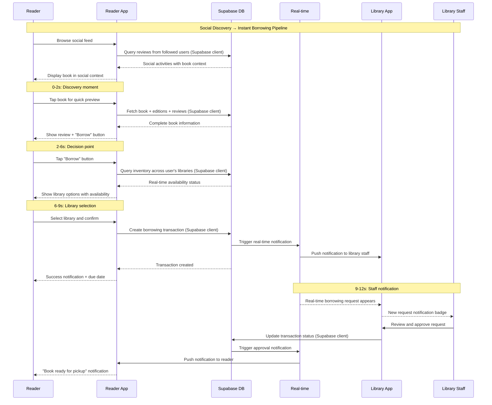
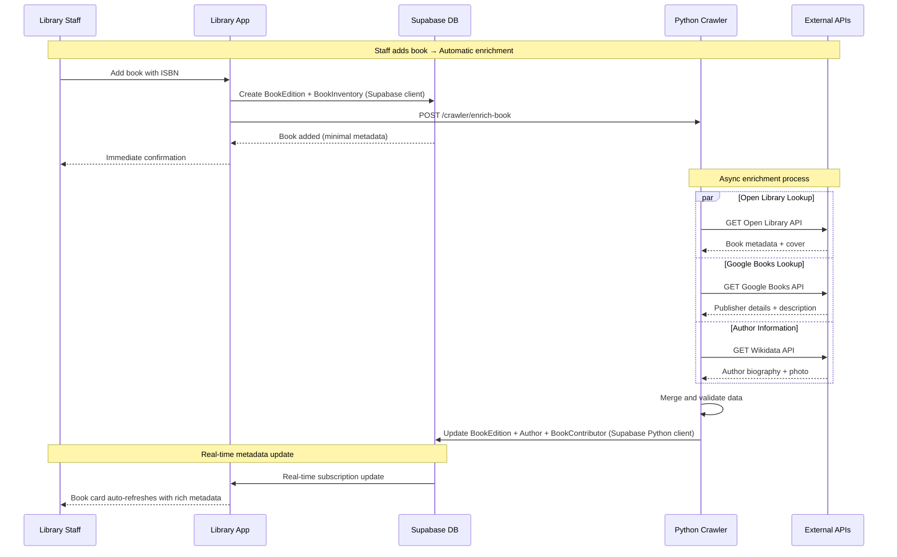
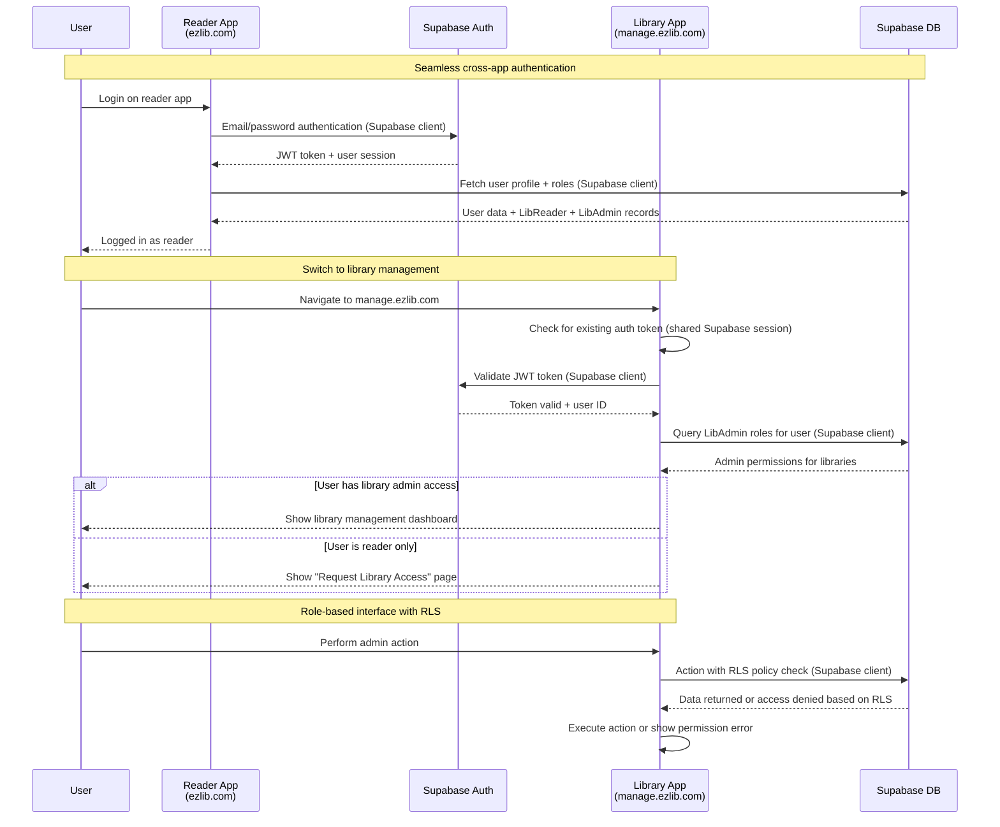

# Core Workflows

Critical system workflows illustrating component interactions, external API integrations, and the complete user journeys from book discovery through library operations.

## 1. Book Discovery to Borrowing Workflow (30-Second Pipeline)

## 2. Book Metadata Enrichment Workflow

## 3. Cross-Subdomain Authentication Workflow

