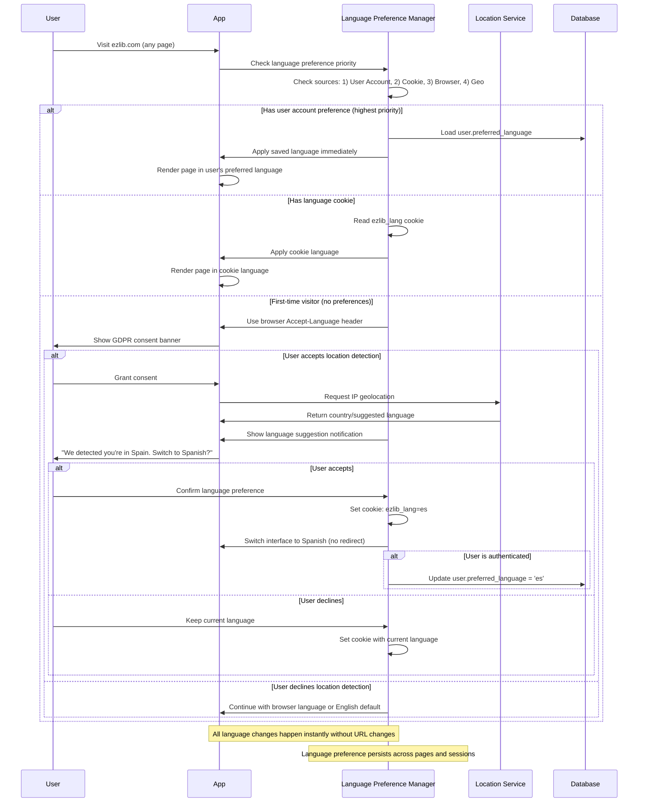

# Internationalization Architecture

EzLib implements comprehensive internationalization (i18n) to support libraries and readers across different countries and languages. The architecture enables automatic location detection, user-configurable preferences, and culturally appropriate interfaces.

## i18n Technology Stack

| Component | Technology | Version | Purpose | Rationale |
|-----------|------------|---------|---------|-----------|
| **Next.js i18n** | Built-in i18n | 14+ | Locale routing and SSG/SSR support | Native Next.js integration, optimal performance |
| **Translation Library** | React-intl (FormatJS) | 6.5+ | Message formatting and component localization | ICU message format, React-focused, extensive formatting |
| **Location Detection** | ipapi.co | Latest | IP-based geolocation service | GDPR-compliant, reliable, generous free tier |
| **Cultural Formatting** | Intl API | Native | Date/number/time formatting | Browser-native, comprehensive locale support |
| **Translation Management** | Crowdin | Latest | Translation workflow and collaboration | Professional translation tools, GitHub integration |

## User Preference-Based i18n Configuration

```typescript
// next.config.js - NO locale routing, clean URLs maintained
module.exports = {
  // Remove i18n routing configuration entirely
  // i18n will be handled through user preferences + client-side switching
  
  webpack: (config, { isServer }) => {
    // Optimize translation bundle loading
    if (!isServer) {
      config.optimization.splitChunks.cacheGroups.translations = {
        test: /[\\/]locales[\\/]/,
        name: 'translations',
        chunks: 'async',
        enforce: true
      };
    }
    return config;
  },
  
  // Enable server-side language detection without routing
  async middleware() {
    return [
      {
        source: '/((?!api|_next|_static).*)',
        destination: '/middleware',
      },
    ];
  }
};

// URL patterns remain clean:
// ezlib.com → User's preferred language applied
// ezlib.com/profile → User's preferred language applied  
// manage.ezlib.com → User's preferred language applied
// No /es, /fr, /de in URLs ever!
```

## User Preference-Driven Language System

```typescript
// Enhanced user preferences model - NO routing involved
interface UserPreferences {
  // Language and region - drives UI language without URL changes
  preferred_language: string; // ISO 639-1 (en, es, vi, fr, de)
  preferred_country: string;  // ISO 3166-1 Alpha-2 (US, ES, VN, FR, DE)
  auto_detected_country?: string; // Original detection result
  
  // Language preference source tracking
  language_source: 'auto_detected' | 'user_selected' | 'browser_default';
  language_changed_at?: Date; // When user last changed language manually
  
  // Cultural formatting preferences (independent of interface language)
  date_format: 'auto' | 'MM/DD/YYYY' | 'DD/MM/YYYY' | 'YYYY-MM-DD';
  time_format: 'auto' | '12h' | '24h';
  number_format: 'auto' | 'US' | 'EU' | 'UK';
  
  // Notification preferences
  notification_email: boolean;
  notification_language: string; // Can differ from interface language
  
  // Privacy
  privacy_social_activity: 'public' | 'followers' | 'private';
  gdpr_consent: {
    location_detection: boolean;
    analytics_cookies: boolean;
    marketing_communications: boolean;
    consent_date: Date;
  };
}

// Language persistence strategy
interface LanguagePreference {
  locale: string;
  source: 'cookie' | 'user_account' | 'browser' | 'geo_detection';
  priority: number; // Higher priority wins
  expires_at?: Date;
}
```

## Preference-Based Language Detection Flow (No URL Changes)



## Translation File Structure

```
locales/
├── en/
│   ├── common.json          # Shared UI elements
│   ├── reader/
│   │   ├── discovery.json   # Book discovery interface
│   │   ├── profile.json     # User profile pages
│   │   └── borrowing.json   # Borrowing workflows
│   ├── library/
│   │   ├── dashboard.json   # Management dashboard
│   │   ├── inventory.json   # Book management
│   │   └── members.json     # Member management
│   └── emails/
│       ├── notifications.json # Email templates
│       └── system.json       # System emails
├── es/
│   └── [same structure]
└── fr/
    └── [same structure]
```

## Cultural Formatting Implementation

```typescript
// Cultural formatting utilities
export class CulturalFormatter {
  constructor(private locale: string, private country: string) {}
  
  formatDate(date: Date, format?: 'short' | 'medium' | 'long'): string {
    const options: Intl.DateTimeFormatOptions = {
      dateStyle: format || 'medium'
    };
    
    // Country-specific overrides
    switch (this.country) {
      case 'US':
        return date.toLocaleDateString('en-US', options);
      case 'GB':
        return date.toLocaleDateString('en-GB', options);
      case 'ES':
        return date.toLocaleDateString('es-ES', options);
      default:
        return date.toLocaleDateString(this.locale, options);
    }
  }
  
  formatNumber(value: number, type: 'decimal' | 'currency' | 'percent' = 'decimal'): string {
    const options: Intl.NumberFormatOptions = { style: type };
    
    if (type === 'currency') {
      options.currency = this.getCurrencyForCountry();
    }
    
    return new Intl.NumberFormat(`${this.locale}-${this.country}`, options).format(value);
  }
  
  private getCurrencyForCountry(): string {
    const currencyMap = {
      'US': 'USD', 'GB': 'GBP', 'ES': 'EUR', 'FR': 'EUR', 'DE': 'EUR'
    };
    return currencyMap[this.country as keyof typeof currencyMap] || 'USD';
  }
}
```
