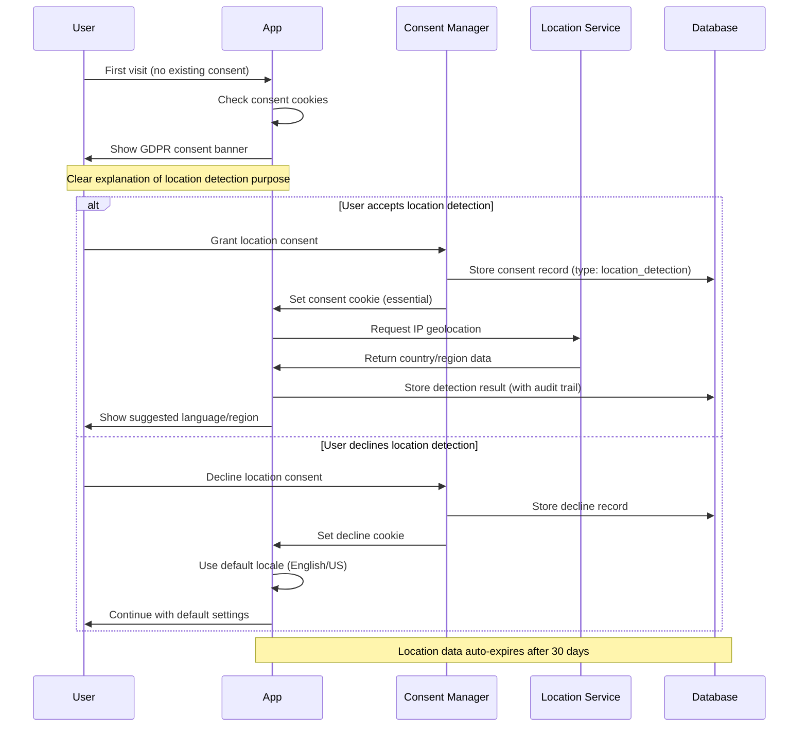

# Privacy and GDPR Compliance Architecture

EzLib implements comprehensive privacy controls and GDPR compliance, particularly for location detection and cross-border data handling required for internationalization features.

## Privacy Technology Stack

| Component | Purpose | Implementation | GDPR Compliance |
|-----------|---------|----------------|-----------------|
| **Consent Management** | User consent tracking | Custom Supabase tables | Explicit consent, withdrawal support |
| **Location Detection** | IP geolocation | ipapi.co with consent | Opt-in required, data minimization |
| **Cookie Management** | Session and preference storage | Next.js secure cookies | Essential cookies only without consent |
| **Data Retention** | Automated cleanup | Supabase functions | Configurable retention periods |
| **Right to Deletion** | User data removal | API endpoints + cascading deletes | Complete data erasure |

## Consent Management Data Model

```sql
-- User consent tracking
CREATE TABLE user_consents (
    id UUID PRIMARY KEY DEFAULT gen_random_uuid(),
    user_id UUID NOT NULL REFERENCES users(id) ON DELETE CASCADE,
    consent_type TEXT NOT NULL CHECK (consent_type IN (
        'location_detection',
        'analytics_cookies',
        'marketing_communications',
        'data_processing',
        'cross_border_transfer'
    )),
    granted BOOLEAN NOT NULL,
    consent_date TIMESTAMPTZ NOT NULL DEFAULT NOW(),
    withdrawal_date TIMESTAMPTZ,
    ip_address INET, -- For legal compliance
    user_agent TEXT, -- For legal compliance
    version TEXT NOT NULL DEFAULT '1.0', -- Consent version
    UNIQUE(user_id, consent_type)
);

-- Location detection audit trail
CREATE TABLE location_detections (
    id UUID PRIMARY KEY DEFAULT gen_random_uuid(),
    user_id UUID REFERENCES users(id) ON DELETE CASCADE,
    session_id TEXT, -- For anonymous users
    ip_address INET NOT NULL,
    detected_country TEXT NOT NULL,
    detected_timezone TEXT,
    detection_service TEXT NOT NULL DEFAULT 'ipapi.co',
    consent_given BOOLEAN NOT NULL,
    created_at TIMESTAMPTZ DEFAULT NOW(),
    -- Automatic cleanup after 30 days
    expires_at TIMESTAMPTZ DEFAULT (NOW() + INTERVAL '30 days')
);
```

## GDPR-Compliant Location Detection



## Consent Management Component

```typescript
// components/ConsentBanner.tsx
import { useState, useEffect } from 'react';
import { createClientComponentClient } from '@supabase/auth-helpers-nextjs';

export function ConsentBanner() {
  const [showBanner, setShowBanner] = useState(false);
  const [consents, setConsents] = useState({
    location_detection: false,
    analytics_cookies: false
  });
  
  useEffect(() => {
    // Check existing consent
    const existingConsent = localStorage.getItem('gdpr_consent');
    if (!existingConsent) {
      setShowBanner(true);
    }
  }, []);
  
  const handleConsentSubmit = async () => {
    const supabase = createClientComponentClient();
    
    // Record consent choices
    for (const [type, granted] of Object.entries(consents)) {
      await supabase.from('user_consents').upsert({
        user_id: (await supabase.auth.getUser()).data.user?.id,
        consent_type: type,
        granted,
        ip_address: await getClientIP(),
        user_agent: navigator.userAgent
      });
    }
    
    // Set consent cookie (essential, no consent needed)
    localStorage.setItem('gdpr_consent', JSON.stringify({
      date: new Date().toISOString(),
      consents
    }));
    
    // Trigger location detection if consented
    if (consents.location_detection) {
      await detectAndSetLocation();
    }
    
    setShowBanner(false);
  };
  
  if (!showBanner) return null;
  
  return (
    <div className="fixed bottom-0 left-0 right-0 bg-slate-900 text-white p-4 z-50">
      <div className="max-w-4xl mx-auto">
        <h3 className="font-semibold mb-2">Privacy Preferences</h3>
        <p className="text-sm mb-4">
          EzLib respects your privacy. We use minimal data to provide our service.
          Please choose your preferences:
        </p>
        
        <div className="space-y-3 mb-4">
          <label className="flex items-center space-x-3">
            <input
              type="checkbox"
              checked={consents.location_detection}
              onChange={(e) => setConsents(prev => ({
                ...prev,
                location_detection: e.target.checked
              }))}
            />
            <div>
              <div className="font-medium">Location Detection</div>
              <div className="text-xs text-gray-300">
                Detect your country to suggest appropriate language and formatting.
                Your IP address is processed temporarily and not stored.
              </div>
            </div>
          </label>
          
          <label className="flex items-center space-x-3">
            <input
              type="checkbox"
              checked={consents.analytics_cookies}
              onChange={(e) => setConsents(prev => ({
                ...prev,
                analytics_cookies: e.target.checked
              }))}
            />
            <div>
              <div className="font-medium">Analytics Cookies</div>
              <div className="text-xs text-gray-300">
                Help us improve EzLib by anonymously tracking usage patterns.
              </div>
            </div>
          </label>
        </div>
        
        <div className="flex space-x-4">
          <button
            onClick={handleConsentSubmit}
            className="bg-blue-600 px-4 py-2 rounded font-medium"
          >
            Save Preferences
          </button>
          <button
            onClick={() => {
              setConsents({ location_detection: false, analytics_cookies: false });
              handleConsentSubmit();
            }}
            className="bg-gray-600 px-4 py-2 rounded"
          >
            Decline All
          </button>
        </div>
      </div>
    </div>
  );
}
```

## Data Retention and Cleanup

```sql
-- Automated data cleanup function
CREATE OR REPLACE FUNCTION cleanup_expired_data()
RETURNS void AS $$
BEGIN
    -- Remove expired location detection records
    DELETE FROM location_detections 
    WHERE expires_at < NOW();
    
    -- Remove old audit logs (keep for 2 years for legal compliance)
    DELETE FROM transaction_events 
    WHERE timestamp < NOW() - INTERVAL '2 years';
    
    -- Clean up withdrawn consent data
    UPDATE user_consents 
    SET ip_address = NULL, user_agent = NULL 
    WHERE withdrawal_date IS NOT NULL 
      AND withdrawal_date < NOW() - INTERVAL '30 days';
      
    RAISE NOTICE 'Data cleanup completed at %', NOW();
END;
$$ LANGUAGE plpgsql;

-- Schedule cleanup (run daily)
SELECT cron.schedule('daily-cleanup', '0 2 * * *', 'SELECT cleanup_expired_data();');
```

## Right to Data Portability and Deletion

```typescript
// api/user/data-export.ts - GDPR data export
export async function POST(request: Request) {
  const { user_id } = await request.json();
  const supabase = createRouteHandlerClient({ cookies });
  
  // Verify user authorization
  const { data: { user } } = await supabase.auth.getUser();
  if (user?.id !== user_id) {
    return NextResponse.json({ error: 'Unauthorized' }, { status: 403 });
  }
  
  // Export all user data
  const userData = await exportUserData(user_id);
  
  return NextResponse.json({
    export_date: new Date().toISOString(),
    user_data: userData,
    note: "This export contains all personal data stored by EzLib."
  });
}

// api/user/delete-account.ts - GDPR right to deletion
export async function DELETE(request: Request) {
  const { user_id } = await request.json();
  const supabase = createRouteHandlerClient({ cookies });
  
  // Verify user authorization
  const { data: { user } } = await supabase.auth.getUser();
  if (user?.id !== user_id) {
    return NextResponse.json({ error: 'Unauthorized' }, { status: 403 });
  }
  
  // Cascading deletion (handled by foreign key constraints)
  await supabase.from('users').delete().eq('id', user_id);
  
  // Sign out user
  await supabase.auth.signOut();
  
  return NextResponse.json({ 
    message: "Account and all associated data has been permanently deleted." 
  });
}
```
