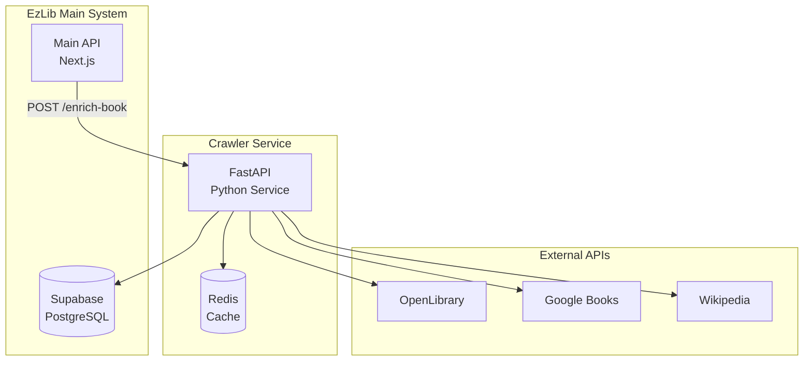

# EzLib Book Crawler Service

A Python FastAPI microservice for automatic book metadata enrichment within the EzLib ecosystem. This service crawls external book databases and APIs to enhance book records with comprehensive metadata, author information, and cover images.

## 🎯 Purpose

The Book Crawler Service automates the tedious process of manual book data entry for library staff by:

- **Enriching book metadata** from authoritative sources (OpenLibrary, Google Books, ISBN databases)
- **Collecting author information** including biographies, photos, and publication history
- **Downloading and processing** book cover images in multiple resolutions
- **Maintaining data quality** through validation, conflict resolution, and consistency checks

## 🏗️ Architecture Overview



## 📚 Documentation

This subproject includes comprehensive documentation for independent development:

### Core Documents
- **[Product Requirements](docs/prd.md)** - Goals, requirements, and success metrics
- **[Technical Architecture](docs/architecture.md)** - System design, tech stack, and deployment
- **[External APIs](docs/external-apis.md)** - Integration with OpenLibrary, Google Books, etc.
- **[Data Contracts](docs/data-contracts.md)** - Database integration and API specifications
- **[Workflows](docs/workflows.md)** - Detailed processing workflows and algorithms

### Key Features

#### 🔍 **Multi-Source Data Collection**
- Primary source: OpenLibrary API (free, comprehensive coverage)
- Secondary source: Google Books API (detailed publisher information)
- Fallback sources: ISBN databases, Wikipedia for author data
- Intelligent source prioritization and conflict resolution

#### 🚀 **High Performance**
- Asynchronous processing with FastAPI
- Redis caching to minimize external API calls
- Rate limiting and respect for API quotas
- Batch processing support for bulk operations

#### 🎯 **Data Quality Assurance**
- Multi-step validation pipeline
- Automatic conflict resolution between sources
- Data completeness scoring
- Suspicious data detection and flagging

#### 🔗 **Seamless Integration**
- Service-to-service authentication with main EzLib API
- Direct Supabase database integration
- Real-time status updates and progress tracking
- Comprehensive error handling and rollback mechanisms

## 🚀 Quick Start

### Prerequisites
- Python 3.11+
- Redis server (for caching)
- Supabase database access
- API keys for external services (Google Books, ISBN databases)

### Environment Setup
```bash
# Create virtual environment
python -m venv crawler-env
source crawler-env/bin/activate  # or `crawler-env\Scripts\activate` on Windows

# Install dependencies
pip install -r requirements.txt

# Set environment variables
cp .env.example .env
# Edit .env with your API keys and database URLs
```

### Development Server
```bash
# Start development server
uvicorn src.main:app --reload --host 0.0.0.0 --port 8000

# Check health endpoint
curl http://localhost:8000/health

# Test enrichment endpoint
curl -X POST http://localhost:8000/api/v1/enrich \
  -H "Content-Type: application/json" \
  -d '{"book_edition_id": "uuid", "isbn_13": "9780441569595"}'
```

## 🏗️ Project Structure

```
services/crawler/
├── docs/                           # Comprehensive documentation
│   ├── prd.md                     # Product requirements
│   ├── architecture.md           # Technical architecture
│   ├── external-apis.md          # External API integration
│   ├── data-contracts.md         # Database and API contracts
│   └── workflows.md              # Processing workflows
├── src/                           # Source code
│   ├── crawler/                   # Main package
│   │   ├── __init__.py
│   │   ├── main.py               # FastAPI application
│   │   ├── config.py             # Configuration management
│   │   ├── models/               # Pydantic data models
│   │   ├── services/             # Business logic
│   │   ├── api/                  # FastAPI routers
│   │   └── utils/                # Utility functions
│   └── tests/                    # Test suite
├── .bmad-core/                   # BMad method configuration
├── requirements.txt              # Python dependencies
├── .env.example                  # Environment variables template
├── Dockerfile                    # Container configuration
├── vercel.json                   # Vercel deployment config
└── README.md                     # This file
```

## 🔧 Configuration

### Environment Variables
```bash
# Supabase configuration
SUPABASE_URL=your_supabase_url
SUPABASE_SERVICE_KEY=your_service_role_key

# External API keys
GOOGLE_BOOKS_API_KEY=your_google_books_key
ISBN_DB_API_KEY=your_isbn_db_key

# Redis configuration
REDIS_URL=redis://localhost:6379

# Service configuration
LOG_LEVEL=INFO
MAX_CONCURRENT_REQUESTS=10
CACHE_TTL_HOURS=24
```

### API Rate Limits
```python
# Built-in rate limiting for external APIs
RATE_LIMITS = {
    "openlibrary": (100, 60),      # 100 requests per minute
    "google_books": (1000, 86400), # 1000 requests per day
    "isbn_db": (100, 3600),        # 100 requests per hour
    "wikipedia": (200, 3600),      # 200 requests per hour
}
```

## 🧪 Testing

```bash
# Run unit tests
pytest tests/unit/

# Run integration tests (requires API keys)
pytest tests/integration/

# Run with coverage
pytest --cov=src tests/

# Run specific test categories
pytest -m "not external_api"  # Skip external API tests
```

## 📊 Monitoring

### Health Checks
- `/health` - Basic service health
- `/health/detailed` - Comprehensive health including external APIs
- `/metrics` - Prometheus-compatible metrics

### Key Metrics
- **Enrichment Success Rate**: Percentage of successful book enrichments
- **Data Quality Score**: Average completeness of enriched metadata
- **External API Response Time**: Performance of external data sources
- **Cache Hit Rate**: Efficiency of caching strategy

## 🚀 Deployment

### Vercel Functions (Phase 1)
```bash
# Deploy to Vercel
vercel deploy

# Environment variables in Vercel dashboard
vercel env add SUPABASE_URL
vercel env add SUPABASE_SERVICE_KEY
# ... other environment variables
```

### Docker Container (Phase 2)
```bash
# Build container
docker build -t ezlib-crawler .

# Run container
docker run -p 8000:8000 --env-file .env ezlib-crawler
```

## 🔗 Integration with Main EzLib System

### Triggering Enrichment
The main EzLib API automatically triggers enrichment when:
1. Library staff adds a new book with an ISBN
2. Batch import operations are performed
3. Manual refresh is requested through the admin interface

### Data Flow
1. **Book Added** → Main API creates book_edition record
2. **Enrichment Triggered** → Crawler service called with book details
3. **External Data Fetched** → APIs queried for metadata
4. **Data Processed** → Validation, merging, quality checks
5. **Database Updated** → Enriched metadata stored
6. **Cache Updated** → Results cached for future requests

## 🤝 Contributing

This subproject uses the BMad Method for structured development:

1. **Planning**: Review PRD and architecture documents
2. **Development**: Follow established patterns and data contracts
3. **Testing**: Ensure comprehensive test coverage including external API mocking
4. **Documentation**: Update docs for any changes to workflows or contracts

### Development Workflow
1. Create feature branch from main
2. Implement changes following architecture patterns
3. Add/update tests for new functionality
4. Update documentation if needed
5. Submit pull request with detailed description

## 🆘 Troubleshooting

### Common Issues

**External API Rate Limiting**
- Check rate limit configurations in `config.py`
- Verify API keys are correctly set
- Monitor cache hit rates to reduce API calls

**Database Connection Issues**
- Verify Supabase URL and service key
- Check network connectivity
- Review RLS policies for service role access

**Data Quality Issues**
- Review validation rules in workflows documentation
- Check external API response formats
- Verify data merging algorithms

### Debug Mode
```bash
# Enable debug logging
export LOG_LEVEL=DEBUG

# Run with debug flags
uvicorn src.main:app --reload --log-level debug
```

## 📄 License

This service is part of the EzLib project. See the main project license for details.

---

*Book Crawler Service - Automated metadata enrichment for the EzLib ecosystem*