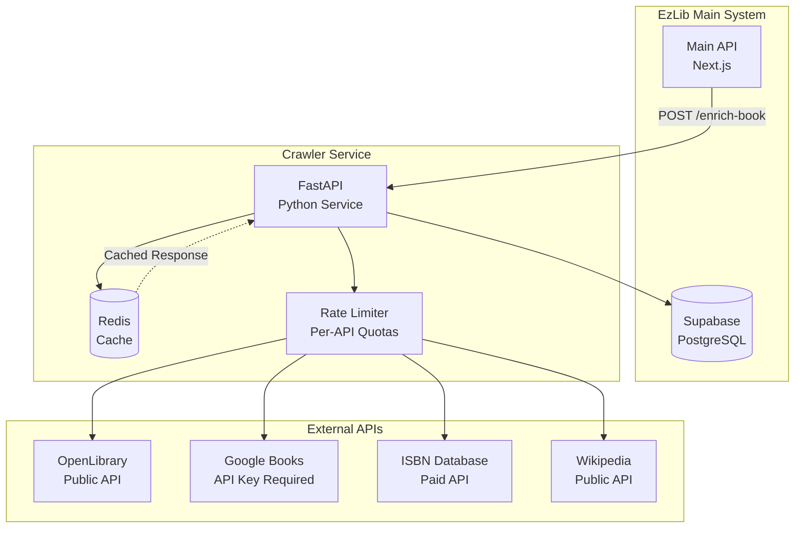
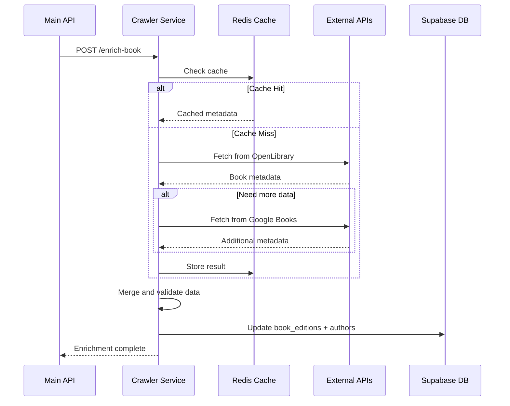

# EzLib Book Crawler Service Architecture

## Overview

The EzLib Book Crawler Service is a Python FastAPI microservice responsible for enriching book metadata from external sources. It operates independently within the EzLib monorepo while maintaining strict data contracts with the main application.

### Service Purpose

- **Primary Goal**: Enrich book metadata automatically when books are added to library inventories
- **Secondary Goals**: Periodic updates of existing book data, author information enrichment
- **Scope**: Data collection and processing only - no user-facing features or business logic

## Technical Architecture

### Service Stack

| Component | Technology | Version | Purpose |
|-----------|------------|---------|---------|
| **API Framework** | FastAPI | 0.100+ | Async REST API with automatic OpenAPI docs |
| **Language** | Python | 3.11+ | Rich ecosystem for data processing and web scraping |
| **HTTP Client** | httpx | 0.24+ | Async HTTP client for external API calls |
| **Data Validation** | Pydantic | 2.0+ | Request/response validation and data models |
| **Database Client** | Supabase Python | 1.0+ | Integration with main EzLib database |
| **Rate Limiting** | slowapi | 0.1+ | Per-API rate limiting and request queuing |
| **Caching** | Redis | 7.0+ | Response caching for external APIs |
| **Web Scraping** | BeautifulSoup4 | 4.12+ | HTML parsing for sites without APIs |
| **Task Queue** | Celery | 5.3+ | Background job processing (future) |
| **Deployment** | Vercel Functions | Latest | Serverless deployment (Phase 1) |

### Service Architecture Diagram



## Data Models

### Core Entities

```python
# Pydantic models for internal use
class BookEnrichmentRequest(BaseModel):
    book_edition_id: str
    isbn_13: Optional[str] = None
    title: str
    author_names: List[str]
    force_refresh: bool = False

class AuthorData(BaseModel):
    name: str
    canonical_name: str
    biography: Optional[str] = None
    birth_date: Optional[date] = None
    death_date: Optional[date] = None
    photo_url: Optional[str] = None
    external_ids: Dict[str, Optional[str]] = {}

class BookMetadata(BaseModel):
    title: str
    subtitle: Optional[str] = None
    publisher: Optional[str] = None
    publication_date: Optional[date] = None
    page_count: Optional[int] = None
    cover_image_url: Optional[str] = None
    description: Optional[str] = None
    subjects: List[str] = []
    format: str = "paperback"
    
class EnrichmentResult(BaseModel):
    book_edition_id: str
    status: Literal["success", "partial", "failed"]
    metadata_updates: BookMetadata
    author_updates: List[AuthorData]
    sources_used: List[str]
    errors: List[str] = []
    enriched_at: datetime
```

## API Specification

### Internal API Endpoints

```yaml
# Crawler service endpoints (called by main EzLib system)
POST /api/v1/enrich-book:
  summary: Trigger book metadata enrichment
  request_body:
    type: BookEnrichmentRequest
  responses:
    202: Enrichment job queued
    400: Invalid request data
    429: Rate limit exceeded

GET /api/v1/enrich-status/{job_id}:
  summary: Check enrichment job status
  responses:
    200: Job status and progress
    404: Job not found

POST /api/v1/enrich-batch:
  summary: Batch enrichment for multiple books
  request_body:
    type: List[BookEnrichmentRequest]
  responses:
    202: Batch job queued

GET /health:
  summary: Health check endpoint
  responses:
    200: Service healthy
```

## External API Integration

### API Priority and Fallback Strategy

1. **Primary Source**: OpenLibrary API (free, comprehensive)
2. **Secondary Source**: Google Books API (detailed publisher info)
3. **Specialized Sources**: ISBN Database (validation), Wikipedia (author bios)
4. **Last Resort**: Structured web scraping (rate-limited)

### Rate Limiting Strategy

```python
# Rate limits per external API
RATE_LIMITS = {
    "openlibrary": (100, 60),      # 100 requests per minute
    "google_books": (1000, 86400), # 1000 requests per day
    "isbn_db": (100, 3600),        # 100 requests per hour
    "wikipedia": (200, 3600),      # 200 requests per hour
    "goodreads_scraping": (30, 3600) # 30 requests per hour
}
```

## Data Processing Pipeline

### Book Enrichment Workflow



### Data Quality Rules

```python
# Data validation and quality checks
class DataQualityValidator:
    def validate_isbn(self, isbn: str) -> bool:
        """Validate ISBN-13 format and checksum"""
        
    def validate_publication_date(self, date: str, title: str) -> bool:
        """Ensure publication date is reasonable"""
        
    def merge_author_data(self, sources: List[AuthorData]) -> AuthorData:
        """Merge author data from multiple sources with conflict resolution"""
        
    def detect_duplicate_books(self, metadata: BookMetadata) -> List[str]:
        """Identify potential duplicate books in database"""
```

## Deployment Configuration

### Phase 1: Vercel Functions

```python
# vercel.json configuration
{
    "functions": {
        "api/*.py": {
            "runtime": "python3.11",
            "maxDuration": 30
        }
    },
    "env": {
        "SUPABASE_URL": "@supabase_url",
        "SUPABASE_SERVICE_KEY": "@supabase_service_key",
        "GOOGLE_BOOKS_API_KEY": "@google_books_key",
        "REDIS_URL": "@redis_url"
    }
}
```

### Phase 2: Dedicated Service

```dockerfile
# Dockerfile for dedicated deployment
FROM python:3.11-slim

WORKDIR /app
COPY requirements.txt .
RUN pip install -r requirements.txt

COPY src/ ./src/
EXPOSE 8000

CMD ["uvicorn", "src.main:app", "--host", "0.0.0.0", "--port", "8000"]
```

## Error Handling and Monitoring

### Error Categories

1. **External API Errors**: Rate limiting, timeouts, invalid responses
2. **Data Quality Errors**: Invalid ISBNs, conflicting metadata, missing required fields
3. **Database Errors**: Connection issues, constraint violations, transaction failures
4. **Processing Errors**: Memory limits, CPU timeouts, data parsing failures

### Monitoring Metrics

```python
# Key metrics to track
METRICS = {
    "enrichment_success_rate": "Percentage of successful enrichments",
    "external_api_response_time": "Average response time per API",
    "cache_hit_rate": "Percentage of requests served from cache",
    "data_quality_score": "Percentage of enrichments with complete data",
    "error_rate_by_source": "Error rates per external API"
}
```

## Security Considerations

### API Security

- **Authentication**: Service-to-service JWT tokens
- **Authorization**: IP whitelist for internal EzLib services
- **Rate Limiting**: Prevent abuse of external APIs
- **Data Sanitization**: Clean all external data before database insertion

### External API Security

- **API Key Management**: Secure storage of API credentials
- **Request Signing**: HMAC signing for sensitive API calls
- **SSL/TLS**: All external requests over HTTPS
- **User Agent**: Proper identification in web scraping

## Future Considerations

### Scalability Path

1. **Current**: Vercel Functions (serverless, auto-scaling)
2. **Phase 2**: Dedicated container (Kubernetes, Docker)
3. **Phase 3**: Microservices architecture with event streams

### Enhanced Features

- **Machine Learning**: Author disambiguation, genre classification
- **Real-time Updates**: WebSocket connections for live enrichment status
- **Advanced Caching**: Multi-layer caching with TTL strategies
- **Analytics**: Detailed metrics on data quality and source reliability

---

*EzLib Book Crawler Architecture v1.0 - Designed for independent development within EzLib ecosystem*