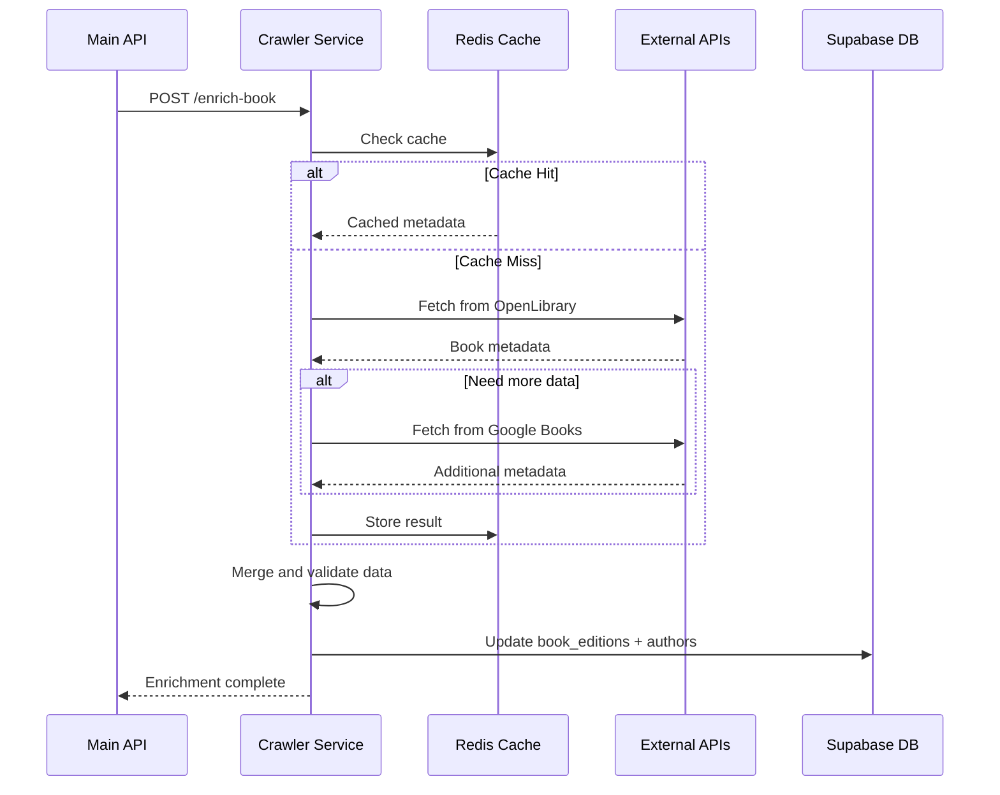

# Data Processing Pipeline

## Book Enrichment Workflow


```mermaid
sequenceDiagram
    participant Main as Main API
    participant Crawler as Crawler Service
    participant Cache as Redis Cache
    participant External as External APIs
    participant DB as Supabase DB

    Main->>Crawler: POST /enrich-book
    Crawler->>Cache: Check cache
    
    alt Cache Hit
        Cache-->>Crawler: Cached metadata
    else Cache Miss
        Crawler->>External: Fetch from OpenLibrary
        External-->>Crawler: Book metadata
        
        alt Need more data
            Crawler->>External: Fetch from Google Books
            External-->>Crawler: Additional metadata
        end
        
        Crawler->>Cache: Store result
    end
    
    Crawler->>Crawler: Merge and validate data
    Crawler->>DB: Update book_editions + authors
    Crawler-->>Main: Enrichment complete
```

## Data Quality Rules

```python