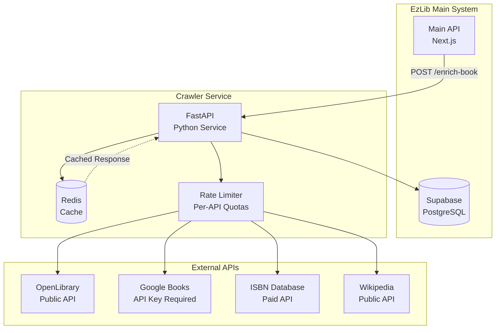

# Technical Architecture

## Service Stack

| Component | Technology | Version | Purpose |
|-----------|------------|---------|---------|
| **API Framework** | FastAPI | 0.100+ | Async REST API with automatic OpenAPI docs |
| **Language** | Python | 3.11+ | Rich ecosystem for data processing and web scraping |
| **HTTP Client** | httpx | 0.24+ | Async HTTP client for external API calls |
| **Data Validation** | Pydantic | 2.0+ | Request/response validation and data models |
| **Database Client** | Supabase Python | 1.0+ | Integration with main EzLib database |
| **Rate Limiting** | slowapi | 0.1+ | Per-API rate limiting and request queuing |
| **Caching** | Redis | 7.0+ | Response caching for external APIs |
| **Web Scraping** | BeautifulSoup4 | 4.12+ | HTML parsing for sites without APIs |
| **Task Queue** | Celery | 5.3+ | Background job processing (future) |
| **Deployment** | Vercel Functions | Latest | Serverless deployment (Phase 1) |

## Service Architecture Diagram

