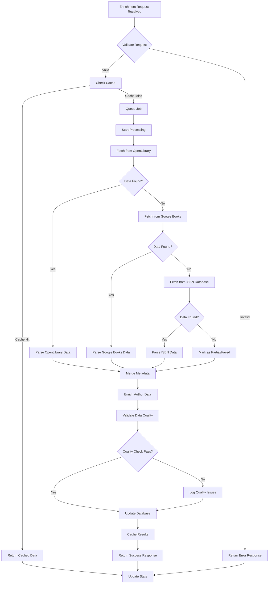

# Crawler Workflows Documentation

## Overview

This document defines the detailed workflows, algorithms, and processes used by the EzLib Book Crawler Service. It covers the complete lifecycle from enrichment triggers to data storage and quality assurance.

## Core Workflow: Book Metadata Enrichment

### Primary Enrichment Workflow



### Implementation

```python
class BookEnrichmentWorkflow:
    def __init__(self, 
                 external_apis: ExternalAPIManager,
                 database: CrawlerDatabase,
                 cache: APIResponseCache,
                 quality_checker: DataQualityChecker):
        self.external_apis = external_apis
        self.database = database
        self.cache = cache
        self.quality_checker = quality_checker
    
    async def execute_enrichment(self, request: EnrichmentRequest) -> EnrichmentResult:
        """Execute the complete book enrichment workflow"""
        job_id = str(uuid.uuid4())
        start_time = datetime.utcnow()
        
        try:
            # Step 1: Validate request
            if not self._validate_request(request):
                return self._create_error_result(job_id, "Invalid request parameters")
            
            # Step 2: Check cache
            if not request.force_refresh:
                cached_result = await self._check_cache(request.book_edition_id)
                if cached_result:
                    return self._create_success_result(job_id, cached_result, ["cache"])
            
            # Step 3: Fetch external data
            external_data = await self._fetch_external_data(request)
            
            # Step 4: Process and merge data
            merged_metadata = await self._merge_metadata(external_data)
            
            # Step 5: Enrich author information
            author_data = await self._enrich_authors(merged_metadata.authors)
            
            # Step 6: Validate data quality
            quality_score = self.quality_checker.calculate_score(merged_metadata)
            
            # Step 7: Update database
            update_success = await self._update_database(request.book_edition_id, 
                                                        merged_metadata, author_data)
            
            # Step 8: Cache results
            await self._cache_results(request.book_edition_id, merged_metadata)
            
            # Step 9: Return result
            return self._create_success_result(
                job_id, merged_metadata, external_data.sources_used, 
                quality_score, author_data
            )
            
        except Exception as e:
            logger.error(f"Enrichment workflow failed for {request.book_edition_id}: {str(e)}")
            return self._create_error_result(job_id, str(e))
```

## External Data Fetching Strategy

### Multi-Source Data Collection

```python
class ExternalDataFetcher:
    async def fetch_book_data(self, isbn: str, title: str = None) -> ExternalDataCollection:
        """Fetch book data from multiple external sources with fallback strategy"""
        collection = ExternalDataCollection()
        
        # Primary source: OpenLibrary
        try:
            ol_data = await self._fetch_openlibrary_data(isbn)
            if ol_data:
                collection.add_source("openlibrary", ol_data)
                logger.info(f"OpenLibrary data found for ISBN {isbn}")
        except Exception as e:
            logger.warning(f"OpenLibrary fetch failed for {isbn}: {str(e)}")
        
        # Secondary source: Google Books (if primary incomplete)
        if not collection.is_complete():
            try:
                gb_data = await self._fetch_google_books_data(isbn)
                if gb_data:
                    collection.add_source("google_books", gb_data)
                    logger.info(f"Google Books data found for ISBN {isbn}")
            except Exception as e:
                logger.warning(f"Google Books fetch failed for {isbn}: {str(e)}")
        
        # Tertiary source: ISBN Database (for validation)
        if not collection.has_valid_isbn():
            try:
                isbn_data = await self._fetch_isbn_database(isbn)
                if isbn_data:
                    collection.add_source("isbn_db", isbn_data)
                    logger.info(f"ISBN Database data found for ISBN {isbn}")
            except Exception as e:
                logger.warning(f"ISBN Database fetch failed for {isbn}: {str(e)}")
        
        return collection
    
    async def _fetch_openlibrary_data(self, isbn: str) -> Optional[dict]:
        """Fetch data from OpenLibrary API with rate limiting"""
        async with self.rate_limiter.acquire("openlibrary"):
            cache_key = f"ol_book_{isbn}"
            
            # Check cache first
            cached = await self.cache.get(cache_key, "book_metadata")
            if cached:
                return cached
            
            # Fetch from API
            response = await self.http_client.get(
                f"https://openlibrary.org/api/books",
                params={
                    "bibkeys": f"ISBN:{isbn}",
                    "format": "json",
                    "jscmd": "data"
                },
                timeout=10.0
            )
            
            if response.status_code == 200:
                data = response.json()
                if data:
                    await self.cache.set(cache_key, data, "book_metadata")
                    return data
            
            return None
```

## Data Merging and Conflict Resolution

### Metadata Merging Algorithm

```python
class MetadataMerger:
    def __init__(self):
        # Priority order for data sources
        self.source_priority = {
            "openlibrary": 3,
            "google_books": 2,
            "isbn_db": 1,
            "manual": 4  # Manual entries have highest priority
        }
        
        # Field-specific merge strategies
        self.merge_strategies = {
            "title": self._merge_by_priority,
            "subtitle": self._merge_by_priority,
            "publisher": self._merge_by_completeness,
            "publication_date": self._merge_by_specificity,
            "page_count": self._merge_by_reasonableness,
            "cover_image_url": self._merge_by_quality,
            "description": self._merge_by_length,
            "subjects": self._merge_by_union,
            "authors": self._merge_authors_complex
        }
    
    async def merge_metadata(self, data_collection: ExternalDataCollection) -> BookMetadata:
        """Merge metadata from multiple sources using field-specific strategies"""
        merged = BookMetadata()
        
        for field_name in BookMetadata.__fields__:
            if field_name in self.merge_strategies:
                merge_func = self.merge_strategies[field_name]
                merged_value = await merge_func(field_name, data_collection)
                setattr(merged, field_name, merged_value)
        
        # Validate merged result
        self._validate_merged_metadata(merged)
        
        return merged
    
    def _merge_by_priority(self, field_name: str, collection: ExternalDataCollection) -> Any:
        """Merge field by source priority"""
        best_value = None
        best_priority = 0
        
        for source_name, data in collection.sources.items():
            source_priority = self.source_priority.get(source_name, 0)
            field_value = data.get(field_name)
            
            if field_value and source_priority > best_priority:
                best_value = field_value
                best_priority = source_priority
        
        return best_value
    
    def _merge_by_completeness(self, field_name: str, collection: ExternalDataCollection) -> Any:
        """Merge field by data completeness"""
        values = []
        
        for source_name, data in collection.sources.items():
            field_value = data.get(field_name)
            if field_value:
                values.append({
                    "value": field_value,
                    "priority": self.source_priority.get(source_name, 0),
                    "completeness": self._calculate_completeness(field_value)
                })
        
        if not values:
            return None
        
        # Sort by completeness, then by priority
        values.sort(key=lambda x: (x["completeness"], x["priority"]), reverse=True)
        return values[0]["value"]
    
    def _merge_publication_date(self, field_name: str, collection: ExternalDataCollection) -> Optional[date]:
        """Merge publication dates with conflict resolution"""
        dates = []
        
        for source_name, data in collection.sources.items():
            date_str = data.get(field_name)
            if date_str:
                parsed_date = self._parse_date(date_str)
                if parsed_date:
                    dates.append({
                        "date": parsed_date,
                        "source": source_name,
                        "priority": self.source_priority.get(source_name, 0),
                        "specificity": self._date_specificity(date_str)
                    })
        
        if not dates:
            return None
        
        # Handle conflicts
        if len(dates) == 1:
            return dates[0]["date"]
        
        # If dates are close (within 1 year), prefer more specific
        if self._dates_are_close(dates):
            dates.sort(key=lambda x: x["specificity"], reverse=True)
            return dates[0]["date"]
        
        # If dates differ significantly, prefer higher priority source
        dates.sort(key=lambda x: x["priority"], reverse=True)
        return dates[0]["date"]
    
    def _merge_authors_complex(self, field_name: str, collection: ExternalDataCollection) -> List[str]:
        """Complex author merging with name normalization"""
        all_authors = []
        
        for source_name, data in collection.sources.items():
            source_authors = data.get("authors", [])
            for author in source_authors:
                normalized = self._normalize_author_name(author)
                if normalized not in [a["normalized"] for a in all_authors]:
                    all_authors.append({
                        "original": author,
                        "normalized": normalized,
                        "source": source_name,
                        "priority": self.source_priority.get(source_name, 0)
                    })
        
        # Remove duplicates and sort by priority
        unique_authors = {}
        for author in all_authors:
            norm_name = author["normalized"]
            if norm_name not in unique_authors or author["priority"] > unique_authors[norm_name]["priority"]:
                unique_authors[norm_name] = author
        
        return [author["original"] for author in unique_authors.values()]
```

## Author Data Enrichment Workflow

### Author Information Enhancement

```python
class AuthorEnrichmentWorkflow:
    async def enrich_authors(self, author_names: List[str]) -> List[AuthorData]:
        """Enrich author information from external sources"""
        enriched_authors = []
        
        for author_name in author_names:
            try:
                # Check if author already exists in database
                existing_author = await self._find_existing_author(author_name)
                
                if existing_author and not self._needs_refresh(existing_author):
                    enriched_authors.append(existing_author)
                    continue
                
                # Fetch from external sources
                author_data = await self._fetch_author_data(author_name)
                
                if author_data:
                    enriched_authors.append(author_data)
                else:
                    # Create minimal author record
                    minimal_author = AuthorData(
                        name=author_name,
                        canonical_name=self._normalize_author_name(author_name)
                    )
                    enriched_authors.append(minimal_author)
                    
            except Exception as e:
                logger.error(f"Failed to enrich author {author_name}: {str(e)}")
                # Continue with minimal data
                minimal_author = AuthorData(
                    name=author_name,
                    canonical_name=self._normalize_author_name(author_name)
                )
                enriched_authors.append(minimal_author)
        
        return enriched_authors
    
    async def _fetch_author_data(self, author_name: str) -> Optional[AuthorData]:
        """Fetch comprehensive author data from Wikipedia/Wikidata"""
        try:
            # Search for author entity
            search_results = await self._search_wikidata_entity(author_name)
            
            if not search_results:
                return None
            
            # Get detailed author information
            entity_id = search_results[0]["id"]
            entity_data = await self._get_wikidata_entity(entity_id)
            
            if entity_data:
                return self._map_wikidata_to_author(entity_data)
            
        except Exception as e:
            logger.warning(f"Failed to fetch author data for {author_name}: {str(e)}")
        
        return None
    
    async def _search_wikidata_entity(self, author_name: str) -> List[dict]:
        """Search for author entity in Wikidata"""
        async with self.rate_limiter.acquire("wikidata"):
            response = await self.http_client.get(
                "https://www.wikidata.org/w/api.php",
                params={
                    "action": "wbsearchentities",
                    "search": author_name,
                    "language": "en",
                    "type": "item",
                    "format": "json",
                    "limit": 5
                }
            )
            
            if response.status_code == 200:
                data = response.json()
                # Filter for human entities (authors)
                return [item for item in data.get("search", []) 
                       if self._is_likely_author(item)]
            
            return []
```

## Data Quality Assurance Workflow

### Quality Validation Pipeline

```python
class DataQualityWorkflow:
    def __init__(self):
        self.validation_rules = [
            self._validate_required_fields,
            self._validate_data_formats,
            self._validate_data_reasonableness,
            self._validate_consistency,
            self._validate_completeness
        ]
    
    async def validate_book_metadata(self, metadata: BookMetadata) -> QualityReport:
        """Run comprehensive quality validation on book metadata"""
        report = QualityReport(
            book_edition_id=metadata.book_edition_id,
            validation_timestamp=datetime.utcnow()
        )
        
        for validation_rule in self.validation_rules:
            try:
                rule_result = await validation_rule(metadata)
                report.add_rule_result(rule_result)
            except Exception as e:
                logger.error(f"Validation rule failed: {str(e)}")
                report.add_error(f"Validation rule error: {str(e)}")
        
        # Calculate overall quality score
        report.quality_score = self._calculate_quality_score(report)
        
        return report
    
    async def _validate_required_fields(self, metadata: BookMetadata) -> ValidationResult:
        """Validate that required fields are present"""
        required_fields = ["title", "authors"]
        missing_fields = []
        
        for field in required_fields:
            value = getattr(metadata, field, None)
            if not value:
                missing_fields.append(field)
        
        return ValidationResult(
            rule_name="required_fields",
            passed=len(missing_fields) == 0,
            issues=missing_fields,
            severity="error" if missing_fields else "info"
        )
    
    async def _validate_data_formats(self, metadata: BookMetadata) -> ValidationResult:
        """Validate data format correctness"""
        issues = []
        
        # Validate ISBN format
        if metadata.isbn_13 and not self._is_valid_isbn13(metadata.isbn_13):
            issues.append(f"Invalid ISBN-13 format: {metadata.isbn_13}")
        
        # Validate publication date
        if metadata.publication_date:
            if not self._is_reasonable_publication_date(metadata.publication_date):
                issues.append(f"Unreasonable publication date: {metadata.publication_date}")
        
        # Validate page count
        if metadata.page_count and (metadata.page_count < 1 or metadata.page_count > 10000):
            issues.append(f"Unreasonable page count: {metadata.page_count}")
        
        # Validate URL formats
        if metadata.cover_image_url and not self._is_valid_url(metadata.cover_image_url):
            issues.append(f"Invalid cover image URL: {metadata.cover_image_url}")
        
        return ValidationResult(
            rule_name="data_formats",
            passed=len(issues) == 0,
            issues=issues,
            severity="warning" if issues else "info"
        )
    
    async def _validate_consistency(self, metadata: BookMetadata) -> ValidationResult:
        """Validate internal data consistency"""
        issues = []
        
        # Check title consistency
        if metadata.title and metadata.subtitle:
            if metadata.subtitle.lower() in metadata.title.lower():
                issues.append("Subtitle appears to be included in title")
        
        # Check author name patterns
        if metadata.authors:
            for author in metadata.authors:
                if not self._is_reasonable_author_name(author):
                    issues.append(f"Suspicious author name: {author}")
        
        # Check publisher vs publication date consistency
        if metadata.publisher and metadata.publication_date:
            if not self._is_publisher_date_consistent(metadata.publisher, metadata.publication_date):
                issues.append("Publisher and publication date may be inconsistent")
        
        return ValidationResult(
            rule_name="consistency",
            passed=len(issues) == 0,
            issues=issues,
            severity="warning" if issues else "info"
        )
```

## Batch Processing Workflow

### Bulk Enrichment Processing

```python
class BatchProcessingWorkflow:
    def __init__(self, max_concurrent: int = 10, batch_size: int = 50):
        self.max_concurrent = max_concurrent
        self.batch_size = batch_size
        self.semaphore = asyncio.Semaphore(max_concurrent)
    
    async def process_batch(self, requests: List[EnrichmentRequest]) -> BatchResult:
        """Process multiple enrichment requests in batches"""
        batch_id = str(uuid.uuid4())
        start_time = datetime.utcnow()
        
        # Split into smaller batches to avoid overwhelming external APIs
        batches = [requests[i:i + self.batch_size] 
                  for i in range(0, len(requests), self.batch_size)]
        
        all_results = []
        
        for batch_index, batch in enumerate(batches):
            logger.info(f"Processing batch {batch_index + 1}/{len(batches)} "
                       f"({len(batch)} items)")
            
            # Process batch concurrently with semaphore limiting
            batch_tasks = [
                self._process_single_with_semaphore(request) 
                for request in batch
            ]
            
            batch_results = await asyncio.gather(*batch_tasks, return_exceptions=True)
            
            # Handle exceptions
            for i, result in enumerate(batch_results):
                if isinstance(result, Exception):
                    logger.error(f"Batch item failed: {str(result)}")
                    batch_results[i] = self._create_error_result(
                        str(uuid.uuid4()), str(result)
                    )
            
            all_results.extend(batch_results)
            
            # Brief pause between batches to be respectful to APIs
            if batch_index < len(batches) - 1:
                await asyncio.sleep(1.0)
        
        return BatchResult(
            batch_id=batch_id,
            total_requests=len(requests),
            successful_count=sum(1 for r in all_results if r.status == "success"),
            failed_count=sum(1 for r in all_results if r.status == "failed"),
            results=all_results,
            processing_time=datetime.utcnow() - start_time
        )
    
    async def _process_single_with_semaphore(self, request: EnrichmentRequest) -> EnrichmentResult:
        """Process single request with concurrency limiting"""
        async with self.semaphore:
            return await self.enrichment_workflow.execute_enrichment(request)
```

## Error Recovery and Retry Mechanisms

### Exponential Backoff Strategy

```python
class RetryWorkflow:
    def __init__(self, max_retries: int = 3, base_delay: float = 1.0, max_delay: float = 60.0):
        self.max_retries = max_retries
        self.base_delay = base_delay
        self.max_delay = max_delay
    
    async def execute_with_retry(self, 
                                operation: Callable,
                                *args, 
                                retryable_exceptions: Tuple = None,
                                **kwargs) -> Any:
        """Execute operation with exponential backoff retry"""
        if retryable_exceptions is None:
            retryable_exceptions = (httpx.TimeoutException, httpx.HTTPStatusError, 
                                  ConnectionError, asyncio.TimeoutError)
        
        last_exception = None
        
        for attempt in range(self.max_retries + 1):
            try:
                return await operation(*args, **kwargs)
                
            except retryable_exceptions as e:
                last_exception = e
                
                if attempt == self.max_retries:
                    logger.error(f"Operation failed after {self.max_retries} retries: {str(e)}")
                    raise e
                
                # Calculate delay with exponential backoff and jitter
                delay = min(
                    self.base_delay * (2 ** attempt) + random.uniform(0, 1),
                    self.max_delay
                )
                
                logger.warning(f"Operation failed (attempt {attempt + 1}), "
                             f"retrying in {delay:.2f} seconds: {str(e)}")
                
                await asyncio.sleep(delay)
            
            except Exception as e:
                # Non-retryable exception
                logger.error(f"Non-retryable error: {str(e)}")
                raise e
        
        # This should never be reached due to the raise in the loop
        raise last_exception
```

## Monitoring and Metrics Collection

### Workflow Metrics

```python
class WorkflowMetrics:
    def __init__(self):
        self.metrics = {
            "enrichment_requests_total": 0,
            "enrichment_success_count": 0,
            "enrichment_failure_count": 0,
            "enrichment_duration_total": 0.0,
            "external_api_calls_count": 0,
            "cache_hits_count": 0,
            "cache_misses_count": 0,
            "data_quality_scores": []
        }
    
    def record_enrichment_start(self, request: EnrichmentRequest):
        """Record start of enrichment process"""
        self.metrics["enrichment_requests_total"] += 1
        logger.info(f"Started enrichment for book {request.book_edition_id}")
    
    def record_enrichment_success(self, result: EnrichmentResult, duration: float):
        """Record successful enrichment"""
        self.metrics["enrichment_success_count"] += 1
        self.metrics["enrichment_duration_total"] += duration
        self.metrics["data_quality_scores"].append(result.data_quality_score)
        
        logger.info(f"Enrichment completed successfully for {result.book_edition_id} "
                   f"in {duration:.2f}s (quality: {result.data_quality_score:.2f})")
    
    def record_enrichment_failure(self, book_edition_id: str, error: str, duration: float):
        """Record failed enrichment"""
        self.metrics["enrichment_failure_count"] += 1
        self.metrics["enrichment_duration_total"] += duration
        
        logger.error(f"Enrichment failed for {book_edition_id} "
                    f"after {duration:.2f}s: {error}")
    
    def get_performance_summary(self) -> dict:
        """Get performance metrics summary"""
        total_requests = self.metrics["enrichment_requests_total"]
        
        if total_requests == 0:
            return {"status": "no_data"}
        
        return {
            "total_requests": total_requests,
            "success_rate": self.metrics["enrichment_success_count"] / total_requests,
            "average_duration": self.metrics["enrichment_duration_total"] / total_requests,
            "average_quality_score": (
                sum(self.metrics["data_quality_scores"]) / len(self.metrics["data_quality_scores"])
                if self.metrics["data_quality_scores"] else 0
            ),
            "cache_hit_rate": (
                self.metrics["cache_hits_count"] / 
                (self.metrics["cache_hits_count"] + self.metrics["cache_misses_count"])
                if (self.metrics["cache_hits_count"] + self.metrics["cache_misses_count"]) > 0 else 0
            )
        }
```

## Scheduled Maintenance Workflows

### Periodic Data Refresh

```python
class MaintenanceWorkflows:
    async def refresh_stale_data(self, max_age_days: int = 30):
        """Refresh metadata for books that haven't been updated recently"""
        cutoff_date = datetime.utcnow() - timedelta(days=max_age_days)
        
        # Find books with stale metadata
        stale_books = await self.database.query(
            """
            SELECT id, isbn_13 
            FROM book_editions 
            WHERE edition_metadata->>'last_enriched_at' < %s 
               OR edition_metadata->>'last_enriched_at' IS NULL
            ORDER BY created_at DESC
            LIMIT 1000
            """,
            (cutoff_date.isoformat(),)
        )
        
        logger.info(f"Found {len(stale_books)} books with stale metadata")
        
        # Create refresh requests
        refresh_requests = [
            EnrichmentRequest(
                book_edition_id=book["id"],
                isbn_13=book["isbn_13"],
                force_refresh=True,
                priority="low"
            )
            for book in stale_books
        ]
        
        # Process in batches
        await self.batch_processor.process_batch(refresh_requests)
    
    async def cleanup_failed_jobs(self, max_age_hours: int = 24):
        """Clean up old failed enrichment jobs"""
        cutoff_time = datetime.utcnow() - timedelta(hours=max_age_hours)
        
        # Clean up job tracking data
        await self.database.execute(
            """
            DELETE FROM enrichment_jobs 
            WHERE status = 'failed' AND created_at < %s
            """,
            (cutoff_time,)
        )
        
        logger.info(f"Cleaned up failed jobs older than {max_age_hours} hours")
    
    async def update_author_statistics(self):
        """Update cached author statistics"""
        authors = await self.database.query(
            "SELECT id FROM authors ORDER BY updated_at ASC LIMIT 100"
        )
        
        for author in authors:
            try:
                stats = await self._calculate_author_stats(author["id"])
                await self.database.execute(
                    """
                    UPDATE authors 
                    SET social_stats = %s, updated_at = NOW() 
                    WHERE id = %s
                    """,
                    (json.dumps(stats), author["id"])
                )
            except Exception as e:
                logger.error(f"Failed to update stats for author {author['id']}: {str(e)}")
```

---

*Crawler Workflows Documentation v1.0 - Comprehensive workflow definitions for EzLib Book Crawler Service*